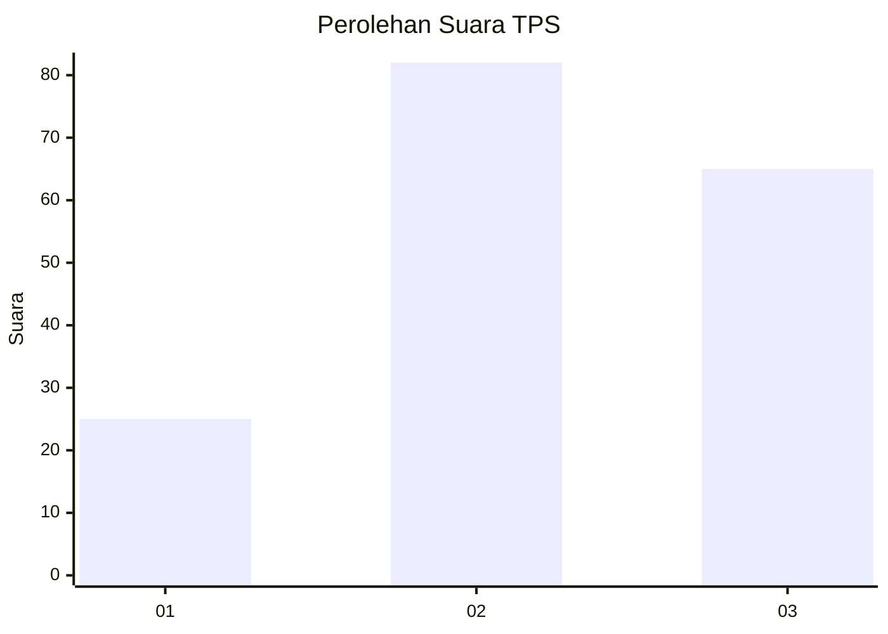
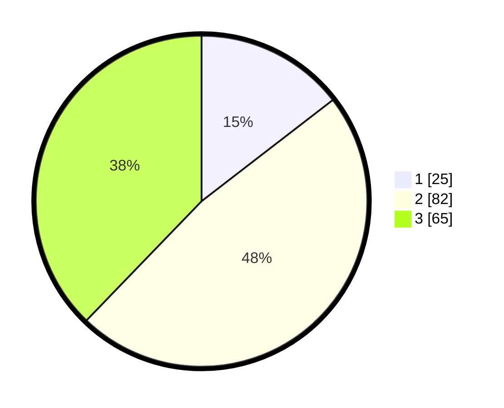

# Hasil

## Grafik

## Tabel

| No. | Nama Paslon    | Suara | Suara (raw) | Persentase |
|:--- |:-------------- | -----:| -----------:| ----------:|
| 1   | ANIES MUHAIMIN | 25    | [25][p-1]   | 14,53      |
| 2   | PRABOWO GIBRAN | 82    | [82][p-2]   | 47,67      |
| 3   | GANJAR MAHFUD  | 65    | [65][p-3]   | 37,79      |

[p-1]: https://github.com/gigit-pemilu/pemilu-2024-34-di-yogyakarta/blob/main/pilpres/hitung-suara/sub/34-di-yogyakarta/sub/71-kota-yogyakarta/sub/05-gedongtengen/sub/1001-sosromenduran/sub/004-tps/sub/paslon-1.txt
[p-2]: https://github.com/gigit-pemilu/pemilu-2024-34-di-yogyakarta/blob/main/pilpres/hitung-suara/sub/34-di-yogyakarta/sub/71-kota-yogyakarta/sub/05-gedongtengen/sub/1001-sosromenduran/sub/004-tps/sub/paslon-2.txt
[p-3]: https://github.com/gigit-pemilu/pemilu-2024-34-di-yogyakarta/blob/main/pilpres/hitung-suara/sub/34-di-yogyakarta/sub/71-kota-yogyakarta/sub/05-gedongtengen/sub/1001-sosromenduran/sub/004-tps/sub/paslon-3.txt

## Foto C Plano

https://sirekap-obj-formc.kpu.go.id/e5ff/pemilu/ppwp/34/71/05/10/01/3471051001004-20240216-015428--db1c288b-0429-4777-bad1-b4424faaeb01.jpg

https://sirekap-obj-formc.kpu.go.id/e5ff/pemilu/ppwp/34/71/05/10/01/3471051001004-20240216-015439--00c73bc5-c78c-4f80-af55-881a04aebaa9.jpg

https://sirekap-obj-formc.kpu.go.id/e5ff/pemilu/ppwp/34/71/05/10/01/3471051001004-20240216-015438--aab71807-4c17-40ea-ba5d-dc497f7a2695.jpg

## Metadata

| Key        | Value               |
| ---------- | ------------------- |
| Time Stamp | 2024-02-16 05:00:26 |

## DATA PEMILIH TETAP

Jumlah pemilih dalam DPT: **210**.
 * L: **107**.
 * P: **103**.

## DATA PENGGUNA HAK PILIH

Jumlah pengguna hak pilih dalam DPT: **165**.
 * L: **85**.
 * P: **80**.

Jumlah pengguna hak pilih dalam DPTb: **8**.
 * L: **3**.
 * P: **5**.

Jumlah pengguna hak pilih dalam DPK: **5**.
 * L: **2**.
 * P: **3**.

Jumlah pengguna hak pilih: **178**.
 * L: **90**.
 * P: **88**.

## JUMLAH SUARA SAH DAN TIDAK SAH

JUMLAH SELURUH SUARA SAH: **172**.

JUMLAH SUARA TIDAK SAH: **6**.

JUMLAH SELURUH SUARA SAH DAN SUARA TIDAK SAH: **178**.

