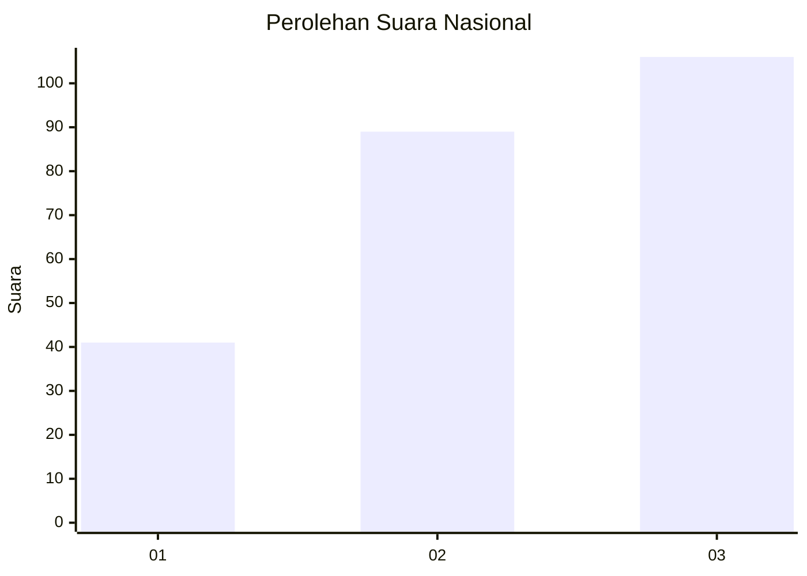
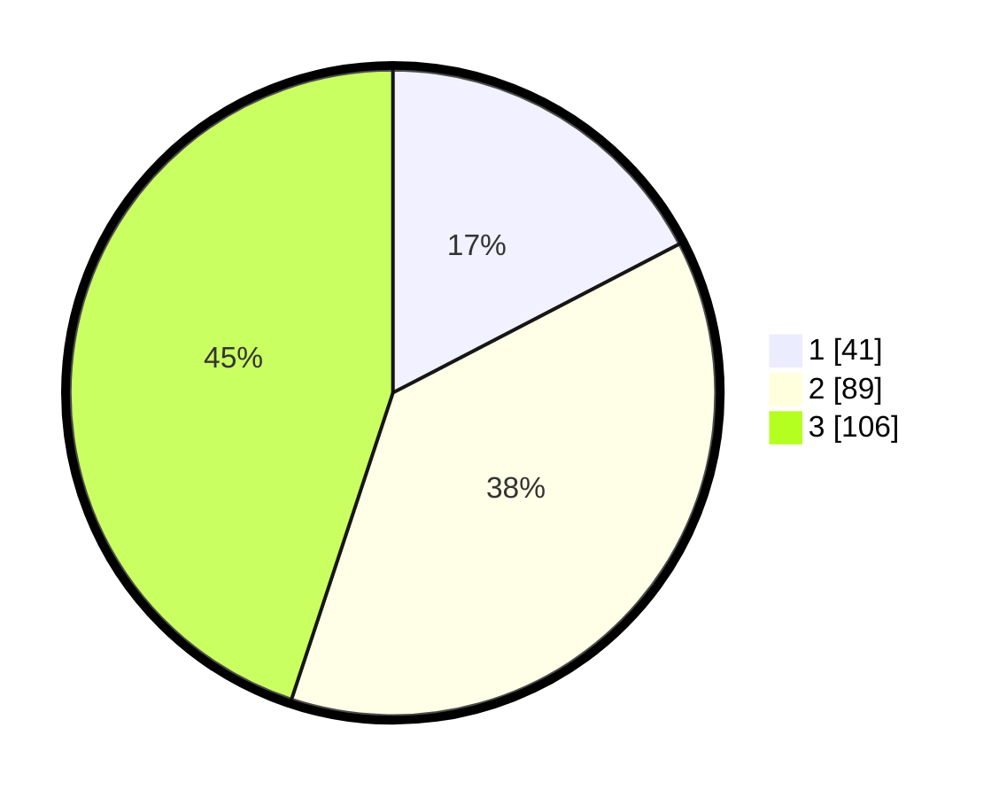

# Hasil

## Grafik

## Tabel

| No. | Nama Paslon    | Suara | Suara (raw) | Persentase |
|:--- |:-------------- | -----:| -----------:| ----------:|
| 1   | ANIES MUHAIMIN | 41    | [41][p-1]   | 17,37      |
| 2   | PRABOWO GIBRAN | 89    | [89][p-2]   | 37,71      |
| 3   | GANJAR MAHFUD  | 106   | [106][p-3]  | 44,92      |

[p-1]: https://github.com/gigit-pemilu/pemilu-2024/blob/main/pilpres/hitung-suara/sub/34-di-yogyakarta/sub/71-kota-yogyakarta/sub/05-gedongtengen/sub/1001-sosromenduran/sub/005-tps/sub/paslon-1.txt
[p-2]: https://github.com/gigit-pemilu/pemilu-2024/blob/main/pilpres/hitung-suara/sub/34-di-yogyakarta/sub/71-kota-yogyakarta/sub/05-gedongtengen/sub/1001-sosromenduran/sub/005-tps/sub/paslon-2.txt
[p-3]: https://github.com/gigit-pemilu/pemilu-2024/blob/main/pilpres/hitung-suara/sub/34-di-yogyakarta/sub/71-kota-yogyakarta/sub/05-gedongtengen/sub/1001-sosromenduran/sub/005-tps/sub/paslon-3.txt

## Foto C Plano

https://sirekap-obj-formc.kpu.go.id/c21b/pemilu/ppwp/34/71/05/10/01/3471051001005-20240214-225813--d864a6d9-8aab-48fc-b91f-fe41a0102457.jpg

https://sirekap-obj-formc.kpu.go.id/c21b/pemilu/ppwp/34/71/05/10/01/3471051001005-20240214-225911--9409ba3c-70c9-42c0-8f15-0e9eb1cc460a.jpg

https://sirekap-obj-formc.kpu.go.id/c21b/pemilu/ppwp/34/71/05/10/01/3471051001005-20240214-225953--daddabe5-ff92-4796-afd9-dc50019359f1.jpg

## Metadata

| Key        | Value               |
| ---------- | ------------------- |
| Time Stamp | 2024-02-15 21:30:27 |

## DATA PEMILIH TETAP

Jumlah pemilih dalam DPT: **284**.
 * L: **134**.
 * P: **150**.

## DATA PENGGUNA HAK PILIH

Jumlah pengguna hak pilih dalam DPT: **235**.
 * L: **108**.
 * P: **127**.

Jumlah pengguna hak pilih dalam DPTb: **6**.
 * L: **3**.
 * P: **3**.

Jumlah pengguna hak pilih dalam DPK: **0**.
 * L: **0**.
 * P: **0**.

Jumlah pengguna hak pilih: **241**.
 * L: **111**.
 * P: **130**.

## JUMLAH SUARA SAH DAN TIDAK SAH

JUMLAH SELURUH SUARA SAH: **236**.

JUMLAH SUARA TIDAK SAH: **5**.

JUMLAH SELURUH SUARA SAH DAN SUARA TIDAK SAH: **241**.

