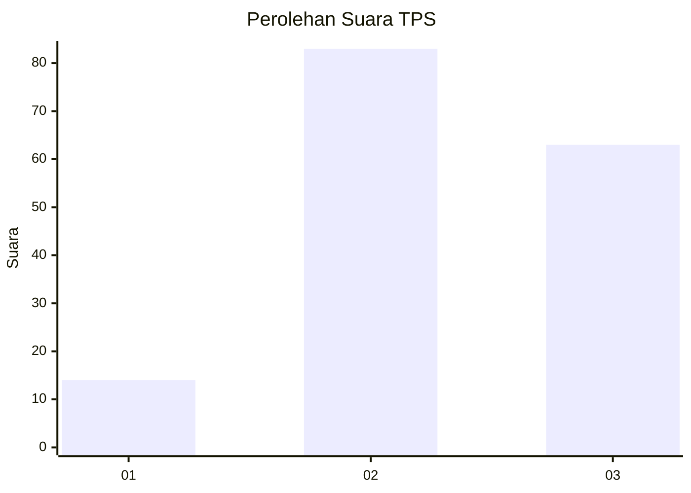
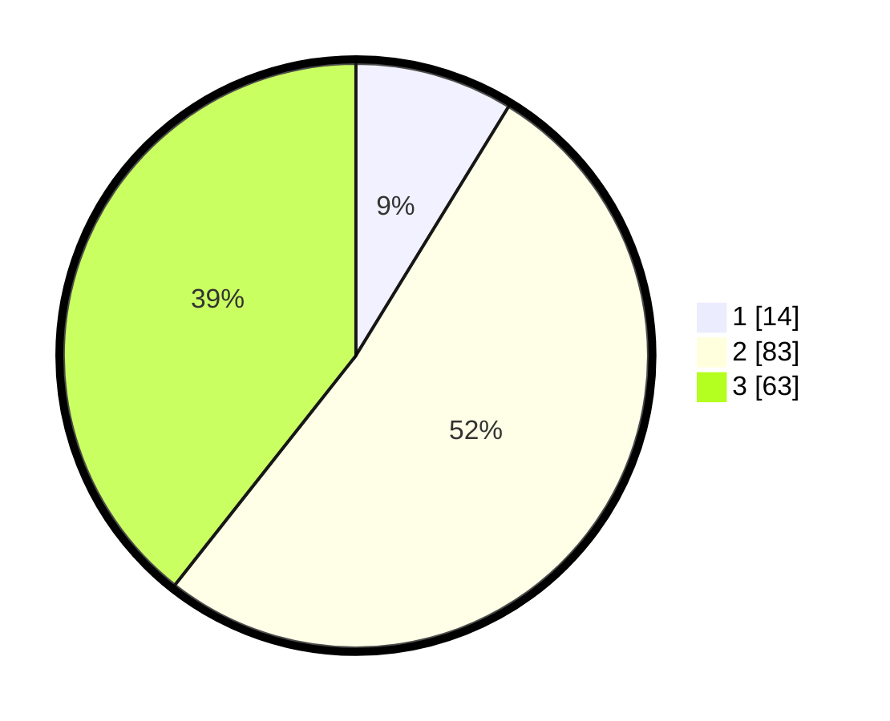

# Hasil

## Grafik

## Tabel

| No. | Nama Paslon    | Suara | Suara (raw) | Persentase |
|:--- |:-------------- | -----:| -----------:| ----------:|
| 1   | ANIES MUHAIMIN | 14    | [14][p-1]   | 8,75       |
| 2   | PRABOWO GIBRAN | 83    | [83][p-2]   | 51,88      |
| 3   | GANJAR MAHFUD  | 63    | [63][p-3]   | 39,38      |

[p-1]: https://github.com/gigit-pemilu/pemilu-2024-34-di-yogyakarta/blob/main/pilpres/hitung-suara/sub/34-di-yogyakarta/sub/71-kota-yogyakarta/sub/05-gedongtengen/sub/1002-pringgokusuman/sub/001-tps/sub/paslon-1.txt
[p-2]: https://github.com/gigit-pemilu/pemilu-2024-34-di-yogyakarta/blob/main/pilpres/hitung-suara/sub/34-di-yogyakarta/sub/71-kota-yogyakarta/sub/05-gedongtengen/sub/1002-pringgokusuman/sub/001-tps/sub/paslon-2.txt
[p-3]: https://github.com/gigit-pemilu/pemilu-2024-34-di-yogyakarta/blob/main/pilpres/hitung-suara/sub/34-di-yogyakarta/sub/71-kota-yogyakarta/sub/05-gedongtengen/sub/1002-pringgokusuman/sub/001-tps/sub/paslon-3.txt

## Foto C Plano

https://sirekap-obj-formc.kpu.go.id/fb0b/pemilu/ppwp/34/71/05/10/02/3471051002001-20240215-003326--266bcc56-575a-4653-8706-fe7029ded924.jpg

https://sirekap-obj-formc.kpu.go.id/fb0b/pemilu/ppwp/34/71/05/10/02/3471051002001-20240216-102404--b4bf647d-a569-46a2-b04b-1fb5fa0c2611.jpg

https://sirekap-obj-formc.kpu.go.id/fb0b/pemilu/ppwp/34/71/05/10/02/3471051002001-20240215-020825--7b48c1e1-21c5-43c9-a0f1-13f9eacc94f5.jpg

## Metadata

| Key        | Value               |
| ---------- | ------------------- |
| Time Stamp | 2024-02-19 06:16:00 |

