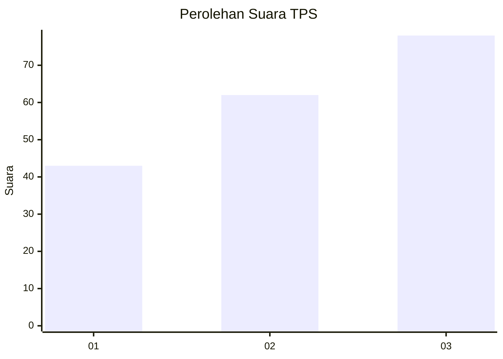
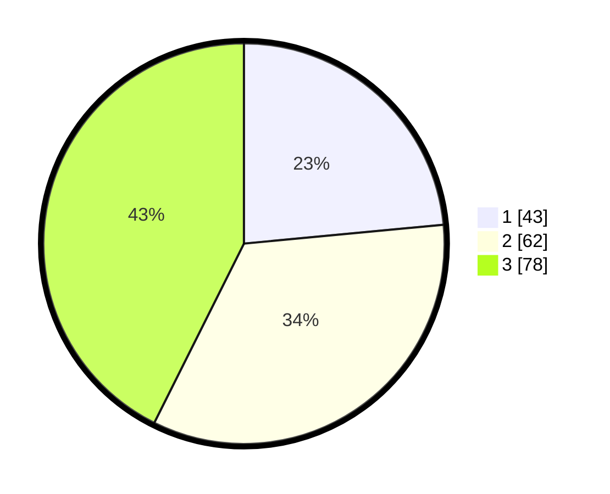

# Hasil

## Grafik

## Tabel

| No. | Nama Paslon    | Suara | Suara (raw) | Persentase |
|:--- |:-------------- | -----:| -----------:| ----------:|
| 1   | ANIES MUHAIMIN | 43    | [43][p-1]   | 23,50      |
| 2   | PRABOWO GIBRAN | 62    | [62][p-2]   | 33,88      |
| 3   | GANJAR MAHFUD  | 78    | [78][p-3]   | 42,62      |

[p-1]: https://github.com/gigit-pemilu/pemilu-2024-34-di-yogyakarta/blob/main/pilpres/hitung-suara/sub/34-di-yogyakarta/sub/71-kota-yogyakarta/sub/05-gedongtengen/sub/1002-pringgokusuman/sub/029-tps/sub/paslon-1.txt
[p-2]: https://github.com/gigit-pemilu/pemilu-2024-34-di-yogyakarta/blob/main/pilpres/hitung-suara/sub/34-di-yogyakarta/sub/71-kota-yogyakarta/sub/05-gedongtengen/sub/1002-pringgokusuman/sub/029-tps/sub/paslon-2.txt
[p-3]: https://github.com/gigit-pemilu/pemilu-2024-34-di-yogyakarta/blob/main/pilpres/hitung-suara/sub/34-di-yogyakarta/sub/71-kota-yogyakarta/sub/05-gedongtengen/sub/1002-pringgokusuman/sub/029-tps/sub/paslon-3.txt

## Foto C Plano

https://sirekap-obj-formc.kpu.go.id/57f1/pemilu/ppwp/34/71/05/10/02/3471051002029-20240214-234711--fb79671b-5fa4-4a63-baff-c7376641ecdd.jpg

https://sirekap-obj-formc.kpu.go.id/57f1/pemilu/ppwp/34/71/05/10/02/3471051002029-20240214-234758--b3258780-f4ea-4718-a05e-e9784be2b42b.jpg

https://sirekap-obj-formc.kpu.go.id/57f1/pemilu/ppwp/34/71/05/10/02/3471051002029-20240216-180321--4a648418-98dc-4a59-a75f-67eecfda1fcd.jpg

## Metadata

| Key        | Value               |
| ---------- | ------------------- |
| Time Stamp | 2024-02-16 21:01:00 |

