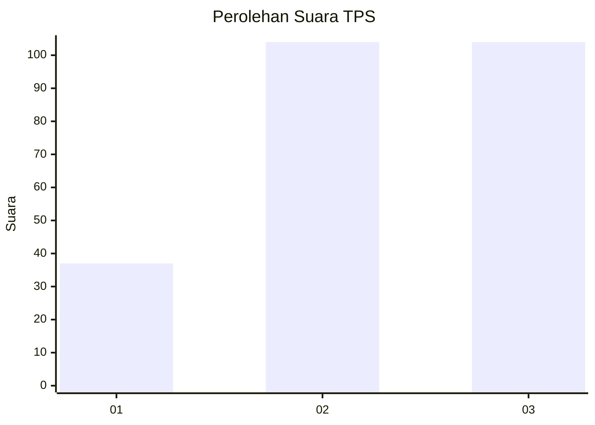
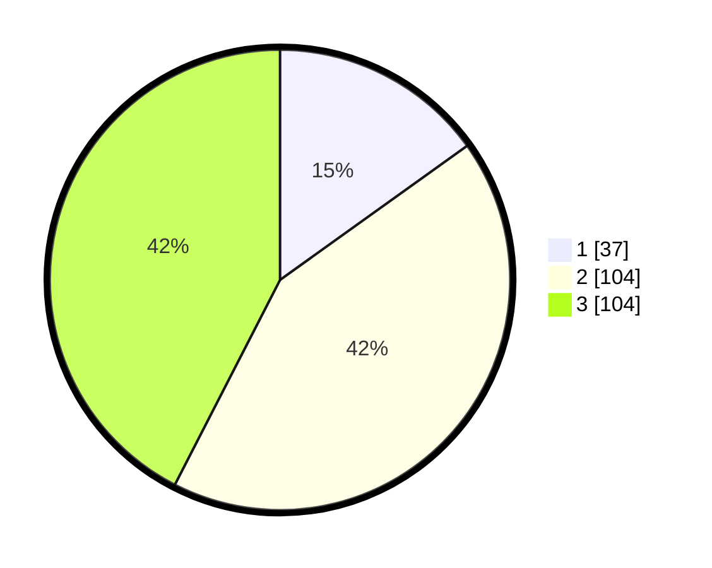

# Hasil

## Grafik

## Tabel

| No. | Nama Paslon    | Suara | Suara (raw) | Persentase |
|:--- |:-------------- | -----:| -----------:| ----------:|
| 1   | ANIES MUHAIMIN | 37    | [37][p-1]   | 15,10      |
| 2   | PRABOWO GIBRAN | 104   | [104][p-2]  | 42,45      |
| 3   | GANJAR MAHFUD  | 104   | [104][p-3]  | 42,45      |

[p-1]: https://github.com/gigit-pemilu/pemilu-2024-34-di-yogyakarta/blob/main/pilpres/hitung-suara/sub/34-di-yogyakarta/sub/71-kota-yogyakarta/sub/05-gedongtengen/sub/1002-pringgokusuman/sub/034-tps/sub/paslon-1.txt
[p-2]: https://github.com/gigit-pemilu/pemilu-2024-34-di-yogyakarta/blob/main/pilpres/hitung-suara/sub/34-di-yogyakarta/sub/71-kota-yogyakarta/sub/05-gedongtengen/sub/1002-pringgokusuman/sub/034-tps/sub/paslon-2.txt
[p-3]: https://github.com/gigit-pemilu/pemilu-2024-34-di-yogyakarta/blob/main/pilpres/hitung-suara/sub/34-di-yogyakarta/sub/71-kota-yogyakarta/sub/05-gedongtengen/sub/1002-pringgokusuman/sub/034-tps/sub/paslon-3.txt

## Foto C Plano

https://sirekap-obj-formc.kpu.go.id/6626/pemilu/ppwp/34/71/05/10/02/3471051002034-20240229-082723--fb001df7-b709-492b-b835-11ce9ee1600a.jpg

https://sirekap-obj-formc.kpu.go.id/6626/pemilu/ppwp/34/71/05/10/02/3471051002034-20240214-224347--d23aa069-ca07-462a-9de9-2bd10639b766.jpg

https://sirekap-obj-formc.kpu.go.id/6626/pemilu/ppwp/34/71/05/10/02/3471051002034-20240214-202438--aaf9eb98-81de-4e31-952f-cd2387b61f53.jpg

## Metadata

| Key        | Value               |
| ---------- | ------------------- |
| Time Stamp | 2024-02-29 09:00:00 |

