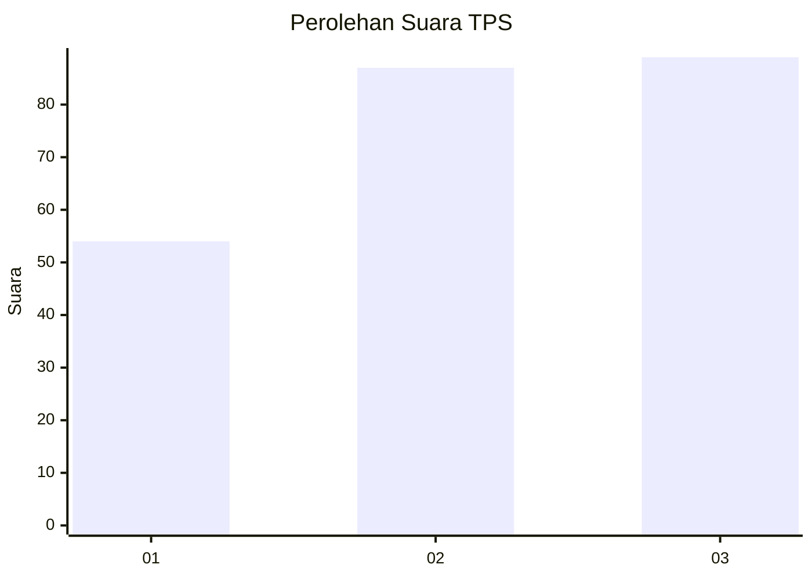
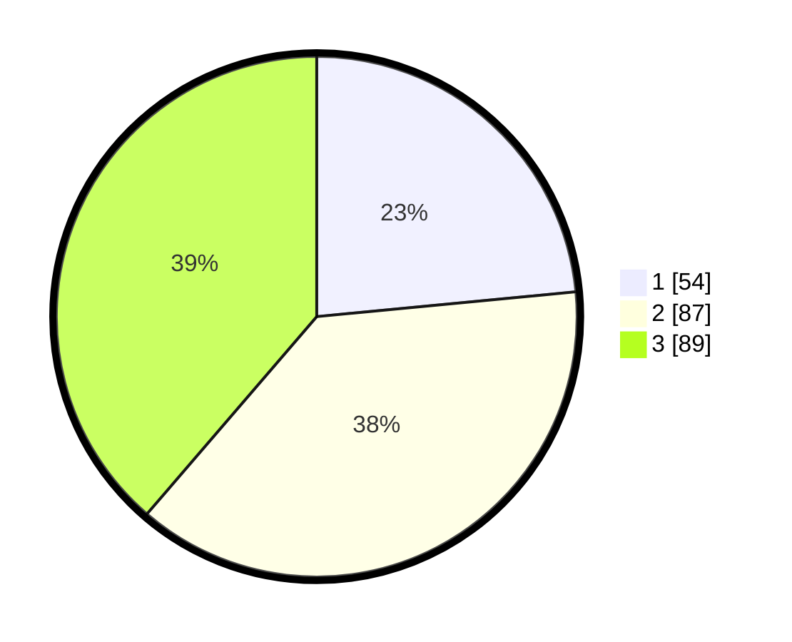

# Hasil

## Grafik

## Tabel

| No. | Nama Paslon    | Suara | Suara (raw) | Persentase |
|:--- |:-------------- | -----:| -----------:| ----------:|
| 1   | ANIES MUHAIMIN | 54    | [54][p-1]   | 23,48      |
| 2   | PRABOWO GIBRAN | 87    | [87][p-2]   | 37,83      |
| 3   | GANJAR MAHFUD  | 89    | [89][p-3]   | 38,70      |

[p-1]: https://github.com/gigit-pemilu/pemilu-2024-34-di-yogyakarta/blob/main/pilpres/hitung-suara/sub/34-di-yogyakarta/sub/71-kota-yogyakarta/sub/06-ngampilan/sub/1001-ngampilan/sub/001-tps/sub/paslon-1.txt
[p-2]: https://github.com/gigit-pemilu/pemilu-2024-34-di-yogyakarta/blob/main/pilpres/hitung-suara/sub/34-di-yogyakarta/sub/71-kota-yogyakarta/sub/06-ngampilan/sub/1001-ngampilan/sub/001-tps/sub/paslon-2.txt
[p-3]: https://github.com/gigit-pemilu/pemilu-2024-34-di-yogyakarta/blob/main/pilpres/hitung-suara/sub/34-di-yogyakarta/sub/71-kota-yogyakarta/sub/06-ngampilan/sub/1001-ngampilan/sub/001-tps/sub/paslon-3.txt

## Foto C Plano

https://sirekap-obj-formc.kpu.go.id/8eb1/pemilu/ppwp/34/71/06/10/01/3471061001001-20240214-192526--a6ff68f6-a4a8-4212-b9fb-2ad9e420400a.jpg

https://sirekap-obj-formc.kpu.go.id/8eb1/pemilu/ppwp/34/71/06/10/01/3471061001001-20240214-192643--d273e029-c2c6-4d83-abf7-2682a46a8a24.jpg

https://sirekap-obj-formc.kpu.go.id/8eb1/pemilu/ppwp/34/71/06/10/01/3471061001001-20240214-192728--c5d32804-09a9-4d5b-b643-1b7f47a48aa0.jpg

## Metadata

| Key        | Value               |
| ---------- | ------------------- |
| Time Stamp | 2024-02-14 21:46:01 |

## DATA PEMILIH TETAP

Jumlah pemilih dalam DPT: **263**.
 * L: **122**.
 * P: **141**.

## DATA PENGGUNA HAK PILIH

Jumlah pengguna hak pilih dalam DPT: **230**.
 * L: **103**.
 * P: **127**.

Jumlah pengguna hak pilih dalam DPTb: **7**.
 * L: **1**.
 * P: **6**.

Jumlah pengguna hak pilih dalam DPK: **0**.
 * L: **0**.
 * P: **0**.

Jumlah pengguna hak pilih: **237**.
 * L: **104**.
 * P: **133**.

## JUMLAH SUARA SAH DAN TIDAK SAH

JUMLAH SELURUH SUARA SAH: **230**.

JUMLAH SUARA TIDAK SAH: **7**.

JUMLAH SELURUH SUARA SAH DAN SUARA TIDAK SAH: **237**.

