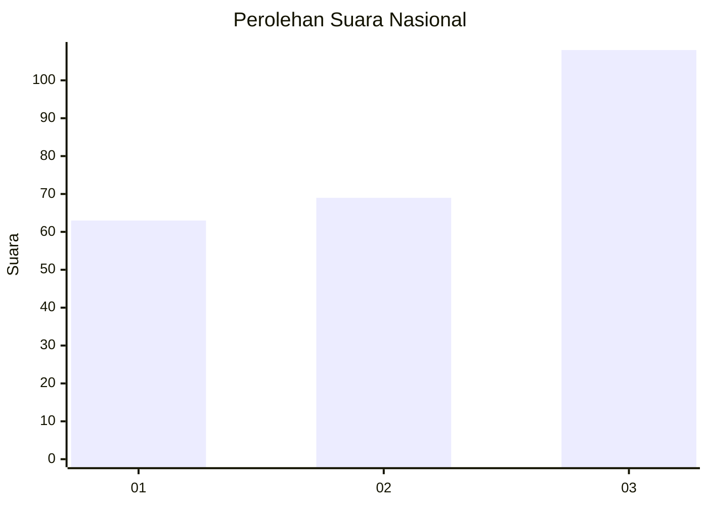
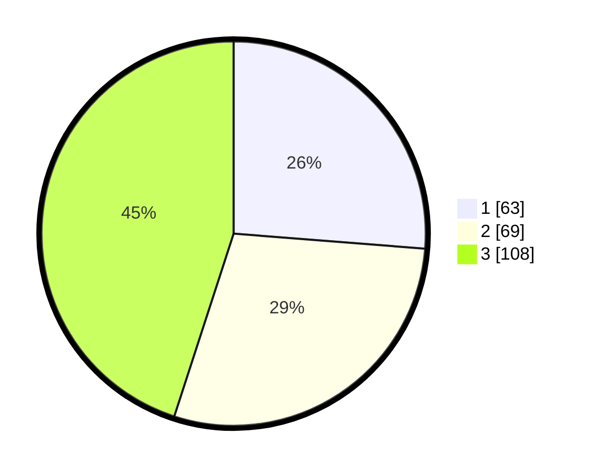

# Hasil

## Grafik

## Tabel

| No. | Nama Paslon    | Suara | Suara (raw) | Persentase |
|:--- |:-------------- | -----:| -----------:| ----------:|
| 1   | ANIES MUHAIMIN | 63    | [63][p-1]   | 26,25      |
| 2   | PRABOWO GIBRAN | 69    | [69][p-2]   | 28,75      |
| 3   | GANJAR MAHFUD  | 108   | [108][p-3]  | 45,00      |

[p-1]: https://github.com/gigit-pemilu/pemilu-2024/blob/main/pilpres/hitung-suara/sub/34-di-yogyakarta/sub/71-kota-yogyakarta/sub/06-ngampilan/sub/1001-ngampilan/sub/003-tps/sub/paslon-1.txt
[p-2]: https://github.com/gigit-pemilu/pemilu-2024/blob/main/pilpres/hitung-suara/sub/34-di-yogyakarta/sub/71-kota-yogyakarta/sub/06-ngampilan/sub/1001-ngampilan/sub/003-tps/sub/paslon-2.txt
[p-3]: https://github.com/gigit-pemilu/pemilu-2024/blob/main/pilpres/hitung-suara/sub/34-di-yogyakarta/sub/71-kota-yogyakarta/sub/06-ngampilan/sub/1001-ngampilan/sub/003-tps/sub/paslon-3.txt

## Foto C Plano

https://sirekap-obj-formc.kpu.go.id/7a22/pemilu/ppwp/34/71/06/10/01/3471061001003-20240215-004145--8743bf26-dd19-4e62-ad17-315ea5c8e354.jpg

https://sirekap-obj-formc.kpu.go.id/7a22/pemilu/ppwp/34/71/06/10/01/3471061001003-20240215-004326--5b1e63fa-ab93-4419-88ac-9a1407894e8c.jpg

https://sirekap-obj-formc.kpu.go.id/7a22/pemilu/ppwp/34/71/06/10/01/3471061001003-20240215-004501--1074a497-ff9e-4603-8878-8c4c5f4d6a62.jpg

## Metadata

| Key        | Value               |
| ---------- | ------------------- |
| Time Stamp | 2024-02-16 12:51:22 |

## DATA PEMILIH TETAP

Jumlah pemilih dalam DPT: **240**.
 * L: **112**.
 * P: **128**.

## DATA PENGGUNA HAK PILIH

Jumlah pengguna hak pilih dalam DPT: **240**.
 * L: **112**.
 * P: **128**.

Jumlah pengguna hak pilih dalam DPTb: **5**.
 * L: **2**.
 * P: **3**.

Jumlah pengguna hak pilih dalam DPK: **1**.
 * L: **1**.
 * P: **0**.

Jumlah pengguna hak pilih: **246**.
 * L: **115**.
 * P: **131**.

## JUMLAH SUARA SAH DAN TIDAK SAH

JUMLAH SELURUH SUARA SAH: **240**.

JUMLAH SUARA TIDAK SAH: **6**.

JUMLAH SELURUH SUARA SAH DAN SUARA TIDAK SAH: **246**.

