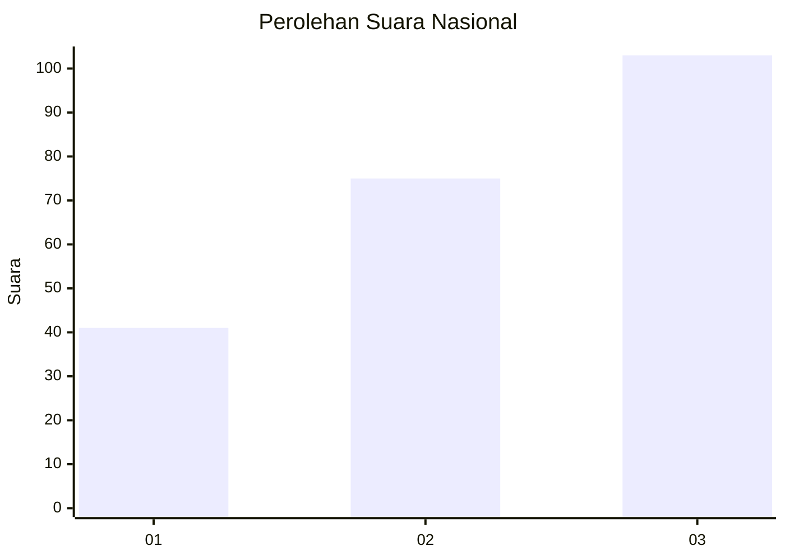
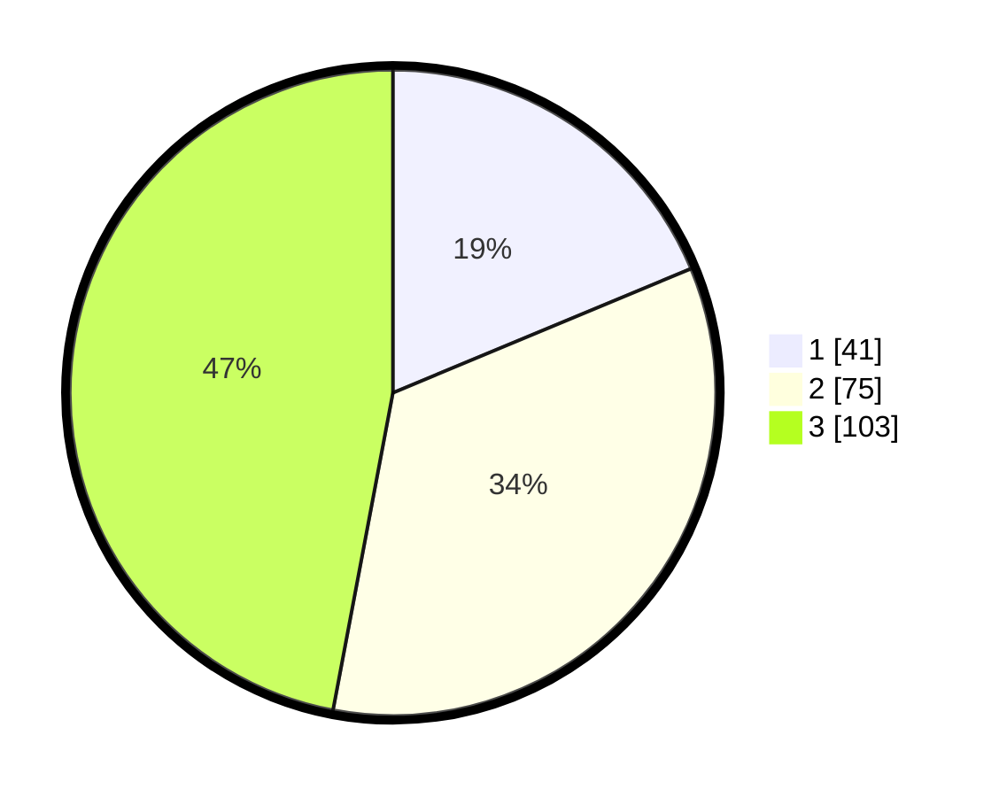

# Hasil

## Grafik

## Tabel

| No. | Nama Paslon    | Suara | Suara (raw) | Persentase |
|:--- |:-------------- | -----:| -----------:| ----------:|
| 1   | ANIES MUHAIMIN | 41    | [41][p-1]   | 18,72      |
| 2   | PRABOWO GIBRAN | 75    | [75][p-2]   | 34,25      |
| 3   | GANJAR MAHFUD  | 103   | [103][p-3]  | 47,03      |

[p-1]: https://github.com/gigit-pemilu/pemilu-2024/blob/main/pilpres/hitung-suara/sub/34-di-yogyakarta/sub/71-kota-yogyakarta/sub/06-ngampilan/sub/1001-ngampilan/sub/005-tps/sub/paslon-1.txt
[p-2]: https://github.com/gigit-pemilu/pemilu-2024/blob/main/pilpres/hitung-suara/sub/34-di-yogyakarta/sub/71-kota-yogyakarta/sub/06-ngampilan/sub/1001-ngampilan/sub/005-tps/sub/paslon-2.txt
[p-3]: https://github.com/gigit-pemilu/pemilu-2024/blob/main/pilpres/hitung-suara/sub/34-di-yogyakarta/sub/71-kota-yogyakarta/sub/06-ngampilan/sub/1001-ngampilan/sub/005-tps/sub/paslon-3.txt

## Foto C Plano

https://sirekap-obj-formc.kpu.go.id/f27a/pemilu/ppwp/34/71/06/10/01/3471061001005-20240216-212702--ece35be8-5b44-48f6-ab23-8201b851caee.jpg

https://sirekap-obj-formc.kpu.go.id/f27a/pemilu/ppwp/34/71/06/10/01/3471061001005-20240216-212703--338ade7a-d0c2-4f6b-a233-d65c594c84b8.jpg

https://sirekap-obj-formc.kpu.go.id/f27a/pemilu/ppwp/34/71/06/10/01/3471061001005-20240216-212702--a6d560ba-72da-4d8d-9e46-5257c92b86bb.jpg

## Metadata

| Key        | Value               |
| ---------- | ------------------- |
| Time Stamp | 2024-02-16 22:01:00 |

## DATA PEMILIH TETAP

Jumlah pemilih dalam DPT: **261**.
 * L: **122**.
 * P: **139**.

## DATA PENGGUNA HAK PILIH

Jumlah pengguna hak pilih dalam DPT: **217**.
 * L: **96**.
 * P: **121**.

Jumlah pengguna hak pilih dalam DPTb: **4**.
 * L: **3**.
 * P: **1**.

Jumlah pengguna hak pilih dalam DPK: **1**.
 * L: **1**.
 * P: **0**.

Jumlah pengguna hak pilih: **222**.
 * L: **100**.
 * P: **122**.

## JUMLAH SUARA SAH DAN TIDAK SAH

JUMLAH SELURUH SUARA SAH: **219**.

JUMLAH SUARA TIDAK SAH: **3**.

JUMLAH SELURUH SUARA SAH DAN SUARA TIDAK SAH: **222**.

