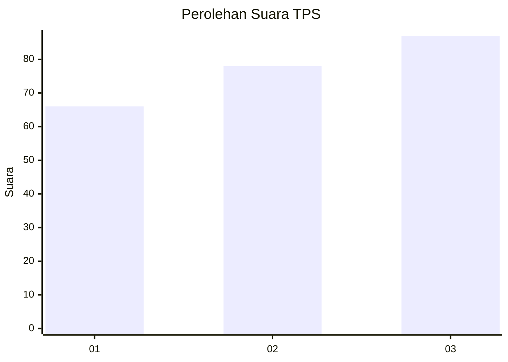
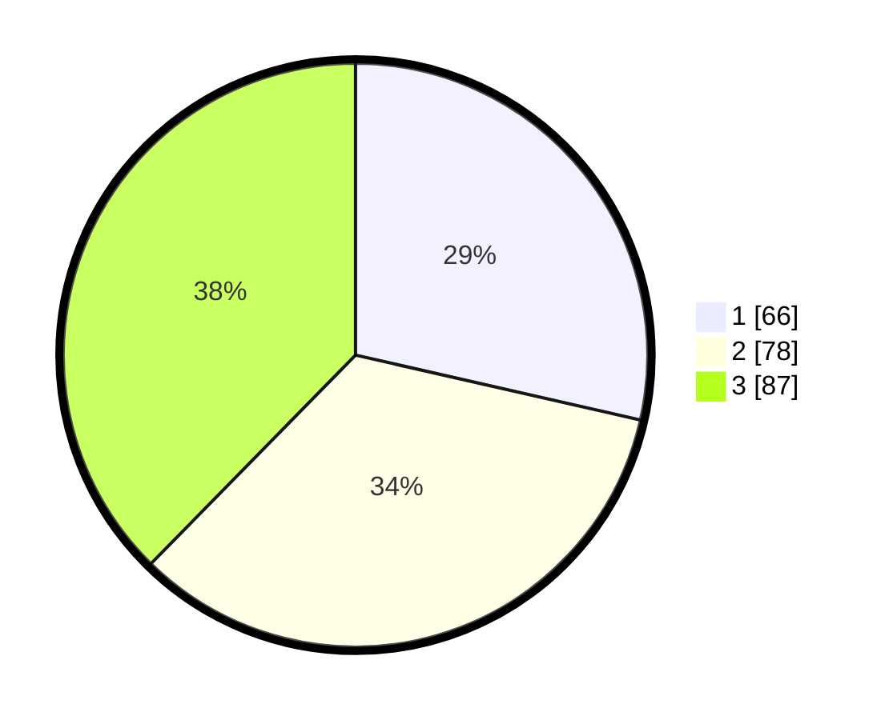

# Hasil

## Grafik

## Tabel

| No. | Nama Paslon    | Suara | Suara (raw) | Persentase |
|:--- |:-------------- | -----:| -----------:| ----------:|
| 1   | ANIES MUHAIMIN | 66    | [66][p-1]   | 28,57      |
| 2   | PRABOWO GIBRAN | 78    | [78][p-2]   | 33,77      |
| 3   | GANJAR MAHFUD  | 87    | [87][p-3]   | 37,66      |

[p-1]: https://github.com/gigit-pemilu/pemilu-2024-34-di-yogyakarta/blob/main/pilpres/hitung-suara/sub/34-di-yogyakarta/sub/71-kota-yogyakarta/sub/07-wirobrajan/sub/1001-pakuncen/sub/002-tps/sub/paslon-1.txt
[p-2]: https://github.com/gigit-pemilu/pemilu-2024-34-di-yogyakarta/blob/main/pilpres/hitung-suara/sub/34-di-yogyakarta/sub/71-kota-yogyakarta/sub/07-wirobrajan/sub/1001-pakuncen/sub/002-tps/sub/paslon-2.txt
[p-3]: https://github.com/gigit-pemilu/pemilu-2024-34-di-yogyakarta/blob/main/pilpres/hitung-suara/sub/34-di-yogyakarta/sub/71-kota-yogyakarta/sub/07-wirobrajan/sub/1001-pakuncen/sub/002-tps/sub/paslon-3.txt

## Foto C Plano

https://sirekap-obj-formc.kpu.go.id/b3ee/pemilu/ppwp/34/71/07/10/01/3471071001002-20240215-072629--8250ebd8-6b9e-4196-8de2-75c7d006a8c6.jpg

https://sirekap-obj-formc.kpu.go.id/b3ee/pemilu/ppwp/34/71/07/10/01/3471071001002-20240215-072650--3b9777c4-13b4-4594-9b02-0bbf05f4c384.jpg

https://sirekap-obj-formc.kpu.go.id/b3ee/pemilu/ppwp/34/71/07/10/01/3471071001002-20240215-072639--32652f43-9829-4f5d-9674-a2e70368aef7.jpg

## Metadata

| Key        | Value               |
| ---------- | ------------------- |
| Time Stamp | 2024-02-16 16:25:10 |

## DATA PEMILIH TETAP

Jumlah pemilih dalam DPT: **255**.
 * L: **0**.
 * P: **0**.

## DATA PENGGUNA HAK PILIH

Jumlah pengguna hak pilih dalam DPT: **227**.
 * L: **0**.
 * P: **0**.

Jumlah pengguna hak pilih dalam DPTb: **9**.
 * L: **0**.
 * P: **0**.

Jumlah pengguna hak pilih dalam DPK: **0**.
 * L: **0**.
 * P: **0**.

Jumlah pengguna hak pilih: **236**.
 * L: **0**.
 * P: **0**.

## JUMLAH SUARA SAH DAN TIDAK SAH

JUMLAH SELURUH SUARA SAH: **231**.

JUMLAH SUARA TIDAK SAH: **5**.

JUMLAH SELURUH SUARA SAH DAN SUARA TIDAK SAH: **236**.

