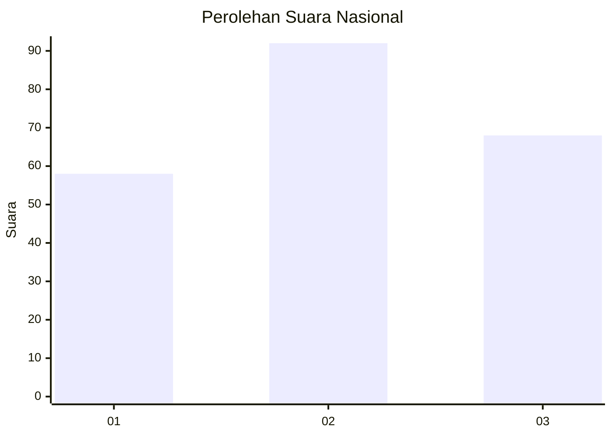
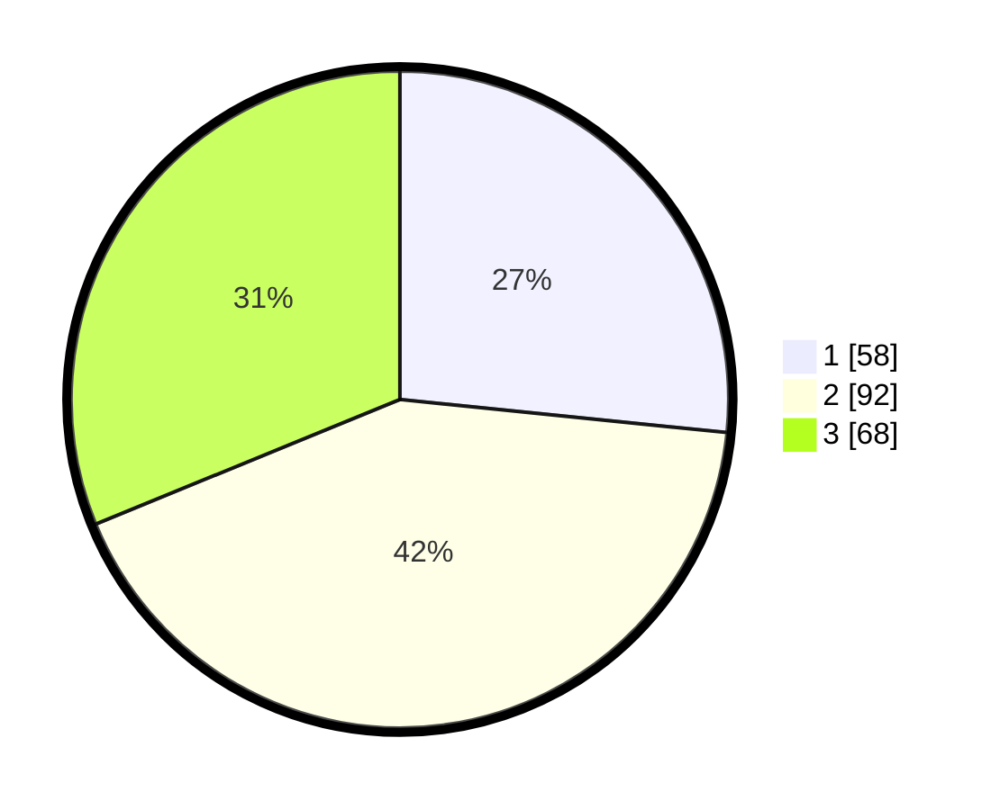

# Hasil

## Grafik

## Tabel

| No. | Nama Paslon    | Suara | Suara (raw) | Persentase |
|:--- |:-------------- | -----:| -----------:| ----------:|
| 1   | ANIES MUHAIMIN | 58    | [58][p-1]   | 26,61      |
| 2   | PRABOWO GIBRAN | 92    | [92][p-2]   | 42,20      |
| 3   | GANJAR MAHFUD  | 68    | [68][p-3]   | 31,19      |

[p-1]: https://github.com/gigit-pemilu/pemilu-2024/blob/main/pilpres/hitung-suara/sub/34-di-yogyakarta/sub/71-kota-yogyakarta/sub/07-wirobrajan/sub/1001-pakuncen/sub/004-tps/sub/paslon-1.txt
[p-2]: https://github.com/gigit-pemilu/pemilu-2024/blob/main/pilpres/hitung-suara/sub/34-di-yogyakarta/sub/71-kota-yogyakarta/sub/07-wirobrajan/sub/1001-pakuncen/sub/004-tps/sub/paslon-2.txt
[p-3]: https://github.com/gigit-pemilu/pemilu-2024/blob/main/pilpres/hitung-suara/sub/34-di-yogyakarta/sub/71-kota-yogyakarta/sub/07-wirobrajan/sub/1001-pakuncen/sub/004-tps/sub/paslon-3.txt

## Foto C Plano

https://sirekap-obj-formc.kpu.go.id/ca84/pemilu/ppwp/34/71/07/10/01/3471071001004-20240214-202556--d8ce8dae-4d75-4c09-a619-25e269e6cf85.jpg

https://sirekap-obj-formc.kpu.go.id/ca84/pemilu/ppwp/34/71/07/10/01/3471071001004-20240214-202801--0cc4ef68-0618-4a99-a7ac-b744bc1e22ce.jpg

https://sirekap-obj-formc.kpu.go.id/ca84/pemilu/ppwp/34/71/07/10/01/3471071001004-20240214-202944--be7d5c44-95ed-480d-8915-d24d1316b3f9.jpg

## Metadata

| Key        | Value               |
| ---------- | ------------------- |
| Time Stamp | 2024-02-24 22:31:28 |

