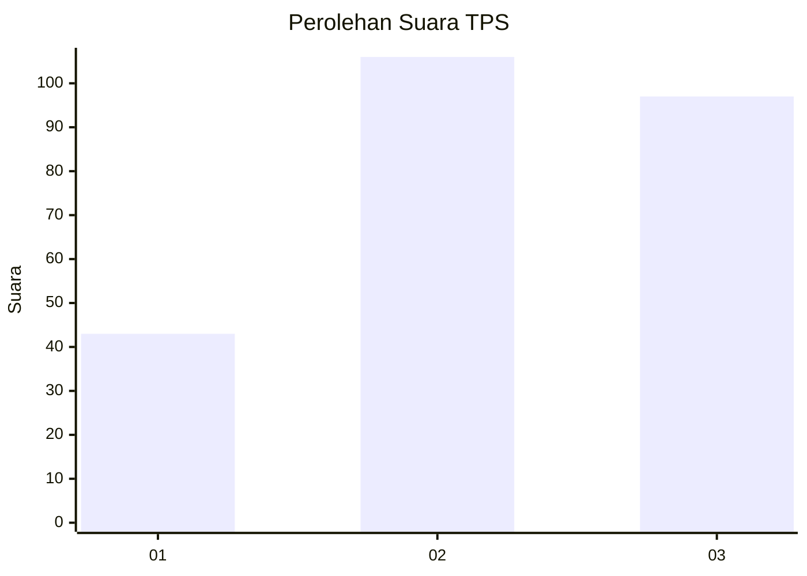
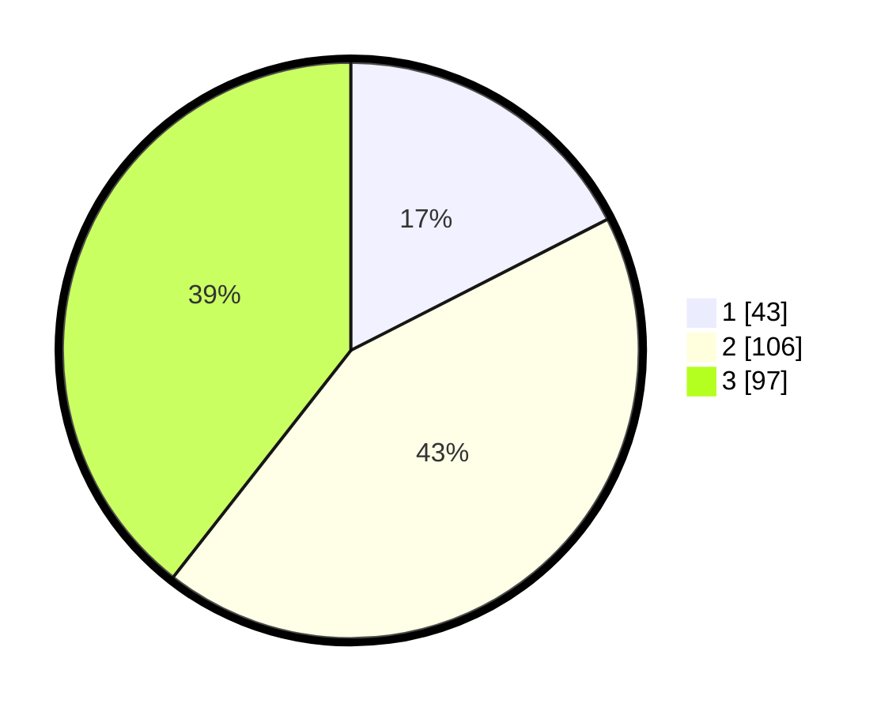

# Hasil

## Grafik

## Tabel

| No. | Nama Paslon    | Suara | Suara (raw) | Persentase |
|:--- |:-------------- | -----:| -----------:| ----------:|
| 1   | ANIES MUHAIMIN | 43    | [43][p-1]   | 17,48      |
| 2   | PRABOWO GIBRAN | 106   | [106][p-2]  | 43,09      |
| 3   | GANJAR MAHFUD  | 97    | [97][p-3]   | 39,43      |

[p-1]: https://github.com/gigit-pemilu/pemilu-2024-34-di-yogyakarta/blob/main/pilpres/hitung-suara/sub/34-di-yogyakarta/sub/71-kota-yogyakarta/sub/07-wirobrajan/sub/1001-pakuncen/sub/005-tps/sub/paslon-1.txt
[p-2]: https://github.com/gigit-pemilu/pemilu-2024-34-di-yogyakarta/blob/main/pilpres/hitung-suara/sub/34-di-yogyakarta/sub/71-kota-yogyakarta/sub/07-wirobrajan/sub/1001-pakuncen/sub/005-tps/sub/paslon-2.txt
[p-3]: https://github.com/gigit-pemilu/pemilu-2024-34-di-yogyakarta/blob/main/pilpres/hitung-suara/sub/34-di-yogyakarta/sub/71-kota-yogyakarta/sub/07-wirobrajan/sub/1001-pakuncen/sub/005-tps/sub/paslon-3.txt

## Foto C Plano

https://sirekap-obj-formc.kpu.go.id/633e/pemilu/ppwp/34/71/07/10/01/3471071001005-20240214-203219--d716fe98-64b8-4a22-ac53-3bb70c59461c.jpg

https://sirekap-obj-formc.kpu.go.id/633e/pemilu/ppwp/34/71/07/10/01/3471071001005-20240214-203234--49413c83-4dd8-40d4-9d97-9e89f8d1cba5.jpg

https://sirekap-obj-formc.kpu.go.id/633e/pemilu/ppwp/34/71/07/10/01/3471071001005-20240214-203243--180df216-008f-4ebd-aeb1-cdb34104b5f1.jpg

## Metadata

| Key        | Value               |
| ---------- | ------------------- |
| Time Stamp | 2024-02-15 15:00:29 |

## DATA PEMILIH TETAP

Jumlah pemilih dalam DPT: **287**.
 * L: **137**.
 * P: **150**.

## DATA PENGGUNA HAK PILIH

Jumlah pengguna hak pilih dalam DPT: **242**.
 * L: **115**.
 * P: **127**.

Jumlah pengguna hak pilih dalam DPTb: **8**.
 * L: **6**.
 * P: **2**.

Jumlah pengguna hak pilih dalam DPK: **3**.
 * L: **0**.
 * P: **3**.

Jumlah pengguna hak pilih: **253**.
 * L: **121**.
 * P: **132**.

## JUMLAH SUARA SAH DAN TIDAK SAH

JUMLAH SELURUH SUARA SAH: **246**.

JUMLAH SUARA TIDAK SAH: **7**.

JUMLAH SELURUH SUARA SAH DAN SUARA TIDAK SAH: **253**.

