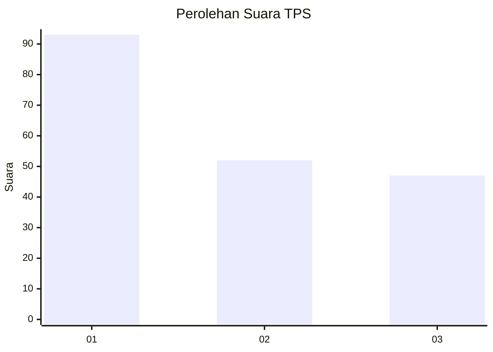
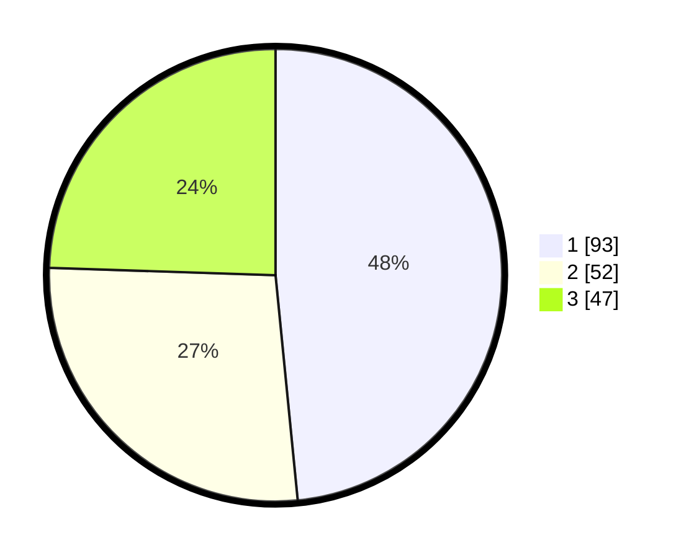

# Hasil

## Grafik

## Tabel

| No. | Nama Paslon    | Suara | Suara (raw) | Persentase |
|:--- |:-------------- | -----:| -----------:| ----------:|
| 1   | ANIES MUHAIMIN | 93    | [93][p-1]   | 48,44      |
| 2   | PRABOWO GIBRAN | 52    | [52][p-2]   | 27,08      |
| 3   | GANJAR MAHFUD  | 47    | [47][p-3]   | 24,48      |

[p-1]: https://github.com/gigit-pemilu/pemilu-2024-34-di-yogyakarta/blob/main/pilpres/hitung-suara/sub/34-di-yogyakarta/sub/71-kota-yogyakarta/sub/07-wirobrajan/sub/1001-pakuncen/sub/010-tps/sub/paslon-1.txt
[p-2]: https://github.com/gigit-pemilu/pemilu-2024-34-di-yogyakarta/blob/main/pilpres/hitung-suara/sub/34-di-yogyakarta/sub/71-kota-yogyakarta/sub/07-wirobrajan/sub/1001-pakuncen/sub/010-tps/sub/paslon-2.txt
[p-3]: https://github.com/gigit-pemilu/pemilu-2024-34-di-yogyakarta/blob/main/pilpres/hitung-suara/sub/34-di-yogyakarta/sub/71-kota-yogyakarta/sub/07-wirobrajan/sub/1001-pakuncen/sub/010-tps/sub/paslon-3.txt

## Foto C Plano

https://sirekap-obj-formc.kpu.go.id/b2f5/pemilu/ppwp/34/71/07/10/01/3471071001010-20240214-221116--4775d06a-f8e3-4e57-a2a9-81570f0c50f1.jpg

https://sirekap-obj-formc.kpu.go.id/b2f5/pemilu/ppwp/34/71/07/10/01/3471071001010-20240215-135024--dddc3857-3bde-46db-bae8-ea70276d3ac0.jpg

## Metadata

| Key        | Value               |
| ---------- | ------------------- |
| Time Stamp | 2024-02-15 15:00:29 |

