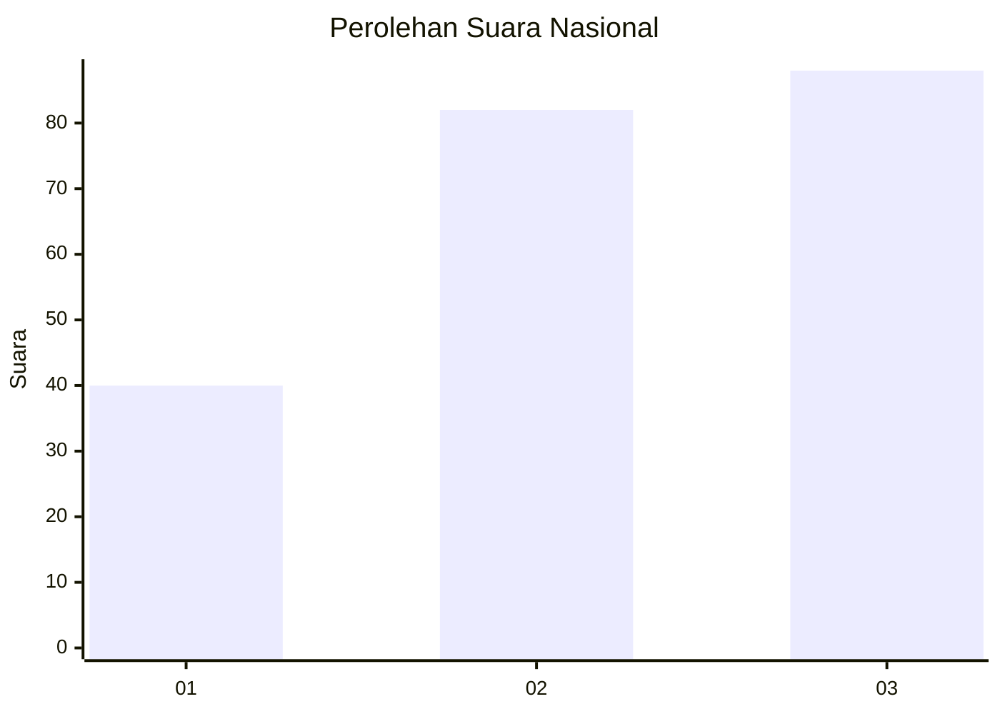
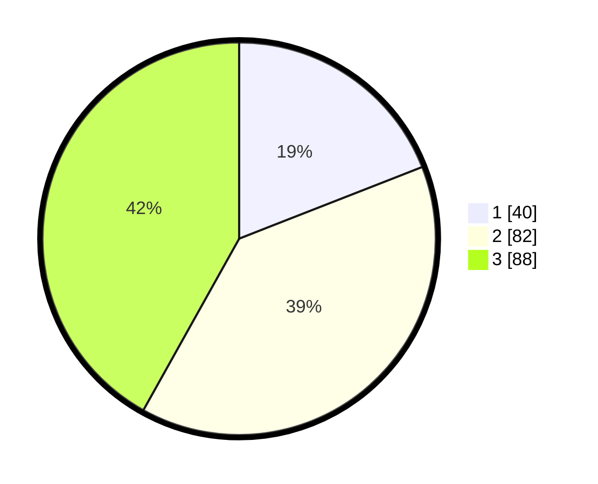

# Hasil

## Grafik

## Tabel

| No. | Nama Paslon    | Suara | Suara (raw) | Persentase |
|:--- |:-------------- | -----:| -----------:| ----------:|
| 1   | ANIES MUHAIMIN | 40    | [40][p-1]   | 19,05      |
| 2   | PRABOWO GIBRAN | 82    | [82][p-2]   | 39,05      |
| 3   | GANJAR MAHFUD  | 88    | [88][p-3]   | 41,90      |

[p-1]: https://github.com/gigit-pemilu/pemilu-2024/blob/main/pilpres/hitung-suara/sub/34-di-yogyakarta/sub/71-kota-yogyakarta/sub/07-wirobrajan/sub/1001-pakuncen/sub/016-tps/sub/paslon-1.txt
[p-2]: https://github.com/gigit-pemilu/pemilu-2024/blob/main/pilpres/hitung-suara/sub/34-di-yogyakarta/sub/71-kota-yogyakarta/sub/07-wirobrajan/sub/1001-pakuncen/sub/016-tps/sub/paslon-2.txt
[p-3]: https://github.com/gigit-pemilu/pemilu-2024/blob/main/pilpres/hitung-suara/sub/34-di-yogyakarta/sub/71-kota-yogyakarta/sub/07-wirobrajan/sub/1001-pakuncen/sub/016-tps/sub/paslon-3.txt

## Foto C Plano

https://sirekap-obj-formc.kpu.go.id/1aa3/pemilu/ppwp/34/71/07/10/01/3471071001016-20240217-065359--f0c09c27-2141-47c4-913b-25c41605c4f8.jpg

https://sirekap-obj-formc.kpu.go.id/1aa3/pemilu/ppwp/34/71/07/10/01/3471071001016-20240217-065400--b26ec718-7bdd-47f8-9f39-ee30a6049648.jpg

https://sirekap-obj-formc.kpu.go.id/1aa3/pemilu/ppwp/34/71/07/10/01/3471071001016-20240217-065400--ae6ea608-c5aa-4a55-936a-8873d46ff1e0.jpg

## Metadata

| Key        | Value               |
| ---------- | ------------------- |
| Time Stamp | 2024-02-17 14:45:18 |

## DATA PEMILIH TETAP

Jumlah pemilih dalam DPT: **253**.
 * L: **119**.
 * P: **134**.

## DATA PENGGUNA HAK PILIH

Jumlah pengguna hak pilih dalam DPT: **208**.
 * L: **96**.
 * P: **112**.

Jumlah pengguna hak pilih dalam DPTb: **16**.
 * L: **9**.
 * P: **7**.

Jumlah pengguna hak pilih dalam DPK: **2**.
 * L: **1**.
 * P: **1**.

Jumlah pengguna hak pilih: **226**.
 * L: **106**.
 * P: **120**.

## JUMLAH SUARA SAH DAN TIDAK SAH

JUMLAH SELURUH SUARA SAH: **210**.

JUMLAH SUARA TIDAK SAH: **16**.

JUMLAH SELURUH SUARA SAH DAN SUARA TIDAK SAH: **226**.

