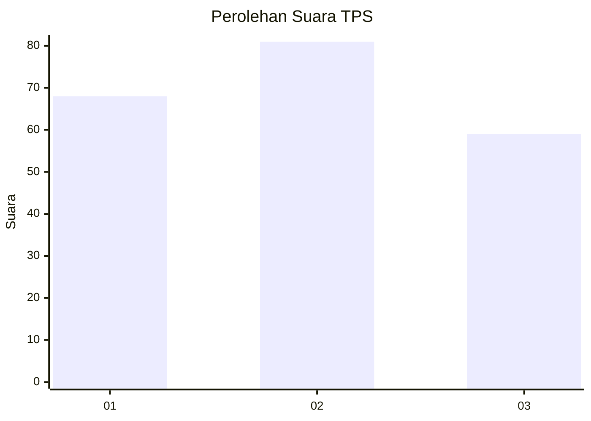
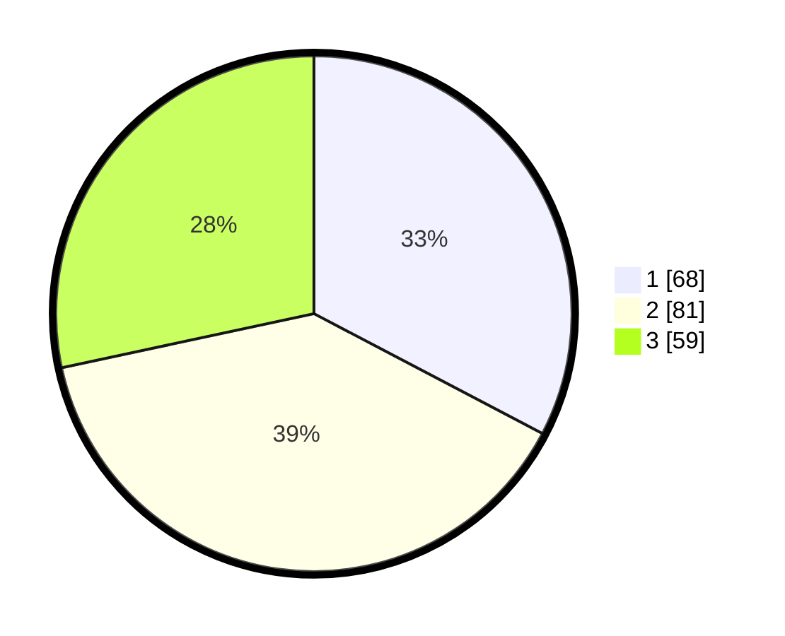

# Hasil

## Grafik

## Tabel

| No. | Nama Paslon    | Suara | Suara (raw) | Persentase |
|:--- |:-------------- | -----:| -----------:| ----------:|
| 1   | ANIES MUHAIMIN | 68    | [68][p-1]   | 32,69      |
| 2   | PRABOWO GIBRAN | 81    | [81][p-2]   | 38,94      |
| 3   | GANJAR MAHFUD  | 59    | [59][p-3]   | 28,37      |

[p-1]: https://github.com/gigit-pemilu/pemilu-2024-34-di-yogyakarta/blob/main/pilpres/hitung-suara/sub/34-di-yogyakarta/sub/71-kota-yogyakarta/sub/07-wirobrajan/sub/1001-pakuncen/sub/020-tps/sub/paslon-1.txt
[p-2]: https://github.com/gigit-pemilu/pemilu-2024-34-di-yogyakarta/blob/main/pilpres/hitung-suara/sub/34-di-yogyakarta/sub/71-kota-yogyakarta/sub/07-wirobrajan/sub/1001-pakuncen/sub/020-tps/sub/paslon-2.txt
[p-3]: https://github.com/gigit-pemilu/pemilu-2024-34-di-yogyakarta/blob/main/pilpres/hitung-suara/sub/34-di-yogyakarta/sub/71-kota-yogyakarta/sub/07-wirobrajan/sub/1001-pakuncen/sub/020-tps/sub/paslon-3.txt

## Foto C Plano

https://sirekap-obj-formc.kpu.go.id/e5a2/pemilu/ppwp/34/71/07/10/01/3471071001020-20240215-022848--180a4edd-7229-4f30-afb9-3f264d1962db.jpg

https://sirekap-obj-formc.kpu.go.id/e5a2/pemilu/ppwp/34/71/07/10/01/3471071001020-20240215-015437--3cbbe027-4d7f-499d-bba7-2eedee391a7b.jpg

https://sirekap-obj-formc.kpu.go.id/e5a2/pemilu/ppwp/34/71/07/10/01/3471071001020-20240215-011845--3486ddd5-00b3-477a-b45e-c0cbaba36291.jpg

## Metadata

| Key        | Value               |
| ---------- | ------------------- |
| Time Stamp | 2024-02-25 12:00:00 |

## DATA PEMILIH TETAP

Jumlah pemilih dalam DPT: **245**.
 * L: **113**.
 * P: **732**.

## DATA PENGGUNA HAK PILIH

Jumlah pengguna hak pilih dalam DPT: **204**.
 * L: **91**.
 * P: **173**.

Jumlah pengguna hak pilih dalam DPTb: **4**.
 * L: **3**.
 * P: **7**.

Jumlah pengguna hak pilih dalam DPK: **3**.
 * L: **1**.
 * P: **2**.

Jumlah pengguna hak pilih: **211**.
 * L: **95**.
 * P: **176**.

## JUMLAH SUARA SAH DAN TIDAK SAH

JUMLAH SELURUH SUARA SAH: **208**.

JUMLAH SUARA TIDAK SAH: **3**.

JUMLAH SELURUH SUARA SAH DAN SUARA TIDAK SAH: **211**.

