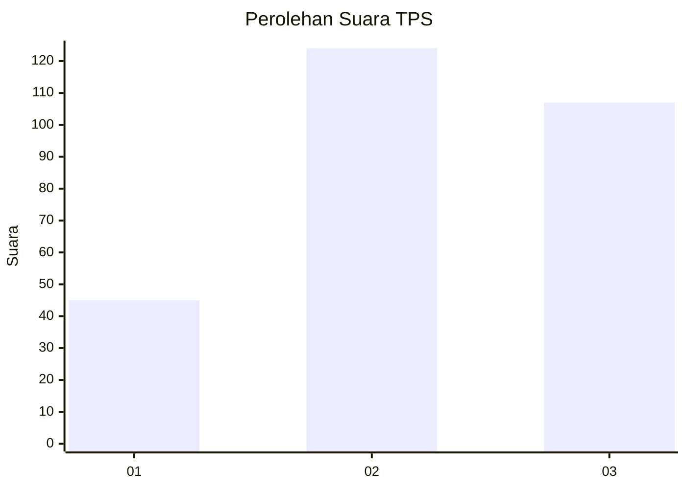
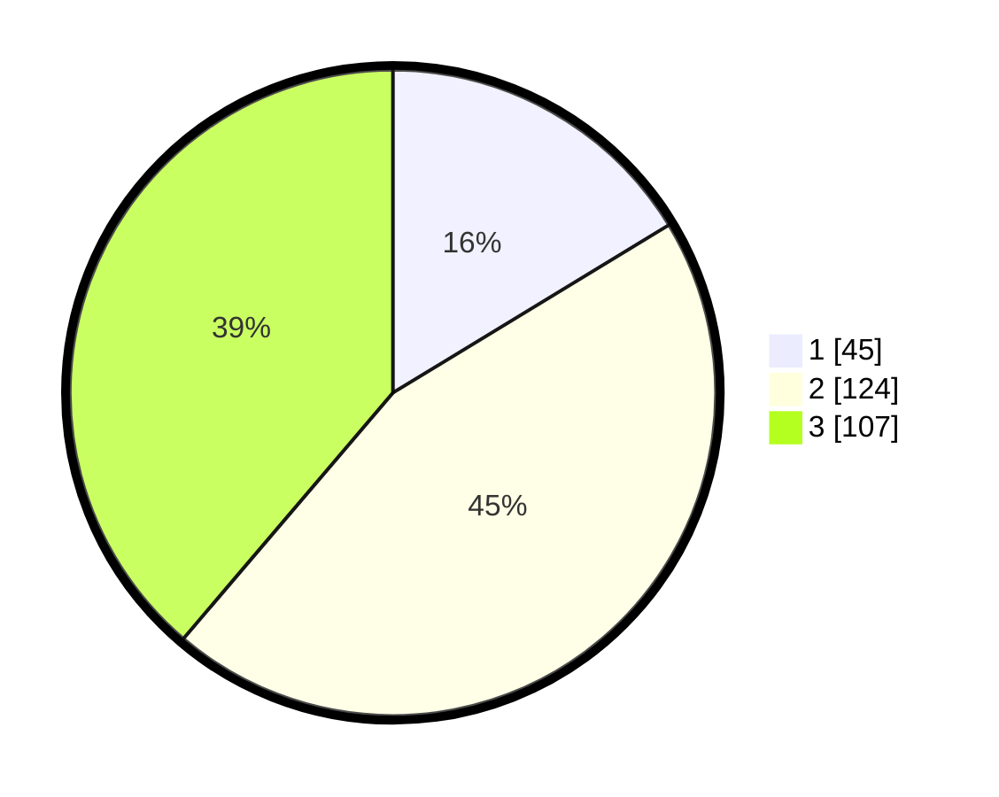

# Hasil

## Grafik

## Tabel

| No. | Nama Paslon    | Suara | Suara (raw) | Persentase |
|:--- |:-------------- | -----:| -----------:| ----------:|
| 1   | ANIES MUHAIMIN | 45    | [45][p-1]   | 16,30      |
| 2   | PRABOWO GIBRAN | 124   | [124][p-2]  | 44,93      |
| 3   | GANJAR MAHFUD  | 107   | [107][p-3]  | 38,77      |

[p-1]: https://github.com/gigit-pemilu/pemilu-2024-34-di-yogyakarta/blob/main/pilpres/hitung-suara/sub/34-di-yogyakarta/sub/71-kota-yogyakarta/sub/07-wirobrajan/sub/1001-pakuncen/sub/031-tps/sub/paslon-1.txt
[p-2]: https://github.com/gigit-pemilu/pemilu-2024-34-di-yogyakarta/blob/main/pilpres/hitung-suara/sub/34-di-yogyakarta/sub/71-kota-yogyakarta/sub/07-wirobrajan/sub/1001-pakuncen/sub/031-tps/sub/paslon-2.txt
[p-3]: https://github.com/gigit-pemilu/pemilu-2024-34-di-yogyakarta/blob/main/pilpres/hitung-suara/sub/34-di-yogyakarta/sub/71-kota-yogyakarta/sub/07-wirobrajan/sub/1001-pakuncen/sub/031-tps/sub/paslon-3.txt

## Foto C Plano

https://sirekap-obj-formc.kpu.go.id/6301/pemilu/ppwp/34/71/07/10/01/3471071001031-20240214-193036--a32474ea-fe93-47b8-940f-326541aefec6.jpg

https://sirekap-obj-formc.kpu.go.id/6301/pemilu/ppwp/34/71/07/10/01/3471071001031-20240214-193124--e6c6b3ac-12d4-4571-995a-7cacd3fb3880.jpg

https://sirekap-obj-formc.kpu.go.id/6301/pemilu/ppwp/34/71/07/10/01/3471071001031-20240214-193223--50f1d52b-32d9-46fd-a83a-160f929d6761.jpg

## Metadata

| Key        | Value               |
| ---------- | ------------------- |
| Time Stamp | 2024-02-17 14:45:18 |

## DATA PEMILIH TETAP

Jumlah pemilih dalam DPT: **296**.
 * L: **145**.
 * P: **151**.

## DATA PENGGUNA HAK PILIH

Jumlah pengguna hak pilih dalam DPT: **267**.
 * L: **129**.
 * P: **132**.

Jumlah pengguna hak pilih dalam DPTb: **7**.
 * L: **6**.
 * P: **7**.

Jumlah pengguna hak pilih dalam DPK: **6**.
 * L: **0**.
 * P: **76**.

Jumlah pengguna hak pilih: **280**.
 * L: **135**.
 * P: **145**.

## JUMLAH SUARA SAH DAN TIDAK SAH

JUMLAH SELURUH SUARA SAH: **276**.

JUMLAH SUARA TIDAK SAH: **4**.

JUMLAH SELURUH SUARA SAH DAN SUARA TIDAK SAH: **280**.

