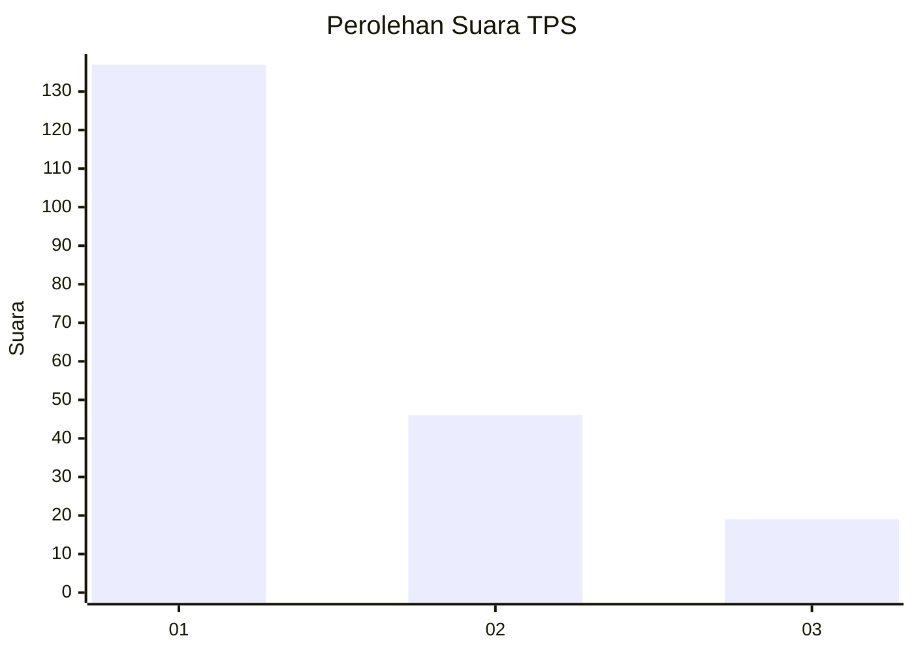
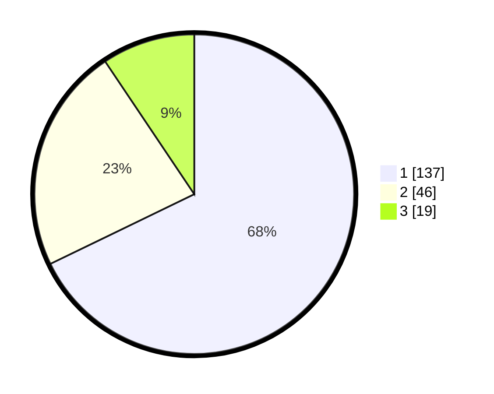

# Hasil

## Grafik

## Tabel

| No. | Nama Paslon    | Suara | Suara (raw) | Persentase |
|:--- |:-------------- | -----:| -----------:| ----------:|
| 1   | ANIES MUHAIMIN | 137   | [137][p-1]  | 67,82      |
| 2   | PRABOWO GIBRAN | 46    | [46][p-2]   | 22,77      |
| 3   | GANJAR MAHFUD  | 19    | [19][p-3]   | 9,41       |

[p-1]: https://github.com/gigit-pemilu/pemilu-2024-34-di-yogyakarta/blob/main/pilpres/hitung-suara/sub/34-di-yogyakarta/sub/71-kota-yogyakarta/sub/07-wirobrajan/sub/1002-wirobrajan/sub/901-tps/sub/paslon-1.txt
[p-2]: https://github.com/gigit-pemilu/pemilu-2024-34-di-yogyakarta/blob/main/pilpres/hitung-suara/sub/34-di-yogyakarta/sub/71-kota-yogyakarta/sub/07-wirobrajan/sub/1002-wirobrajan/sub/901-tps/sub/paslon-2.txt
[p-3]: https://github.com/gigit-pemilu/pemilu-2024-34-di-yogyakarta/blob/main/pilpres/hitung-suara/sub/34-di-yogyakarta/sub/71-kota-yogyakarta/sub/07-wirobrajan/sub/1002-wirobrajan/sub/901-tps/sub/paslon-3.txt

## Foto C Plano

https://sirekap-obj-formc.kpu.go.id/92ab/pemilu/ppwp/34/71/07/10/02/3471071002901-20240214-155110--d7651643-df58-452e-ae34-21cf810c1d5b.jpg

https://sirekap-obj-formc.kpu.go.id/92ab/pemilu/ppwp/34/71/07/10/02/3471071002901-20240214-155015--d1d2684c-a4c0-43c3-9b36-7bce1ad1880f.jpg

https://sirekap-obj-formc.kpu.go.id/92ab/pemilu/ppwp/34/71/07/10/02/3471071002901-20240214-155058--26459201-feb6-43a5-a95c-faf9dc3cd85a.jpg

## Metadata

| Key        | Value               |
| ---------- | ------------------- |
| Time Stamp | 2024-02-16 16:25:10 |

## DATA PEMILIH TETAP

Jumlah pemilih dalam DPT: **217**.
 * L: **217**.
 * P: **0**.

## DATA PENGGUNA HAK PILIH

Jumlah pengguna hak pilih dalam DPT: **193**.
 * L: **193**.
 * P: **0**.

Jumlah pengguna hak pilih dalam DPTb: **11**.
 * L: **10**.
 * P: **1**.

Jumlah pengguna hak pilih dalam DPK: **0**.
 * L: **0**.
 * P: **0**.

Jumlah pengguna hak pilih: **204**.
 * L: **203**.
 * P: **1**.

## JUMLAH SUARA SAH DAN TIDAK SAH

JUMLAH SELURUH SUARA SAH: **202**.

JUMLAH SUARA TIDAK SAH: **2**.

JUMLAH SELURUH SUARA SAH DAN SUARA TIDAK SAH: **204**.

