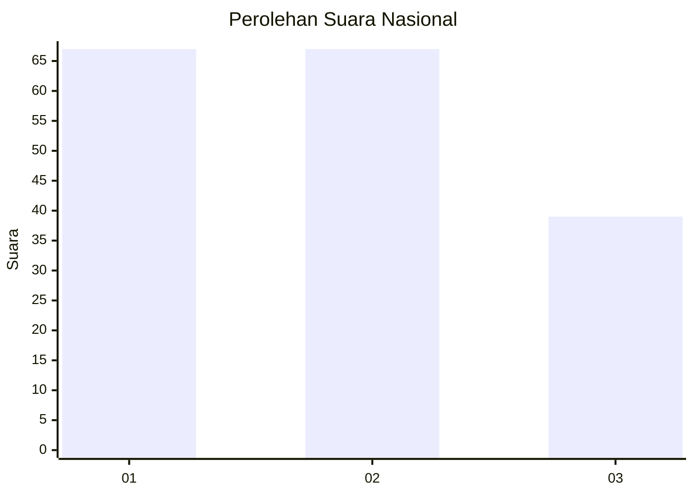
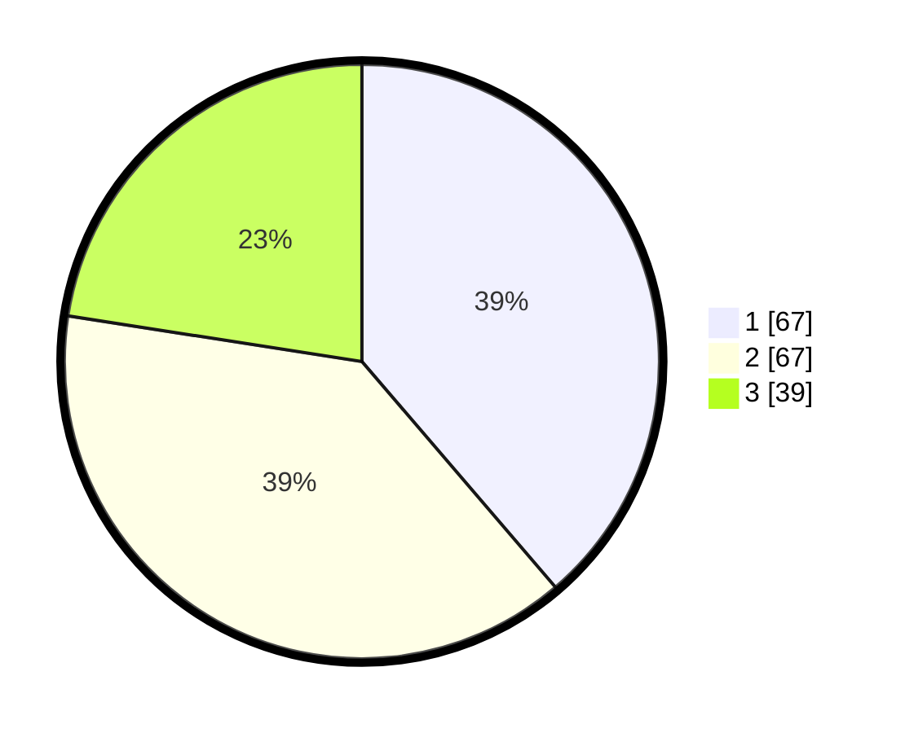

# Hasil

## Grafik

## Tabel

| No. | Nama Paslon    | Suara | Suara (raw) | Persentase |
|:--- |:-------------- | -----:| -----------:| ----------:|
| 1   | ANIES MUHAIMIN | 67    | [67][p-1]   | 38,73      |
| 2   | PRABOWO GIBRAN | 67    | [67][p-2]   | 38,73      |
| 3   | GANJAR MAHFUD  | 39    | [39][p-3]   | 22,54      |

[p-1]: https://github.com/gigit-pemilu/pemilu-2024/blob/main/pilpres/hitung-suara/sub/34-di-yogyakarta/sub/71-kota-yogyakarta/sub/07-wirobrajan/sub/1003-patangpuluhan/sub/002-tps/sub/paslon-1.txt
[p-2]: https://github.com/gigit-pemilu/pemilu-2024/blob/main/pilpres/hitung-suara/sub/34-di-yogyakarta/sub/71-kota-yogyakarta/sub/07-wirobrajan/sub/1003-patangpuluhan/sub/002-tps/sub/paslon-2.txt
[p-3]: https://github.com/gigit-pemilu/pemilu-2024/blob/main/pilpres/hitung-suara/sub/34-di-yogyakarta/sub/71-kota-yogyakarta/sub/07-wirobrajan/sub/1003-patangpuluhan/sub/002-tps/sub/paslon-3.txt

## Foto C Plano

https://sirekap-obj-formc.kpu.go.id/5227/pemilu/ppwp/34/71/07/10/03/3471071003002-20240214-184805--d77e668d-f8a1-4c16-b4cb-3bfa28bfc7f5.jpg

https://sirekap-obj-formc.kpu.go.id/5227/pemilu/ppwp/34/71/07/10/03/3471071003002-20240214-194800--4fa512aa-08d6-4b88-9077-f77020e5fe21.jpg

https://sirekap-obj-formc.kpu.go.id/5227/pemilu/ppwp/34/71/07/10/03/3471071003002-20240214-202552--5aadc932-33a5-44e6-aeab-8bf84a400a1c.jpg

## Metadata

| Key        | Value               |
| ---------- | ------------------- |
| Time Stamp | 2024-02-24 22:31:28 |

