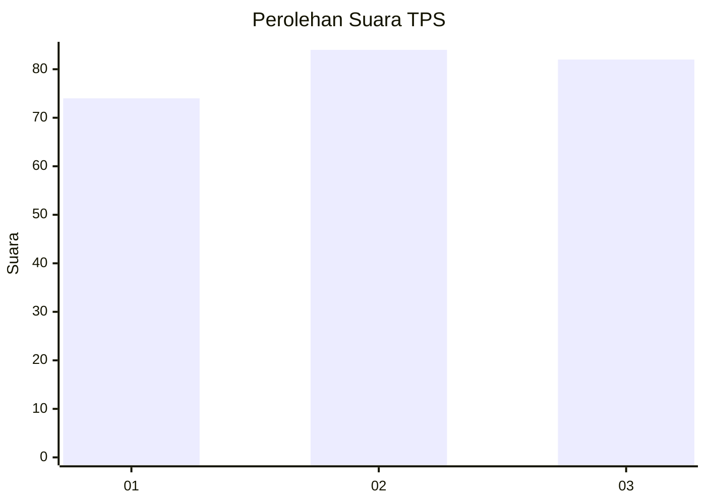
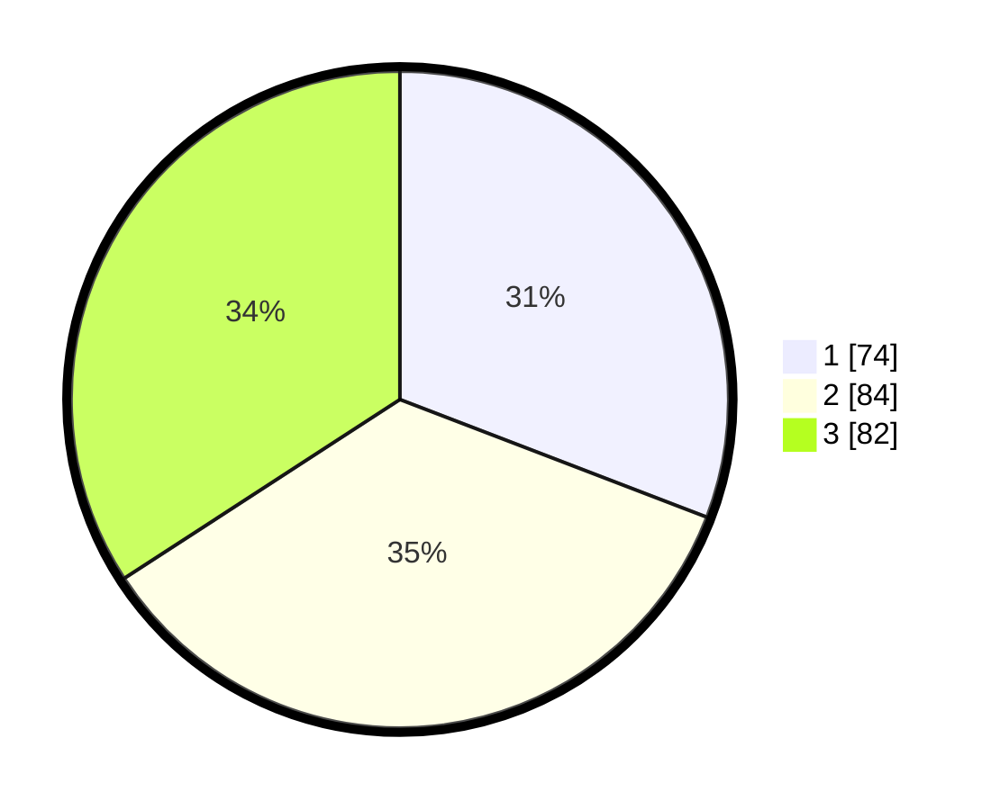

# Hasil

## Grafik

## Tabel

| No. | Nama Paslon    | Suara | Suara (raw) | Persentase |
|:--- |:-------------- | -----:| -----------:| ----------:|
| 1   | ANIES MUHAIMIN | 74    | [74][p-1]   | 30,83      |
| 2   | PRABOWO GIBRAN | 84    | [84][p-2]   | 35,00      |
| 3   | GANJAR MAHFUD  | 82    | [82][p-3]   | 34,17      |

[p-1]: https://github.com/gigit-pemilu/pemilu-2024-34-di-yogyakarta/blob/main/pilpres/hitung-suara/sub/34-di-yogyakarta/sub/71-kota-yogyakarta/sub/07-wirobrajan/sub/1003-patangpuluhan/sub/010-tps/sub/paslon-1.txt
[p-2]: https://github.com/gigit-pemilu/pemilu-2024-34-di-yogyakarta/blob/main/pilpres/hitung-suara/sub/34-di-yogyakarta/sub/71-kota-yogyakarta/sub/07-wirobrajan/sub/1003-patangpuluhan/sub/010-tps/sub/paslon-2.txt
[p-3]: https://github.com/gigit-pemilu/pemilu-2024-34-di-yogyakarta/blob/main/pilpres/hitung-suara/sub/34-di-yogyakarta/sub/71-kota-yogyakarta/sub/07-wirobrajan/sub/1003-patangpuluhan/sub/010-tps/sub/paslon-3.txt

## Foto C Plano

https://sirekap-obj-formc.kpu.go.id/1625/pemilu/ppwp/34/71/07/10/03/3471071003010-20240218-145748--7e8f0b17-12e4-4151-8921-ca08accef87d.jpg

https://sirekap-obj-formc.kpu.go.id/1625/pemilu/ppwp/34/71/07/10/03/3471071003010-20240214-225611--f3011205-c4e7-4101-86bd-b10b31bef2cb.jpg

https://sirekap-obj-formc.kpu.go.id/1625/pemilu/ppwp/34/71/07/10/03/3471071003010-20240218-145843--e4628f2e-9df8-42e2-85cd-1cfc33031254.jpg

## Metadata

| Key        | Value               |
| ---------- | ------------------- |
| Time Stamp | 2024-02-25 15:00:00 |

