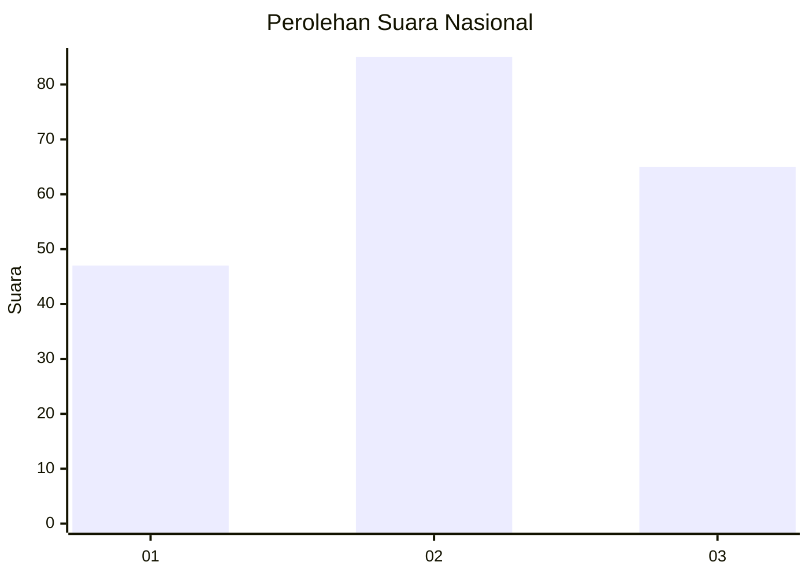
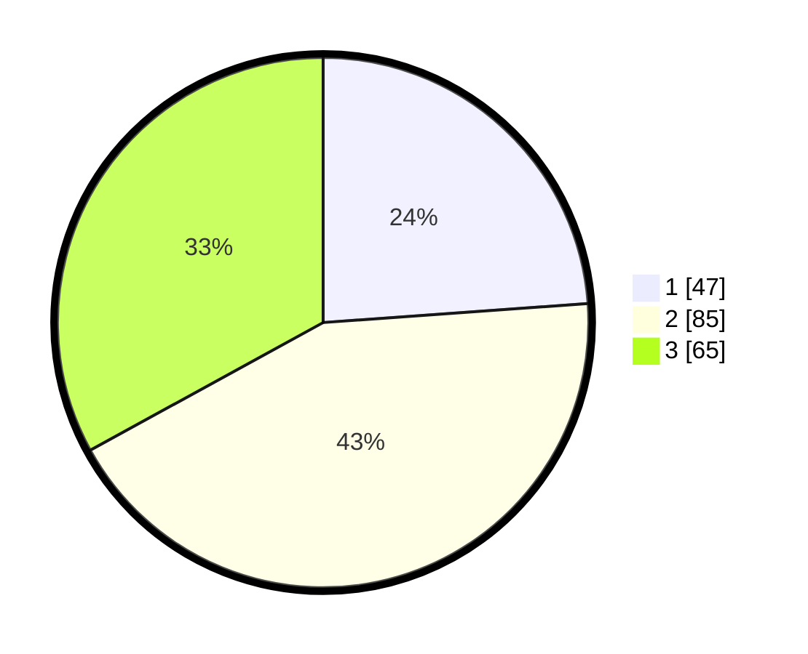

# Hasil

## Grafik

## Tabel

| No. | Nama Paslon    | Suara | Suara (raw) | Persentase |
|:--- |:-------------- | -----:| -----------:| ----------:|
| 1   | ANIES MUHAIMIN | 47    | [47][p-1]   | 23,86      |
| 2   | PRABOWO GIBRAN | 85    | [85][p-2]   | 43,15      |
| 3   | GANJAR MAHFUD  | 65    | [65][p-3]   | 32,99      |

[p-1]: https://github.com/gigit-pemilu/pemilu-2024/blob/main/pilpres/hitung-suara/sub/34-di-yogyakarta/sub/71-kota-yogyakarta/sub/07-wirobrajan/sub/1003-patangpuluhan/sub/012-tps/sub/paslon-1.txt
[p-2]: https://github.com/gigit-pemilu/pemilu-2024/blob/main/pilpres/hitung-suara/sub/34-di-yogyakarta/sub/71-kota-yogyakarta/sub/07-wirobrajan/sub/1003-patangpuluhan/sub/012-tps/sub/paslon-2.txt
[p-3]: https://github.com/gigit-pemilu/pemilu-2024/blob/main/pilpres/hitung-suara/sub/34-di-yogyakarta/sub/71-kota-yogyakarta/sub/07-wirobrajan/sub/1003-patangpuluhan/sub/012-tps/sub/paslon-3.txt

## Foto C Plano

https://sirekap-obj-formc.kpu.go.id/be23/pemilu/ppwp/34/71/07/10/03/3471071003012-20240218-201508--a6fbbae7-6594-40ed-88eb-9fe35681626b.jpg

https://sirekap-obj-formc.kpu.go.id/be23/pemilu/ppwp/34/71/07/10/03/3471071003012-20240218-112117--275f8219-8cde-4f1c-a045-a45152579332.jpg

https://sirekap-obj-formc.kpu.go.id/be23/pemilu/ppwp/34/71/07/10/03/3471071003012-20240218-112233--116d7e69-ecf8-4b7a-85f3-4ea22055df87.jpg

## Metadata

| Key        | Value               |
| ---------- | ------------------- |
| Time Stamp | 2024-02-21 17:00:00 |

