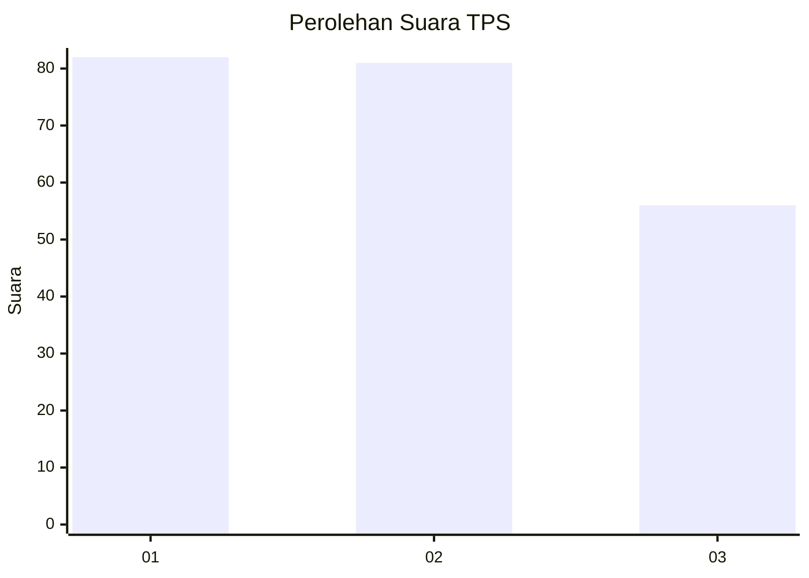
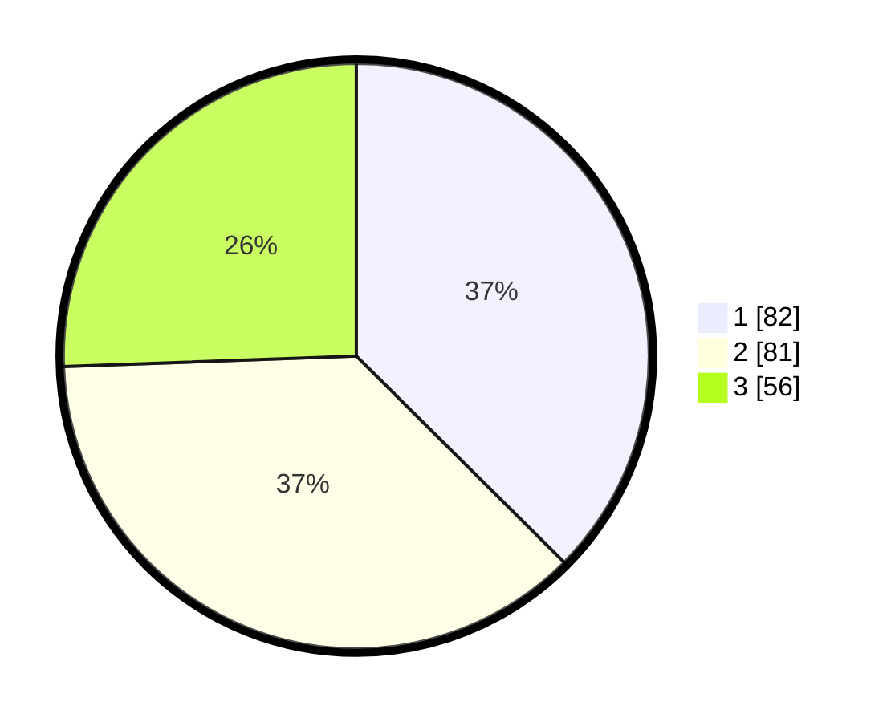

# Hasil

## Grafik

## Tabel

| No. | Nama Paslon    | Suara | Suara (raw) | Persentase |
|:--- |:-------------- | -----:| -----------:| ----------:|
| 1   | ANIES MUHAIMIN | 82    | [82][p-1]   | 37,44      |
| 2   | PRABOWO GIBRAN | 81    | [81][p-2]   | 36,99      |
| 3   | GANJAR MAHFUD  | 56    | [56][p-3]   | 25,57      |

[p-1]: https://github.com/gigit-pemilu/pemilu-2024-34-di-yogyakarta/blob/main/pilpres/hitung-suara/sub/34-di-yogyakarta/sub/71-kota-yogyakarta/sub/07-wirobrajan/sub/1003-patangpuluhan/sub/013-tps/sub/paslon-1.txt
[p-2]: https://github.com/gigit-pemilu/pemilu-2024-34-di-yogyakarta/blob/main/pilpres/hitung-suara/sub/34-di-yogyakarta/sub/71-kota-yogyakarta/sub/07-wirobrajan/sub/1003-patangpuluhan/sub/013-tps/sub/paslon-2.txt
[p-3]: https://github.com/gigit-pemilu/pemilu-2024-34-di-yogyakarta/blob/main/pilpres/hitung-suara/sub/34-di-yogyakarta/sub/71-kota-yogyakarta/sub/07-wirobrajan/sub/1003-patangpuluhan/sub/013-tps/sub/paslon-3.txt

## Foto C Plano

https://sirekap-obj-formc.kpu.go.id/dfda/pemilu/ppwp/34/71/07/10/03/3471071003013-20240214-231301--360e7442-a05d-463c-ac76-7d6330203ebe.jpg

https://sirekap-obj-formc.kpu.go.id/dfda/pemilu/ppwp/34/71/07/10/03/3471071003013-20240214-215949--c92e1cba-27ba-4b96-83a4-5cf9faa26a07.jpg

https://sirekap-obj-formc.kpu.go.id/dfda/pemilu/ppwp/34/71/07/10/03/3471071003013-20240214-205324--98e4181d-847a-4fe6-9605-c2de5952cdd1.jpg

## Metadata

| Key        | Value               |
| ---------- | ------------------- |
| Time Stamp | 2024-02-24 22:31:28 |

