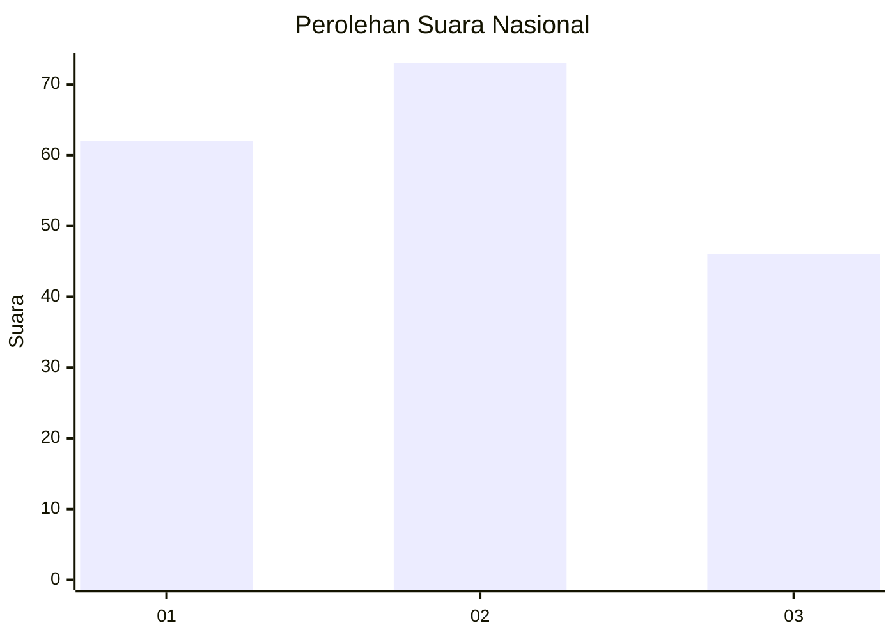
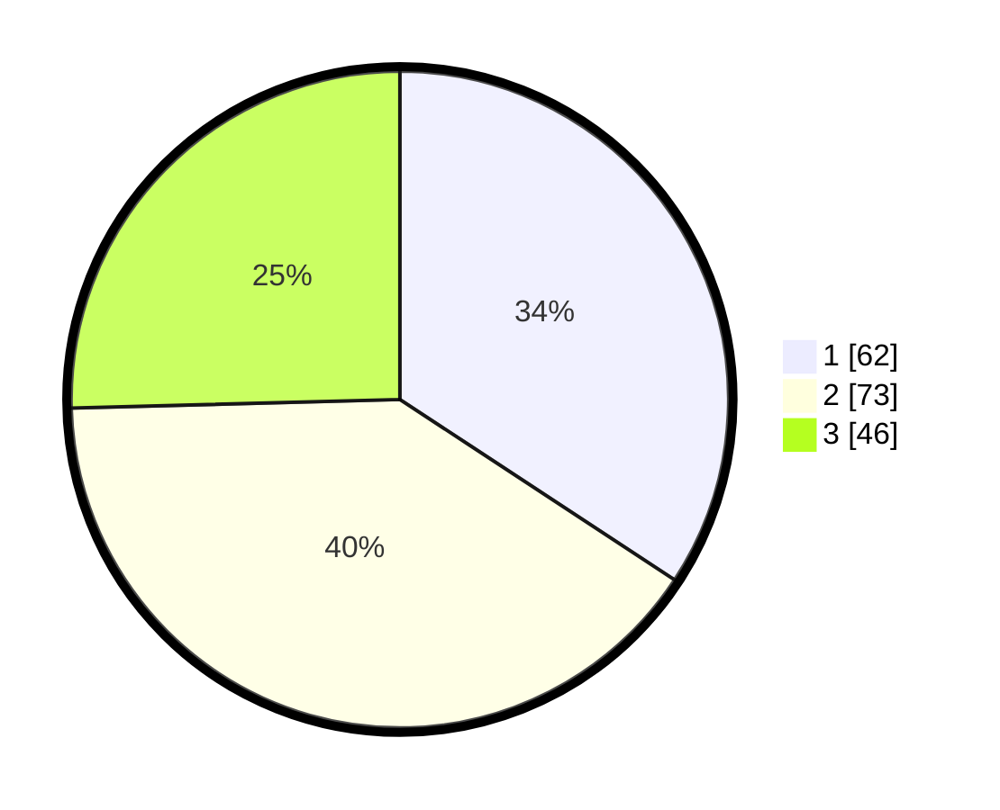

# Hasil

## Grafik

## Tabel

| No. | Nama Paslon    | Suara | Suara (raw) | Persentase |
|:--- |:-------------- | -----:| -----------:| ----------:|
| 1   | ANIES MUHAIMIN | 62    | [62][p-1]   | 34,25      |
| 2   | PRABOWO GIBRAN | 73    | [73][p-2]   | 40,33      |
| 3   | GANJAR MAHFUD  | 46    | [46][p-3]   | 25,41      |

[p-1]: https://github.com/gigit-pemilu/pemilu-2024/blob/main/pilpres/hitung-suara/sub/34-di-yogyakarta/sub/71-kota-yogyakarta/sub/07-wirobrajan/sub/1003-patangpuluhan/sub/014-tps/sub/paslon-1.txt
[p-2]: https://github.com/gigit-pemilu/pemilu-2024/blob/main/pilpres/hitung-suara/sub/34-di-yogyakarta/sub/71-kota-yogyakarta/sub/07-wirobrajan/sub/1003-patangpuluhan/sub/014-tps/sub/paslon-2.txt
[p-3]: https://github.com/gigit-pemilu/pemilu-2024/blob/main/pilpres/hitung-suara/sub/34-di-yogyakarta/sub/71-kota-yogyakarta/sub/07-wirobrajan/sub/1003-patangpuluhan/sub/014-tps/sub/paslon-3.txt

## Foto C Plano

https://sirekap-obj-formc.kpu.go.id/7477/pemilu/ppwp/34/71/07/10/03/3471071003014-20240219-090202--0baae51b-7a9b-463c-bc84-09bdaf7149f4.jpg

https://sirekap-obj-formc.kpu.go.id/7477/pemilu/ppwp/34/71/07/10/03/3471071003014-20240219-085931--158afe50-6dc6-4fdf-941c-43dfb1c11ded.jpg

https://sirekap-obj-formc.kpu.go.id/7477/pemilu/ppwp/34/71/07/10/03/3471071003014-20240214-231046--41a1ad43-9cfa-416b-b5e7-bdff18d5e1c9.jpg

## Metadata

| Key        | Value               |
| ---------- | ------------------- |
| Time Stamp | 2024-02-24 22:31:28 |

