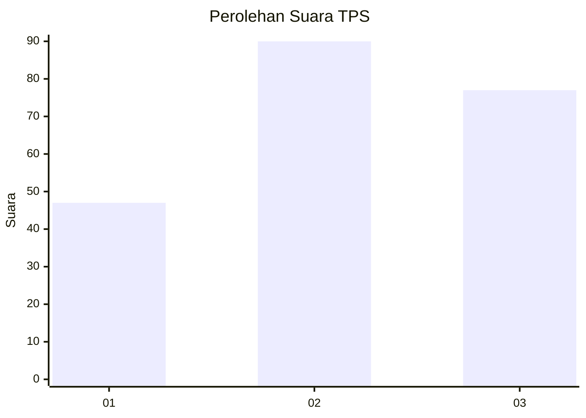
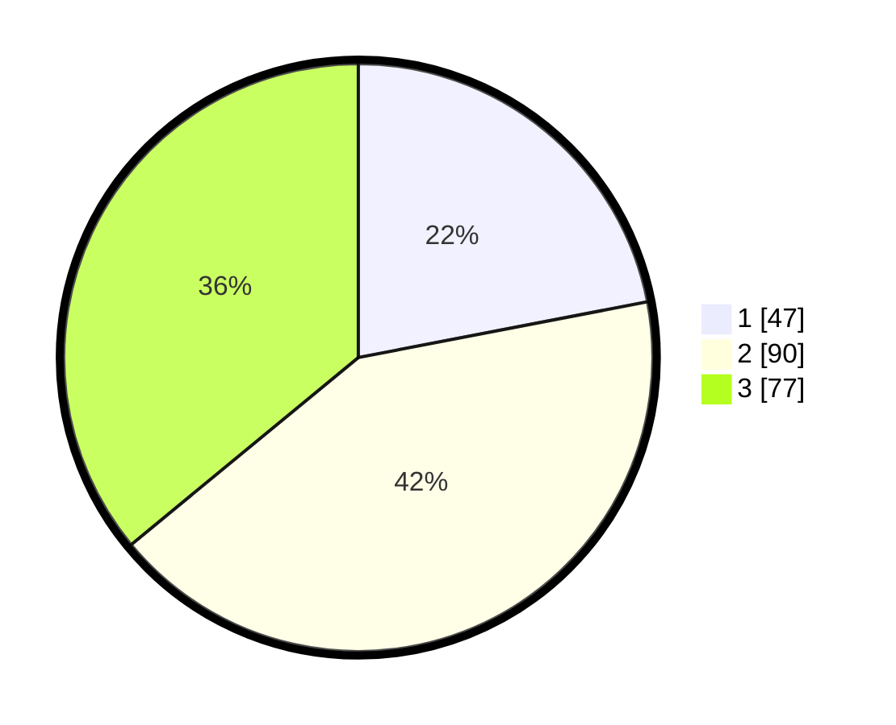

# Hasil

## Grafik

## Tabel

| No. | Nama Paslon    | Suara | Suara (raw) | Persentase |
|:--- |:-------------- | -----:| -----------:| ----------:|
| 1   | ANIES MUHAIMIN | 47    | [47][p-1]   | 21,96      |
| 2   | PRABOWO GIBRAN | 90    | [90][p-2]   | 42,06      |
| 3   | GANJAR MAHFUD  | 77    | [77][p-3]   | 35,98      |

[p-1]: https://github.com/gigit-pemilu/pemilu-2024-34-di-yogyakarta/blob/main/pilpres/hitung-suara/sub/34-di-yogyakarta/sub/71-kota-yogyakarta/sub/07-wirobrajan/sub/1003-patangpuluhan/sub/020-tps/sub/paslon-1.txt
[p-2]: https://github.com/gigit-pemilu/pemilu-2024-34-di-yogyakarta/blob/main/pilpres/hitung-suara/sub/34-di-yogyakarta/sub/71-kota-yogyakarta/sub/07-wirobrajan/sub/1003-patangpuluhan/sub/020-tps/sub/paslon-2.txt
[p-3]: https://github.com/gigit-pemilu/pemilu-2024-34-di-yogyakarta/blob/main/pilpres/hitung-suara/sub/34-di-yogyakarta/sub/71-kota-yogyakarta/sub/07-wirobrajan/sub/1003-patangpuluhan/sub/020-tps/sub/paslon-3.txt

## Foto C Plano

https://sirekap-obj-formc.kpu.go.id/561b/pemilu/ppwp/34/71/07/10/03/3471071003020-20240215-051915--2186cee5-ac6a-4efc-966e-3ccf78db321c.jpg

https://sirekap-obj-formc.kpu.go.id/561b/pemilu/ppwp/34/71/07/10/03/3471071003020-20240215-052028--67bc894b-5aa0-4c93-b5ec-59ec28dcdf32.jpg

https://sirekap-obj-formc.kpu.go.id/561b/pemilu/ppwp/34/71/07/10/03/3471071003020-20240215-052126--595cf7c4-9b07-4899-9a9f-afff6d539d3e.jpg

## Metadata

| Key        | Value               |
| ---------- | ------------------- |
| Time Stamp | 2024-02-19 06:16:00 |

