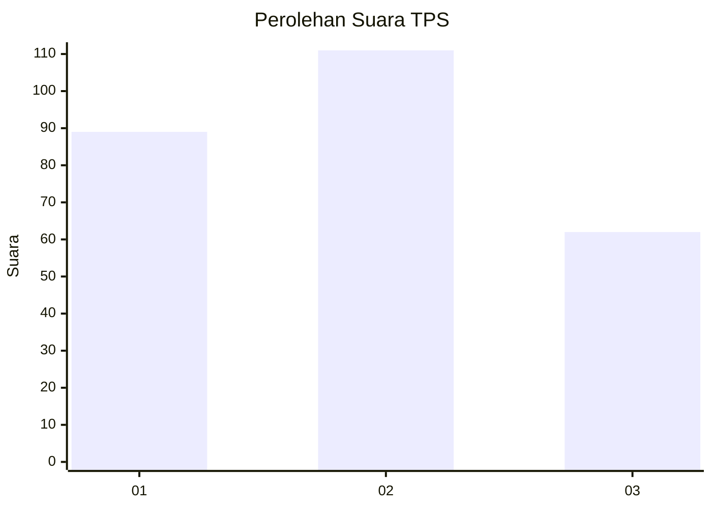
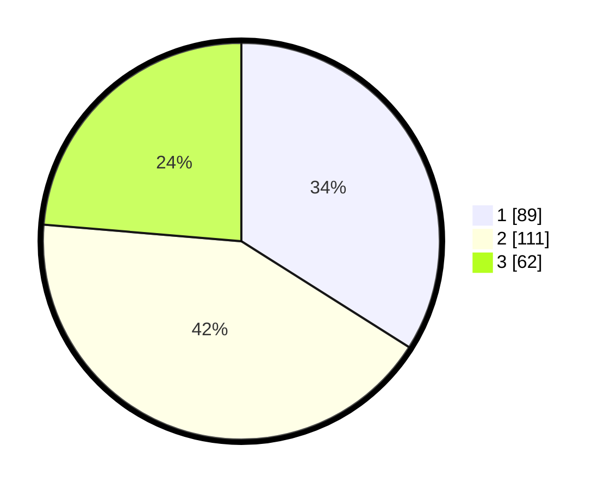

# Hasil

## Grafik

## Tabel

| No. | Nama Paslon    | Suara | Suara (raw) | Persentase |
|:--- |:-------------- | -----:| -----------:| ----------:|
| 1   | ANIES MUHAIMIN | 89    | [89][p-1]   | 33,97      |
| 2   | PRABOWO GIBRAN | 111   | [111][p-2]  | 42,37      |
| 3   | GANJAR MAHFUD  | 62    | [62][p-3]   | 23,66      |

[p-1]: https://github.com/gigit-pemilu/pemilu-2024-34-di-yogyakarta/blob/main/pilpres/hitung-suara/sub/34-di-yogyakarta/sub/71-kota-yogyakarta/sub/07-wirobrajan/sub/1003-patangpuluhan/sub/021-tps/sub/paslon-1.txt
[p-2]: https://github.com/gigit-pemilu/pemilu-2024-34-di-yogyakarta/blob/main/pilpres/hitung-suara/sub/34-di-yogyakarta/sub/71-kota-yogyakarta/sub/07-wirobrajan/sub/1003-patangpuluhan/sub/021-tps/sub/paslon-2.txt
[p-3]: https://github.com/gigit-pemilu/pemilu-2024-34-di-yogyakarta/blob/main/pilpres/hitung-suara/sub/34-di-yogyakarta/sub/71-kota-yogyakarta/sub/07-wirobrajan/sub/1003-patangpuluhan/sub/021-tps/sub/paslon-3.txt

## Foto C Plano

https://sirekap-obj-formc.kpu.go.id/fcba/pemilu/ppwp/34/71/07/10/03/3471071003021-20240220-135957--95f4d624-e6ac-466b-b197-dd88efa1b51c.jpg

https://sirekap-obj-formc.kpu.go.id/fcba/pemilu/ppwp/34/71/07/10/03/3471071003021-20240220-140100--0deb52e6-6a42-4af5-9efa-81a77e771e44.jpg

https://sirekap-obj-formc.kpu.go.id/fcba/pemilu/ppwp/34/71/07/10/03/3471071003021-20240220-140032--5459e1da-6f61-4386-8da7-15bf3d3197bd.jpg

## Metadata

| Key        | Value               |
| ---------- | ------------------- |
| Time Stamp | 2024-02-24 22:31:28 |

