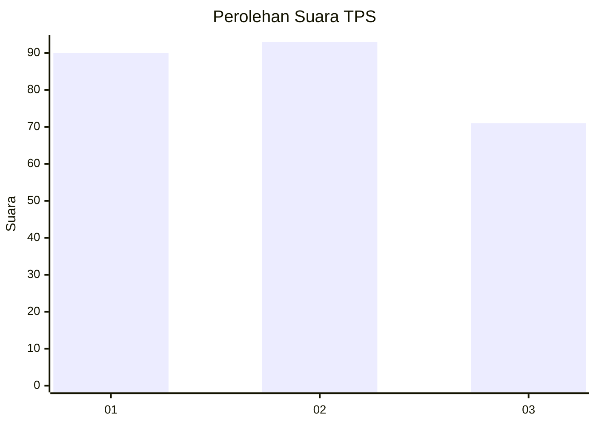
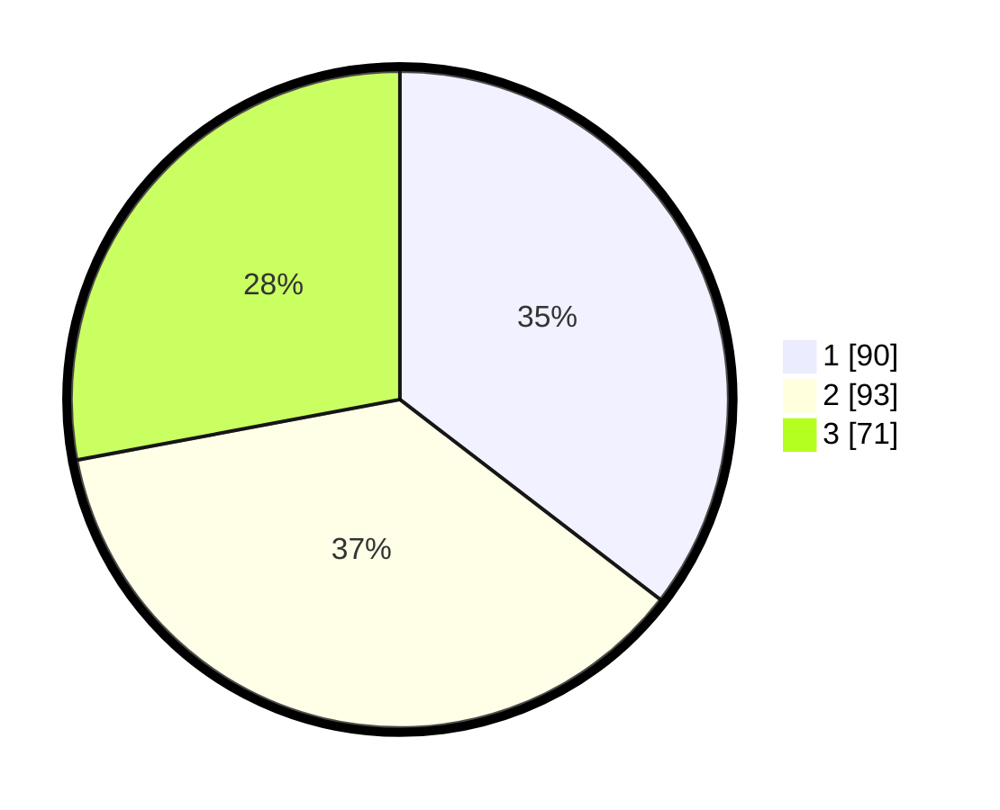

# Hasil

## Grafik

## Tabel

| No. | Nama Paslon    | Suara | Suara (raw) | Persentase |
|:--- |:-------------- | -----:| -----------:| ----------:|
| 1   | ANIES MUHAIMIN | 90    | [90][p-1]   | 35,43      |
| 2   | PRABOWO GIBRAN | 93    | [93][p-2]   | 36,61      |
| 3   | GANJAR MAHFUD  | 71    | [71][p-3]   | 27,95      |

[p-1]: https://github.com/gigit-pemilu/pemilu-2024-34-di-yogyakarta/blob/main/pilpres/hitung-suara/sub/34-di-yogyakarta/sub/71-kota-yogyakarta/sub/07-wirobrajan/sub/1003-patangpuluhan/sub/022-tps/sub/paslon-1.txt
[p-2]: https://github.com/gigit-pemilu/pemilu-2024-34-di-yogyakarta/blob/main/pilpres/hitung-suara/sub/34-di-yogyakarta/sub/71-kota-yogyakarta/sub/07-wirobrajan/sub/1003-patangpuluhan/sub/022-tps/sub/paslon-2.txt
[p-3]: https://github.com/gigit-pemilu/pemilu-2024-34-di-yogyakarta/blob/main/pilpres/hitung-suara/sub/34-di-yogyakarta/sub/71-kota-yogyakarta/sub/07-wirobrajan/sub/1003-patangpuluhan/sub/022-tps/sub/paslon-3.txt

## Foto C Plano

https://sirekap-obj-formc.kpu.go.id/b315/pemilu/ppwp/34/71/07/10/03/3471071003022-20240215-042626--8f995a07-b9b2-457b-a9ee-ff75c13e0cd8.jpg

https://sirekap-obj-formc.kpu.go.id/b315/pemilu/ppwp/34/71/07/10/03/3471071003022-20240215-042723--50004e40-f353-441f-953f-695d3074cf8e.jpg

https://sirekap-obj-formc.kpu.go.id/b315/pemilu/ppwp/34/71/07/10/03/3471071003022-20240215-042807--7abe6ad8-6cbe-4008-9c8d-3bcb44f05753.jpg

## Metadata

| Key        | Value               |
| ---------- | ------------------- |
| Time Stamp | 2024-02-24 22:31:28 |

