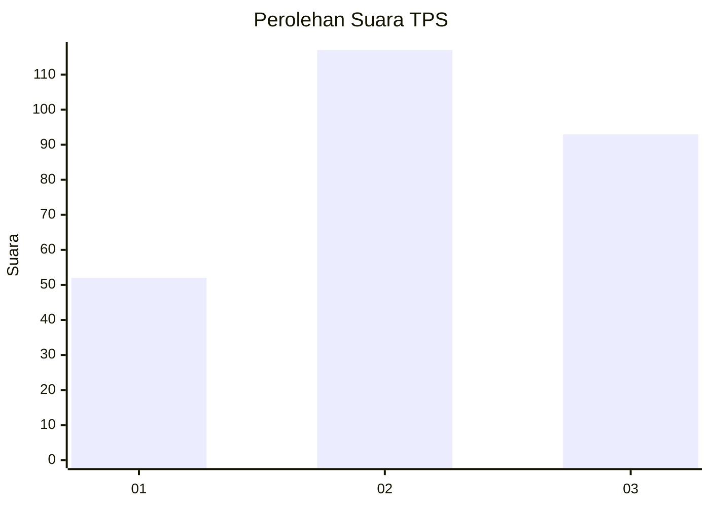
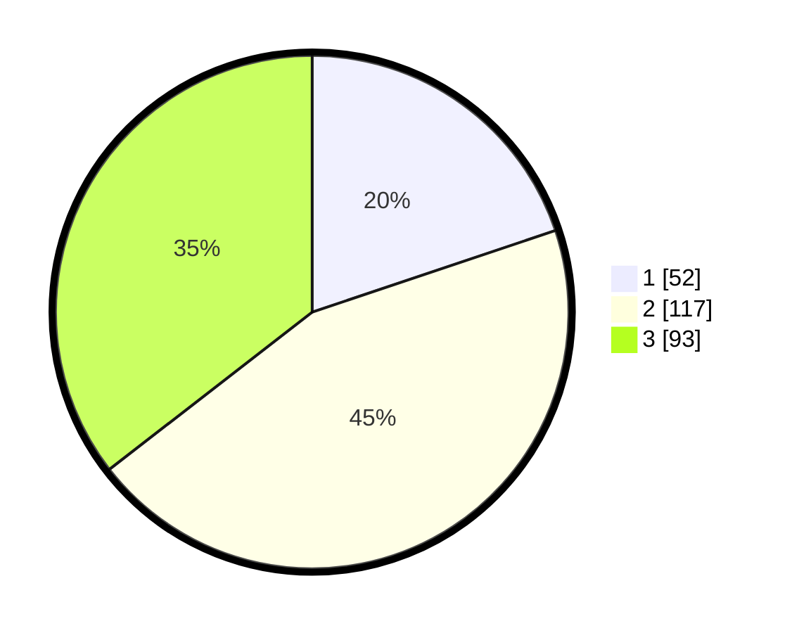

# Hasil

## Grafik

## Tabel

| No. | Nama Paslon    | Suara | Suara (raw) | Persentase |
|:--- |:-------------- | -----:| -----------:| ----------:|
| 1   | ANIES MUHAIMIN | 52    | [52][p-1]   | 19,85      |
| 2   | PRABOWO GIBRAN | 117   | [117][p-2]  | 44,66      |
| 3   | GANJAR MAHFUD  | 93    | [93][p-3]   | 35,50      |

[p-1]: https://github.com/gigit-pemilu/pemilu-2024-34-di-yogyakarta/blob/main/pilpres/hitung-suara/sub/34-di-yogyakarta/sub/71-kota-yogyakarta/sub/07-wirobrajan/sub/1003-patangpuluhan/sub/023-tps/sub/paslon-1.txt
[p-2]: https://github.com/gigit-pemilu/pemilu-2024-34-di-yogyakarta/blob/main/pilpres/hitung-suara/sub/34-di-yogyakarta/sub/71-kota-yogyakarta/sub/07-wirobrajan/sub/1003-patangpuluhan/sub/023-tps/sub/paslon-2.txt
[p-3]: https://github.com/gigit-pemilu/pemilu-2024-34-di-yogyakarta/blob/main/pilpres/hitung-suara/sub/34-di-yogyakarta/sub/71-kota-yogyakarta/sub/07-wirobrajan/sub/1003-patangpuluhan/sub/023-tps/sub/paslon-3.txt

## Foto C Plano

https://sirekap-obj-formc.kpu.go.id/966b/pemilu/ppwp/34/71/07/10/03/3471071003023-20240214-184453--ddfea9ad-8e77-46d2-b363-e9199ec1f91b.jpg

https://sirekap-obj-formc.kpu.go.id/966b/pemilu/ppwp/34/71/07/10/03/3471071003023-20240214-155446--595fcb0a-0545-4ab5-b9c6-b2c3e0f168f6.jpg

https://sirekap-obj-formc.kpu.go.id/966b/pemilu/ppwp/34/71/07/10/03/3471071003023-20240214-155211--649f3fa0-2062-417f-a728-84717311f5a0.jpg

## Metadata

| Key        | Value               |
| ---------- | ------------------- |
| Time Stamp | 2024-02-24 22:31:28 |

