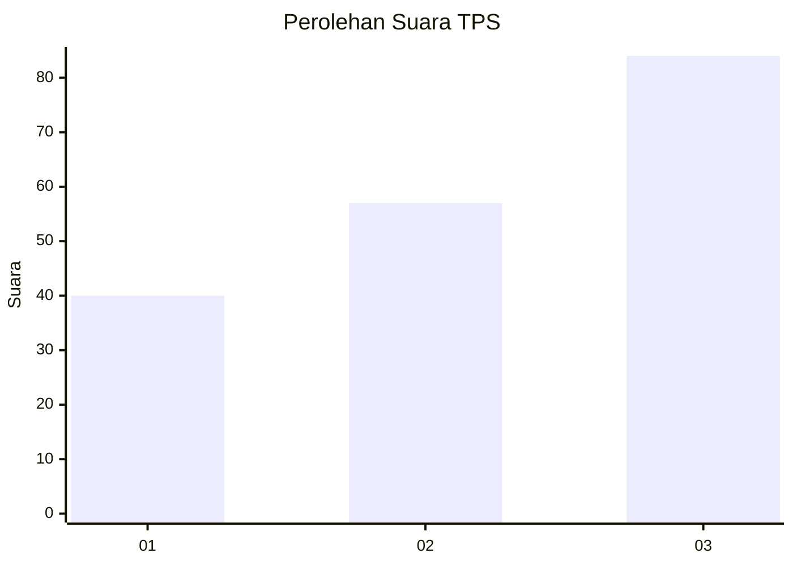
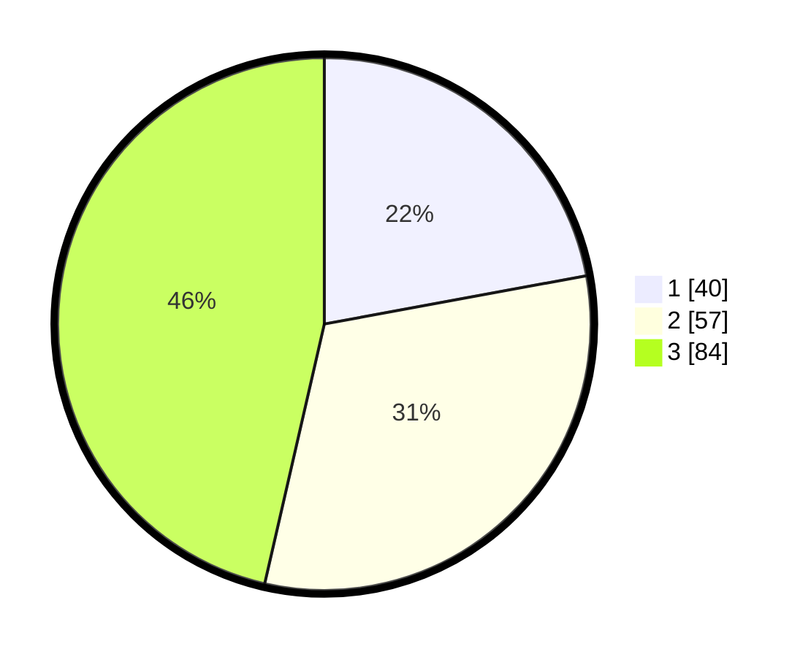

# Hasil

## Grafik

## Tabel

| No. | Nama Paslon    | Suara | Suara (raw) | Persentase |
|:--- |:-------------- | -----:| -----------:| ----------:|
| 1   | ANIES MUHAIMIN | 40    | [40][p-1]   | 22,10      |
| 2   | PRABOWO GIBRAN | 57    | [57][p-2]   | 31,49      |
| 3   | GANJAR MAHFUD  | 84    | [84][p-3]   | 46,41      |

[p-1]: https://github.com/gigit-pemilu/pemilu-2024-34-di-yogyakarta/blob/main/pilpres/hitung-suara/sub/34-di-yogyakarta/sub/71-kota-yogyakarta/sub/08-mantrijeron/sub/1001-gedongkiwo/sub/001-tps/sub/paslon-1.txt
[p-2]: https://github.com/gigit-pemilu/pemilu-2024-34-di-yogyakarta/blob/main/pilpres/hitung-suara/sub/34-di-yogyakarta/sub/71-kota-yogyakarta/sub/08-mantrijeron/sub/1001-gedongkiwo/sub/001-tps/sub/paslon-2.txt
[p-3]: https://github.com/gigit-pemilu/pemilu-2024-34-di-yogyakarta/blob/main/pilpres/hitung-suara/sub/34-di-yogyakarta/sub/71-kota-yogyakarta/sub/08-mantrijeron/sub/1001-gedongkiwo/sub/001-tps/sub/paslon-3.txt

## Foto C Plano

https://sirekap-obj-formc.kpu.go.id/c211/pemilu/ppwp/34/71/08/10/01/3471081001001-20240215-041202--06211d06-afe3-47e3-af1d-6359567752b9.jpg

https://sirekap-obj-formc.kpu.go.id/c211/pemilu/ppwp/34/71/08/10/01/3471081001001-20240216-155458--b4a3abb0-69bc-4f9a-b533-27045bb27e4c.jpg

https://sirekap-obj-formc.kpu.go.id/c211/pemilu/ppwp/34/71/08/10/01/3471081001001-20240216-155458--f242d201-59f6-4771-95c7-06569e6228b0.jpg

## Metadata

| Key        | Value               |
| ---------- | ------------------- |
| Time Stamp | 2024-02-17 14:45:18 |

## DATA PEMILIH TETAP

Jumlah pemilih dalam DPT: **226**.
 * L: **104**.
 * P: **122**.

## DATA PENGGUNA HAK PILIH

Jumlah pengguna hak pilih dalam DPT: **188**.
 * L: **87**.
 * P: **101**.

Jumlah pengguna hak pilih dalam DPTb: **4**.
 * L: **4**.
 * P: **0**.

Jumlah pengguna hak pilih dalam DPK: **0**.
 * L: **0**.
 * P: **0**.

Jumlah pengguna hak pilih: **192**.
 * L: **91**.
 * P: **141**.

## JUMLAH SUARA SAH DAN TIDAK SAH

JUMLAH SELURUH SUARA SAH: **181**.

JUMLAH SUARA TIDAK SAH: **11**.

JUMLAH SELURUH SUARA SAH DAN SUARA TIDAK SAH: **192**.

