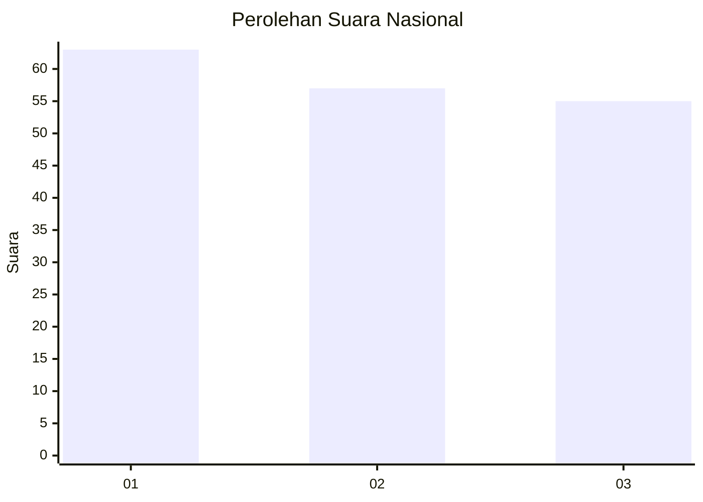
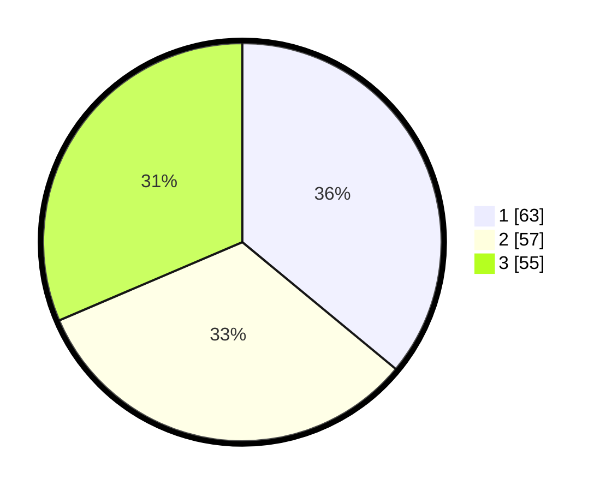

# Hasil

## Grafik

## Tabel

| No. | Nama Paslon    | Suara | Suara (raw) | Persentase |
|:--- |:-------------- | -----:| -----------:| ----------:|
| 1   | ANIES MUHAIMIN | 63    | [63][p-1]   | 36,00      |
| 2   | PRABOWO GIBRAN | 57    | [57][p-2]   | 32,57      |
| 3   | GANJAR MAHFUD  | 55    | [55][p-3]   | 31,43      |

[p-1]: https://github.com/gigit-pemilu/pemilu-2024/blob/main/pilpres/hitung-suara/sub/34-di-yogyakarta/sub/71-kota-yogyakarta/sub/08-mantrijeron/sub/1001-gedongkiwo/sub/003-tps/sub/paslon-1.txt
[p-2]: https://github.com/gigit-pemilu/pemilu-2024/blob/main/pilpres/hitung-suara/sub/34-di-yogyakarta/sub/71-kota-yogyakarta/sub/08-mantrijeron/sub/1001-gedongkiwo/sub/003-tps/sub/paslon-2.txt
[p-3]: https://github.com/gigit-pemilu/pemilu-2024/blob/main/pilpres/hitung-suara/sub/34-di-yogyakarta/sub/71-kota-yogyakarta/sub/08-mantrijeron/sub/1001-gedongkiwo/sub/003-tps/sub/paslon-3.txt

## Foto C Plano

https://sirekap-obj-formc.kpu.go.id/12e3/pemilu/ppwp/34/71/08/10/01/3471081001003-20240216-002915--f1ea8a97-7037-4da9-88e1-fdcb9b81aa9c.jpg

https://sirekap-obj-formc.kpu.go.id/12e3/pemilu/ppwp/34/71/08/10/01/3471081001003-20240216-002918--d85209ee-a731-4ed2-ae19-0f64dc704887.jpg

https://sirekap-obj-formc.kpu.go.id/12e3/pemilu/ppwp/34/71/08/10/01/3471081001003-20240216-002917--32d92b6b-8792-4200-9e88-f3a7eb4f0b64.jpg

## Metadata

| Key        | Value               |
| ---------- | ------------------- |
| Time Stamp | 2024-02-16 01:00:27 |

## DATA PEMILIH TETAP

Jumlah pemilih dalam DPT: **210**.
 * L: **96**.
 * P: **114**.

## DATA PENGGUNA HAK PILIH

Jumlah pengguna hak pilih dalam DPT: **169**.
 * L: **70**.
 * P: **99**.

Jumlah pengguna hak pilih dalam DPTb: **7**.
 * L: **4**.
 * P: **3**.

Jumlah pengguna hak pilih dalam DPK: **0**.
 * L: **0**.
 * P: **0**.

Jumlah pengguna hak pilih: **176**.
 * L: **74**.
 * P: **102**.

## JUMLAH SUARA SAH DAN TIDAK SAH

JUMLAH SELURUH SUARA SAH: **175**.

JUMLAH SUARA TIDAK SAH: **1**.

JUMLAH SELURUH SUARA SAH DAN SUARA TIDAK SAH: **176**.

