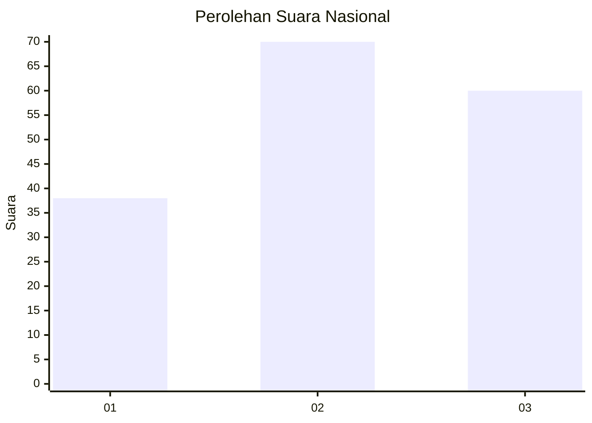
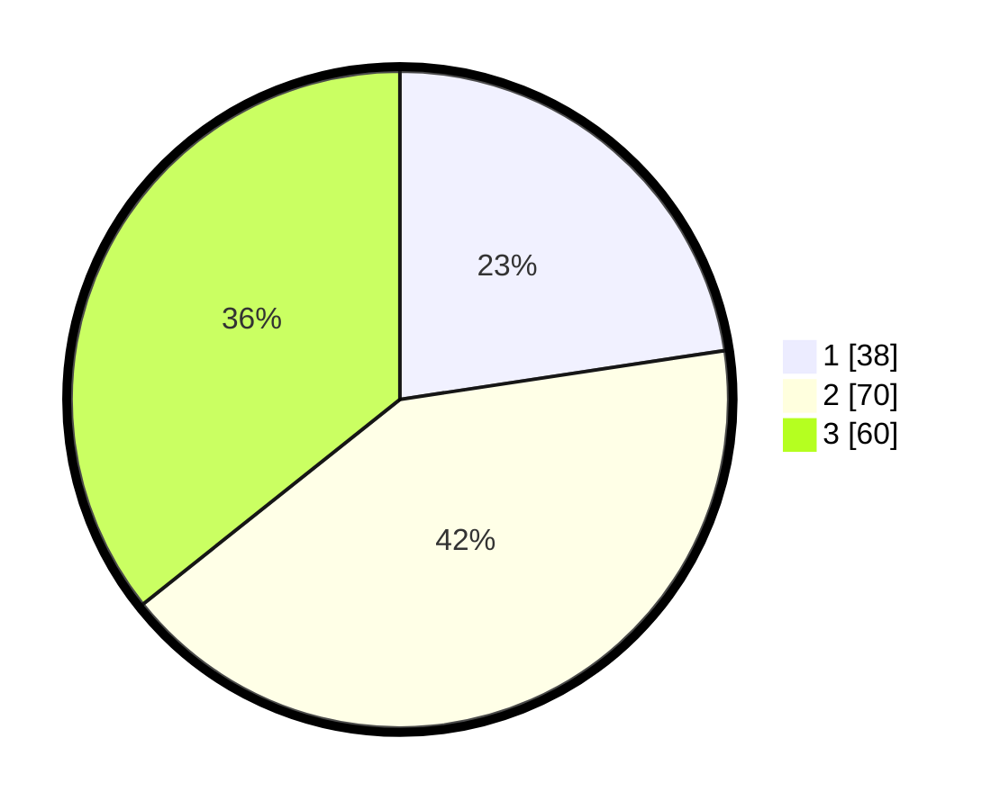

# Hasil

## Grafik

## Tabel

| No. | Nama Paslon    | Suara | Suara (raw) | Persentase |
|:--- |:-------------- | -----:| -----------:| ----------:|
| 1   | ANIES MUHAIMIN | 38    | [38][p-1]   | 22,62      |
| 2   | PRABOWO GIBRAN | 70    | [70][p-2]   | 41,67      |
| 3   | GANJAR MAHFUD  | 60    | [60][p-3]   | 35,71      |

[p-1]: https://github.com/gigit-pemilu/pemilu-2024/blob/main/pilpres/hitung-suara/sub/34-di-yogyakarta/sub/71-kota-yogyakarta/sub/08-mantrijeron/sub/1001-gedongkiwo/sub/004-tps/sub/paslon-1.txt
[p-2]: https://github.com/gigit-pemilu/pemilu-2024/blob/main/pilpres/hitung-suara/sub/34-di-yogyakarta/sub/71-kota-yogyakarta/sub/08-mantrijeron/sub/1001-gedongkiwo/sub/004-tps/sub/paslon-2.txt
[p-3]: https://github.com/gigit-pemilu/pemilu-2024/blob/main/pilpres/hitung-suara/sub/34-di-yogyakarta/sub/71-kota-yogyakarta/sub/08-mantrijeron/sub/1001-gedongkiwo/sub/004-tps/sub/paslon-3.txt

## Foto C Plano

https://sirekap-obj-formc.kpu.go.id/4544/pemilu/ppwp/34/71/08/10/01/3471081001004-20240214-184559--fee1bde2-3f7e-4809-987c-9b438ddcfc11.jpg

https://sirekap-obj-formc.kpu.go.id/4544/pemilu/ppwp/34/71/08/10/01/3471081001004-20240214-155331--fe24c14a-45d0-4a46-af16-7f785648a104.jpg

https://sirekap-obj-formc.kpu.go.id/4544/pemilu/ppwp/34/71/08/10/01/3471081001004-20240214-155645--5fbea6d3-0dfd-42bd-b86d-8fe8983c4d35.jpg

## Metadata

| Key        | Value               |
| ---------- | ------------------- |
| Time Stamp | 2024-02-14 21:46:01 |

## DATA PEMILIH TETAP

Jumlah pemilih dalam DPT: **216**.
 * L: **98**.
 * P: **118**.

## DATA PENGGUNA HAK PILIH

Jumlah pengguna hak pilih dalam DPT: **169**.
 * L: **74**.
 * P: **95**.

Jumlah pengguna hak pilih dalam DPTb: **6**.
 * L: **1**.
 * P: **5**.

Jumlah pengguna hak pilih dalam DPK: **0**.
 * L: **0**.
 * P: **0**.

Jumlah pengguna hak pilih: **175**.
 * L: **75**.
 * P: **100**.

## JUMLAH SUARA SAH DAN TIDAK SAH

JUMLAH SELURUH SUARA SAH: **168**.

JUMLAH SUARA TIDAK SAH: **7**.

JUMLAH SELURUH SUARA SAH DAN SUARA TIDAK SAH: **175**.

