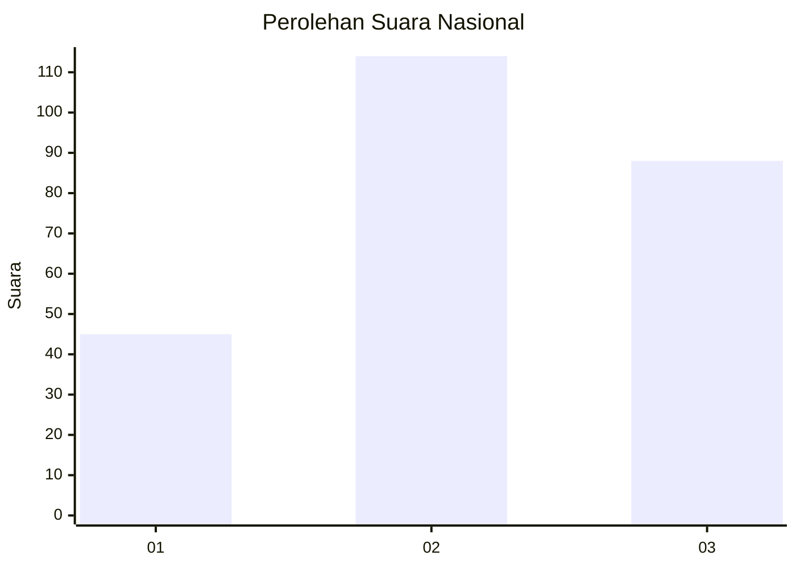
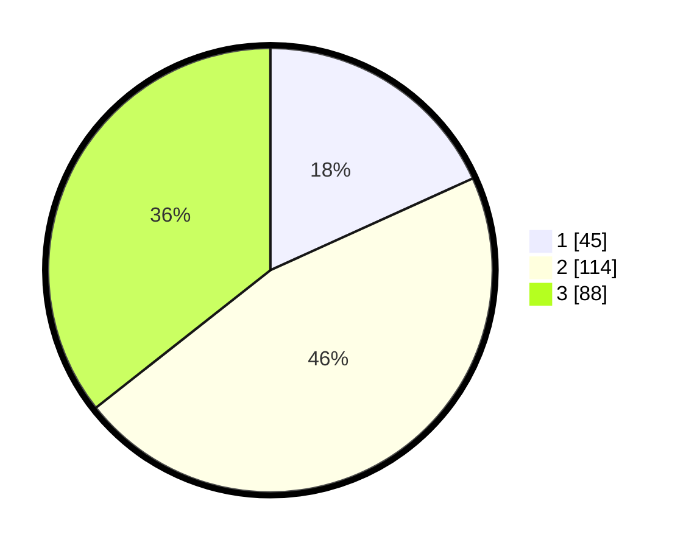

# Hasil

## Grafik

## Tabel

| No. | Nama Paslon    | Suara | Suara (raw) | Persentase |
|:--- |:-------------- | -----:| -----------:| ----------:|
| 1   | ANIES MUHAIMIN | 45    | [45][p-1]   | 18,22      |
| 2   | PRABOWO GIBRAN | 114   | [114][p-2]  | 46,15      |
| 3   | GANJAR MAHFUD  | 88    | [88][p-3]   | 35,63      |

[p-1]: https://github.com/gigit-pemilu/pemilu-2024/blob/main/pilpres/hitung-suara/sub/34-di-yogyakarta/sub/71-kota-yogyakarta/sub/08-mantrijeron/sub/1001-gedongkiwo/sub/005-tps/sub/paslon-1.txt
[p-2]: https://github.com/gigit-pemilu/pemilu-2024/blob/main/pilpres/hitung-suara/sub/34-di-yogyakarta/sub/71-kota-yogyakarta/sub/08-mantrijeron/sub/1001-gedongkiwo/sub/005-tps/sub/paslon-2.txt
[p-3]: https://github.com/gigit-pemilu/pemilu-2024/blob/main/pilpres/hitung-suara/sub/34-di-yogyakarta/sub/71-kota-yogyakarta/sub/08-mantrijeron/sub/1001-gedongkiwo/sub/005-tps/sub/paslon-3.txt

## Foto C Plano

https://sirekap-obj-formc.kpu.go.id/a24b/pemilu/ppwp/34/71/08/10/01/3471081001005-20240215-030539--7c4bc92d-add1-4020-b953-0d1c69660ee8.jpg

https://sirekap-obj-formc.kpu.go.id/a24b/pemilu/ppwp/34/71/08/10/01/3471081001005-20240215-030624--b58a7ed4-15c7-4c1c-812f-2802d596074c.jpg

https://sirekap-obj-formc.kpu.go.id/a24b/pemilu/ppwp/34/71/08/10/01/3471081001005-20240215-030708--95b55924-67bf-4f82-b2b9-3d17c15427a1.jpg

## Metadata

| Key        | Value               |
| ---------- | ------------------- |
| Time Stamp | 2024-02-25 18:00:00 |

## DATA PEMILIH TETAP

Jumlah pemilih dalam DPT: **287**.
 * L: **0**.
 * P: **0**.

## DATA PENGGUNA HAK PILIH

Jumlah pengguna hak pilih dalam DPT: **246**.
 * L: **0**.
 * P: **0**.

Jumlah pengguna hak pilih dalam DPTb: **4**.
 * L: **0**.
 * P: **0**.

Jumlah pengguna hak pilih dalam DPK: **2**.
 * L: **0**.
 * P: **0**.

Jumlah pengguna hak pilih: **252**.
 * L: **0**.
 * P: **0**.

## JUMLAH SUARA SAH DAN TIDAK SAH

JUMLAH SELURUH SUARA SAH: **247**.

JUMLAH SUARA TIDAK SAH: **5**.

JUMLAH SELURUH SUARA SAH DAN SUARA TIDAK SAH: **252**.

