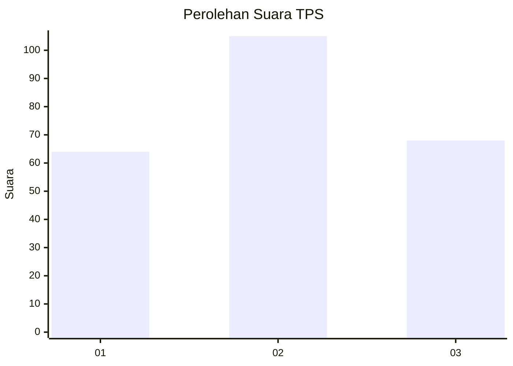
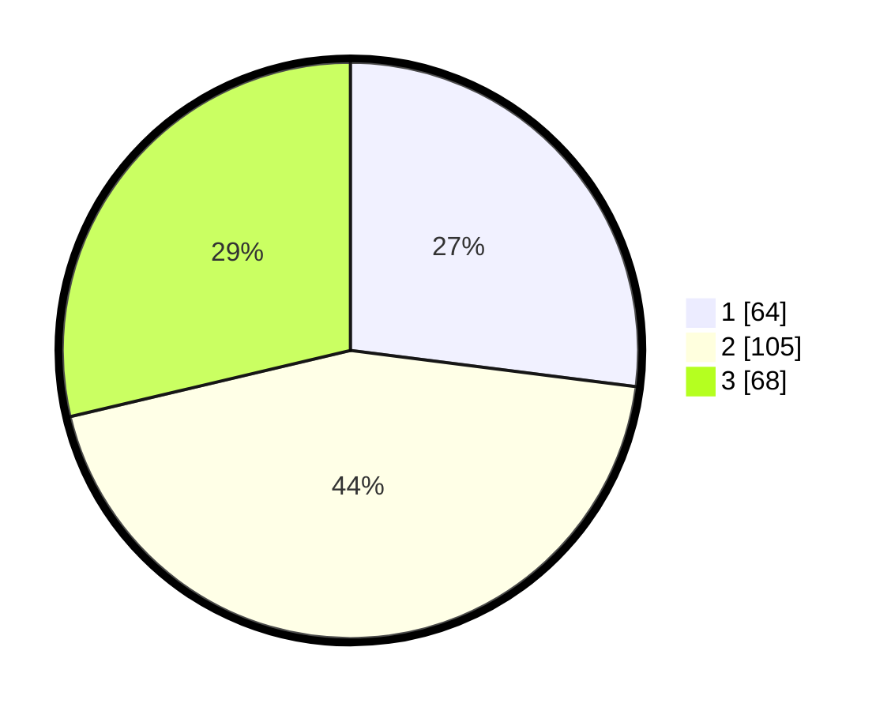

# Hasil

## Grafik

## Tabel

| No. | Nama Paslon    | Suara | Suara (raw) | Persentase |
|:--- |:-------------- | -----:| -----------:| ----------:|
| 1   | ANIES MUHAIMIN | 64    | [64][p-1]   | 27,00      |
| 2   | PRABOWO GIBRAN | 105   | [105][p-2]  | 44,30      |
| 3   | GANJAR MAHFUD  | 68    | [68][p-3]   | 28,69      |

[p-1]: https://github.com/gigit-pemilu/pemilu-2024-34-di-yogyakarta/blob/main/pilpres/hitung-suara/sub/34-di-yogyakarta/sub/71-kota-yogyakarta/sub/08-mantrijeron/sub/1001-gedongkiwo/sub/006-tps/sub/paslon-1.txt
[p-2]: https://github.com/gigit-pemilu/pemilu-2024-34-di-yogyakarta/blob/main/pilpres/hitung-suara/sub/34-di-yogyakarta/sub/71-kota-yogyakarta/sub/08-mantrijeron/sub/1001-gedongkiwo/sub/006-tps/sub/paslon-2.txt
[p-3]: https://github.com/gigit-pemilu/pemilu-2024-34-di-yogyakarta/blob/main/pilpres/hitung-suara/sub/34-di-yogyakarta/sub/71-kota-yogyakarta/sub/08-mantrijeron/sub/1001-gedongkiwo/sub/006-tps/sub/paslon-3.txt

## Foto C Plano

https://sirekap-obj-formc.kpu.go.id/8e21/pemilu/ppwp/34/71/08/10/01/3471081001006-20240217-172754--0f8b5622-df2b-4a67-b67e-58fb58632a2d.jpg

https://sirekap-obj-formc.kpu.go.id/8e21/pemilu/ppwp/34/71/08/10/01/3471081001006-20240217-172605--be048921-f0c1-49ed-b1a1-1af2fa61415b.jpg

https://sirekap-obj-formc.kpu.go.id/8e21/pemilu/ppwp/34/71/08/10/01/3471081001006-20240217-173226--83bf9e8d-b77d-4c6b-92ca-6aaaa7ef48bb.jpg

## Metadata

| Key        | Value               |
| ---------- | ------------------- |
| Time Stamp | 2024-02-24 22:31:28 |

