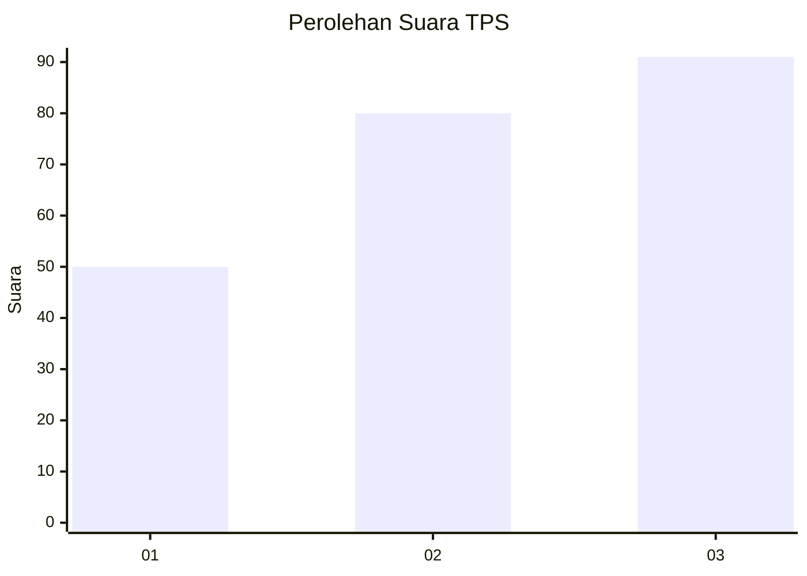
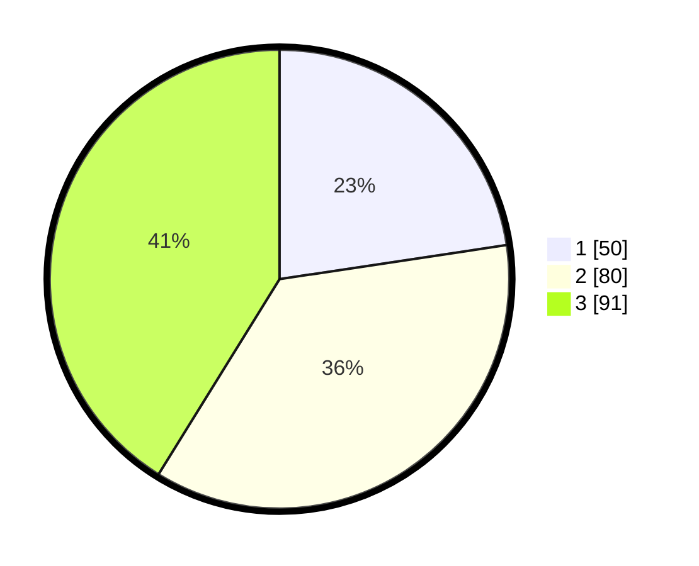

# Hasil

## Grafik

## Tabel

| No. | Nama Paslon    | Suara | Suara (raw) | Persentase |
|:--- |:-------------- | -----:| -----------:| ----------:|
| 1   | ANIES MUHAIMIN | 50    | [50][p-1]   | 22,62      |
| 2   | PRABOWO GIBRAN | 80    | [80][p-2]   | 36,20      |
| 3   | GANJAR MAHFUD  | 91    | [91][p-3]   | 41,18      |

[p-1]: https://github.com/gigit-pemilu/pemilu-2024-34-di-yogyakarta/blob/main/pilpres/hitung-suara/sub/34-di-yogyakarta/sub/71-kota-yogyakarta/sub/08-mantrijeron/sub/1001-gedongkiwo/sub/025-tps/sub/paslon-1.txt
[p-2]: https://github.com/gigit-pemilu/pemilu-2024-34-di-yogyakarta/blob/main/pilpres/hitung-suara/sub/34-di-yogyakarta/sub/71-kota-yogyakarta/sub/08-mantrijeron/sub/1001-gedongkiwo/sub/025-tps/sub/paslon-2.txt
[p-3]: https://github.com/gigit-pemilu/pemilu-2024-34-di-yogyakarta/blob/main/pilpres/hitung-suara/sub/34-di-yogyakarta/sub/71-kota-yogyakarta/sub/08-mantrijeron/sub/1001-gedongkiwo/sub/025-tps/sub/paslon-3.txt

## Foto C Plano

https://sirekap-obj-formc.kpu.go.id/de40/pemilu/ppwp/34/71/08/10/01/3471081001025-20240215-022006--90ffb859-911c-49f6-a286-2fa73ce6bd87.jpg

https://sirekap-obj-formc.kpu.go.id/de40/pemilu/ppwp/34/71/08/10/01/3471081001025-20240215-022028--3ef959b6-2a8a-4fbf-b27d-3eb3b9dcb9ac.jpg

https://sirekap-obj-formc.kpu.go.id/de40/pemilu/ppwp/34/71/08/10/01/3471081001025-20240215-022049--feeb25e9-a42a-4133-ab5d-c1954777e949.jpg

## Metadata

| Key        | Value               |
| ---------- | ------------------- |
| Time Stamp | 2024-02-24 22:31:28 |

## DATA PEMILIH TETAP

Jumlah pemilih dalam DPT: **267**.
 * L: **259**.
 * P: **48**.

## DATA PENGGUNA HAK PILIH

Jumlah pengguna hak pilih dalam DPT: **226**.
 * L: **898**.
 * P: **529**.

Jumlah pengguna hak pilih dalam DPTb: **7**.
 * L: **823**.
 * P: **889**.

Jumlah pengguna hak pilih dalam DPK: **1**.
 * L: **885**.
 * P: **888**.

Jumlah pengguna hak pilih: **234**.
 * L: **405**.
 * P: **433**.

## JUMLAH SUARA SAH DAN TIDAK SAH

JUMLAH SELURUH SUARA SAH: **221**.

JUMLAH SUARA TIDAK SAH: **13**.

JUMLAH SELURUH SUARA SAH DAN SUARA TIDAK SAH: **234**.

