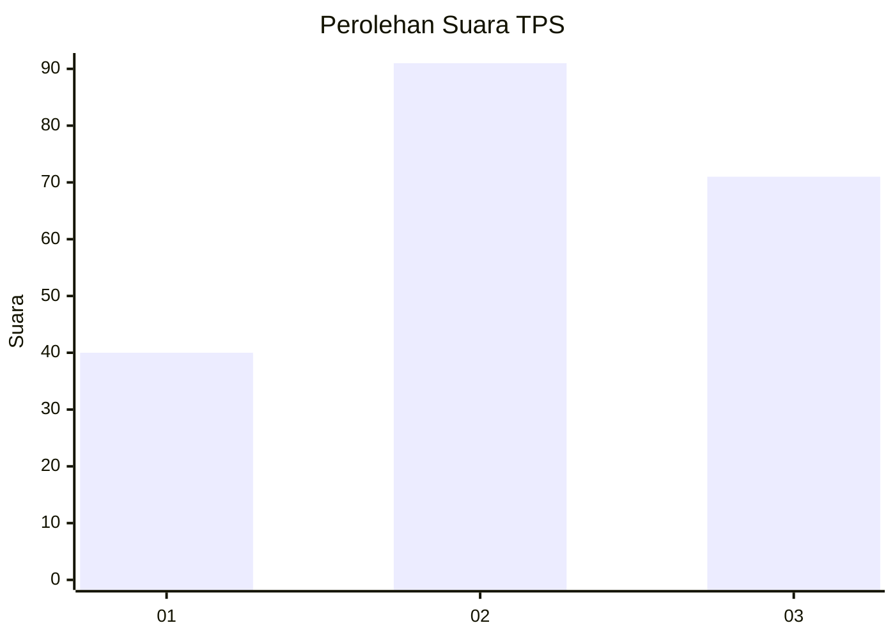
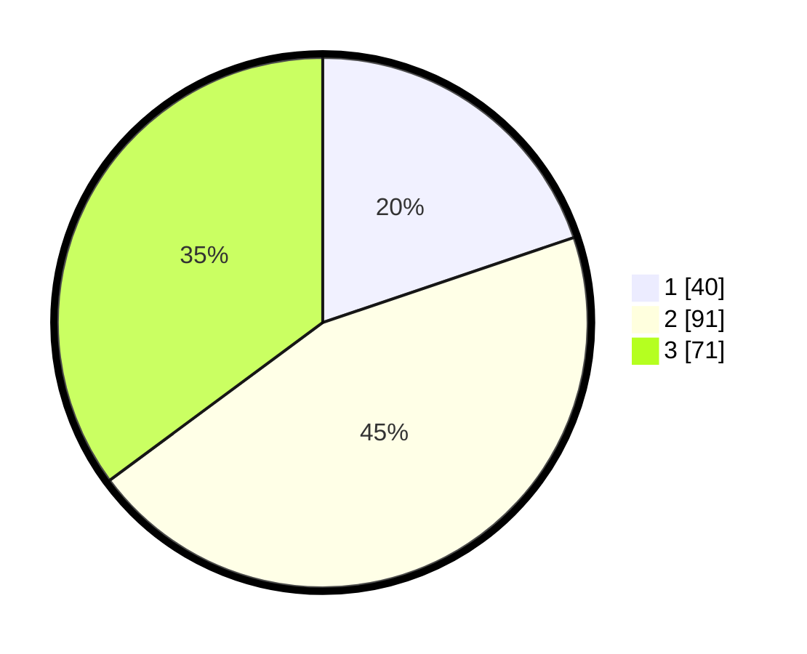

# Hasil

## Grafik

## Tabel

| No. | Nama Paslon    | Suara | Suara (raw) | Persentase |
|:--- |:-------------- | -----:| -----------:| ----------:|
| 1   | ANIES MUHAIMIN | 40    | [40][p-1]   | 19,80      |
| 2   | PRABOWO GIBRAN | 91    | [91][p-2]   | 45,05      |
| 3   | GANJAR MAHFUD  | 71    | [71][p-3]   | 35,15      |

[p-1]: https://github.com/gigit-pemilu/pemilu-2024-34-di-yogyakarta/blob/main/pilpres/hitung-suara/sub/34-di-yogyakarta/sub/71-kota-yogyakarta/sub/08-mantrijeron/sub/1002-suryodiningratan/sub/018-tps/sub/paslon-1.txt
[p-2]: https://github.com/gigit-pemilu/pemilu-2024-34-di-yogyakarta/blob/main/pilpres/hitung-suara/sub/34-di-yogyakarta/sub/71-kota-yogyakarta/sub/08-mantrijeron/sub/1002-suryodiningratan/sub/018-tps/sub/paslon-2.txt
[p-3]: https://github.com/gigit-pemilu/pemilu-2024-34-di-yogyakarta/blob/main/pilpres/hitung-suara/sub/34-di-yogyakarta/sub/71-kota-yogyakarta/sub/08-mantrijeron/sub/1002-suryodiningratan/sub/018-tps/sub/paslon-3.txt

## Foto C Plano

https://sirekap-obj-formc.kpu.go.id/b4d6/pemilu/ppwp/34/71/08/10/02/3471081002018-20240219-120306--44eda2fd-80cf-489f-8468-e6eeab4ea5f5.jpg

https://sirekap-obj-formc.kpu.go.id/b4d6/pemilu/ppwp/34/71/08/10/02/3471081002018-20240220-111817--1cd19496-bf2b-4e77-b893-f59ba57e759c.jpg

https://sirekap-obj-formc.kpu.go.id/b4d6/pemilu/ppwp/34/71/08/10/02/3471081002018-20240219-120421--71929ae9-910a-41ea-94fc-8335ca627304.jpg

## Metadata

| Key        | Value               |
| ---------- | ------------------- |
| Time Stamp | 2024-03-01 14:00:00 |

