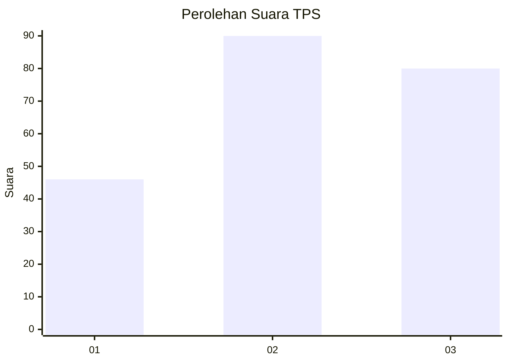
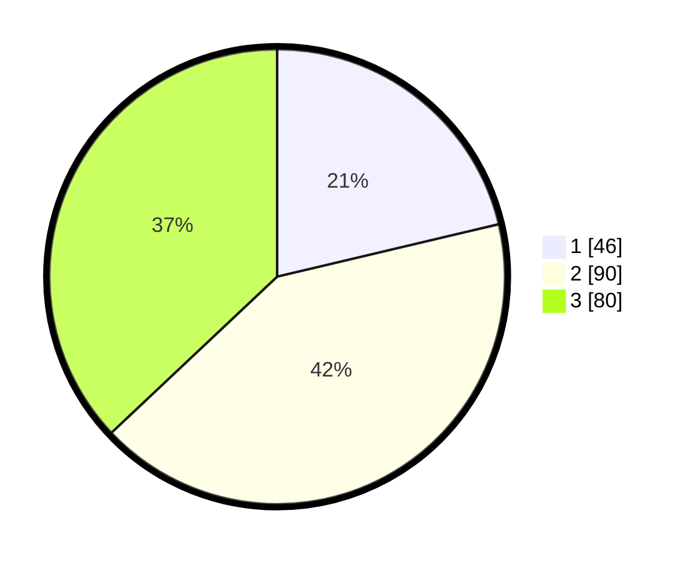

# Hasil

## Grafik

## Tabel

| No. | Nama Paslon    | Suara | Suara (raw) | Persentase |
|:--- |:-------------- | -----:| -----------:| ----------:|
| 1   | ANIES MUHAIMIN | 46    | [46][p-1]   | 21,30      |
| 2   | PRABOWO GIBRAN | 90    | [90][p-2]   | 41,67      |
| 3   | GANJAR MAHFUD  | 80    | [80][p-3]   | 37,04      |

[p-1]: https://github.com/gigit-pemilu/pemilu-2024-34-di-yogyakarta/blob/main/pilpres/hitung-suara/sub/34-di-yogyakarta/sub/71-kota-yogyakarta/sub/08-mantrijeron/sub/1003-mantrijeron/sub/002-tps/sub/paslon-1.txt
[p-2]: https://github.com/gigit-pemilu/pemilu-2024-34-di-yogyakarta/blob/main/pilpres/hitung-suara/sub/34-di-yogyakarta/sub/71-kota-yogyakarta/sub/08-mantrijeron/sub/1003-mantrijeron/sub/002-tps/sub/paslon-2.txt
[p-3]: https://github.com/gigit-pemilu/pemilu-2024-34-di-yogyakarta/blob/main/pilpres/hitung-suara/sub/34-di-yogyakarta/sub/71-kota-yogyakarta/sub/08-mantrijeron/sub/1003-mantrijeron/sub/002-tps/sub/paslon-3.txt

## Foto C Plano

https://sirekap-obj-formc.kpu.go.id/9fdc/pemilu/ppwp/34/71/08/10/03/3471081003002-20240215-132556--a369825a-727e-4b26-92e2-41d84e6a9bd1.jpg

https://sirekap-obj-formc.kpu.go.id/9fdc/pemilu/ppwp/34/71/08/10/03/3471081003002-20240215-161857--4c66de42-f444-42ef-b5af-6f280b8609dc.jpg

https://sirekap-obj-formc.kpu.go.id/9fdc/pemilu/ppwp/34/71/08/10/03/3471081003002-20240215-051927--67e82236-1631-4d3a-84ce-e875a6bf21b7.jpg

## Metadata

| Key        | Value               |
| ---------- | ------------------- |
| Time Stamp | 2024-02-16 01:30:27 |

## DATA PEMILIH TETAP

Jumlah pemilih dalam DPT: **261**.
 * L: **121**.
 * P: **140**.

## DATA PENGGUNA HAK PILIH

Jumlah pengguna hak pilih dalam DPT: **206**.
 * L: **89**.
 * P: **117**.

Jumlah pengguna hak pilih dalam DPTb: **14**.
 * L: **13**.
 * P: **1**.

Jumlah pengguna hak pilih dalam DPK: **2**.
 * L: **0**.
 * P: **2**.

Jumlah pengguna hak pilih: **222**.
 * L: **102**.
 * P: **120**.

## JUMLAH SUARA SAH DAN TIDAK SAH

JUMLAH SELURUH SUARA SAH: **216**.

JUMLAH SUARA TIDAK SAH: **6**.

JUMLAH SELURUH SUARA SAH DAN SUARA TIDAK SAH: **222**.

