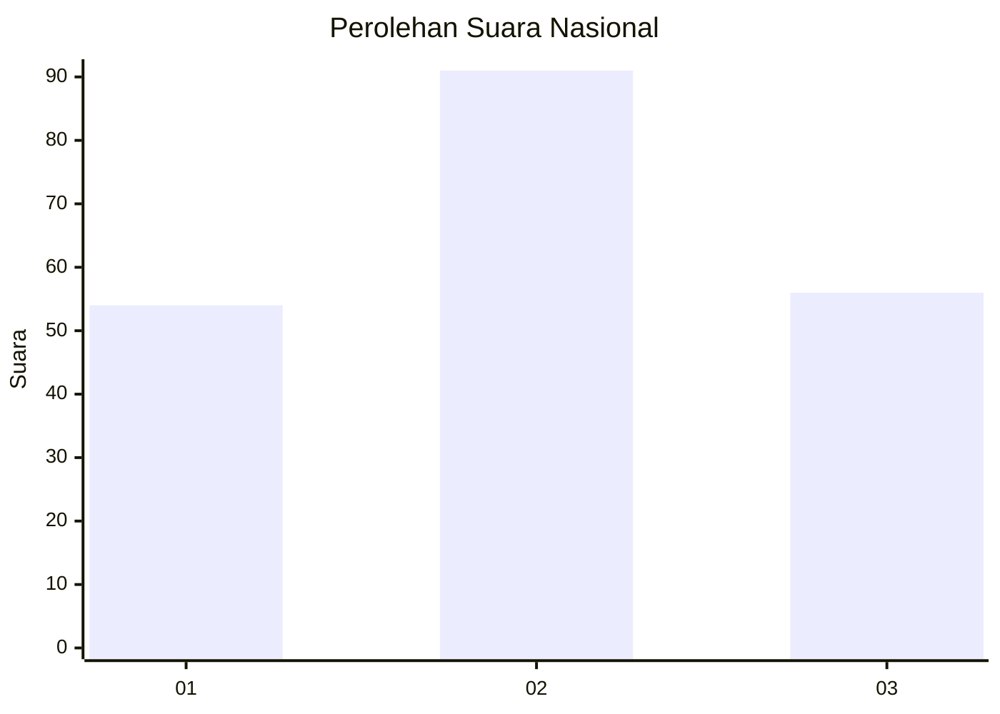
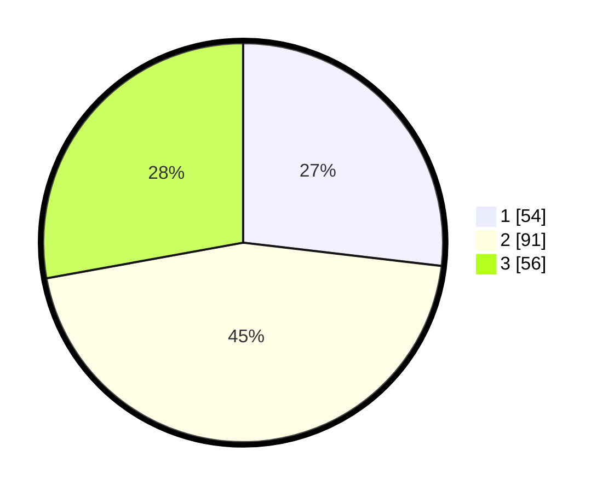

# Hasil

## Grafik

## Tabel

| No. | Nama Paslon    | Suara | Suara (raw) | Persentase |
|:--- |:-------------- | -----:| -----------:| ----------:|
| 1   | ANIES MUHAIMIN | 54    | [54][p-1]   | 26,87      |
| 2   | PRABOWO GIBRAN | 91    | [91][p-2]   | 45,27      |
| 3   | GANJAR MAHFUD  | 56    | [56][p-3]   | 27,86      |

[p-1]: https://github.com/gigit-pemilu/pemilu-2024/blob/main/pilpres/hitung-suara/sub/34-di-yogyakarta/sub/71-kota-yogyakarta/sub/08-mantrijeron/sub/1003-mantrijeron/sub/003-tps/sub/paslon-1.txt
[p-2]: https://github.com/gigit-pemilu/pemilu-2024/blob/main/pilpres/hitung-suara/sub/34-di-yogyakarta/sub/71-kota-yogyakarta/sub/08-mantrijeron/sub/1003-mantrijeron/sub/003-tps/sub/paslon-2.txt
[p-3]: https://github.com/gigit-pemilu/pemilu-2024/blob/main/pilpres/hitung-suara/sub/34-di-yogyakarta/sub/71-kota-yogyakarta/sub/08-mantrijeron/sub/1003-mantrijeron/sub/003-tps/sub/paslon-3.txt

## Foto C Plano

https://sirekap-obj-formc.kpu.go.id/5324/pemilu/ppwp/34/71/08/10/03/3471081003003-20240214-185810--aa993eb2-2123-486d-a62c-535a583905a7.jpg

https://sirekap-obj-formc.kpu.go.id/5324/pemilu/ppwp/34/71/08/10/03/3471081003003-20240214-220105--7d021261-82f4-4e6b-839c-d49217884eff.jpg

https://sirekap-obj-formc.kpu.go.id/5324/pemilu/ppwp/34/71/08/10/03/3471081003003-20240214-220257--c5eb9d1f-68b3-45ea-8b36-a046cb2551f8.jpg

## Metadata

| Key        | Value               |
| ---------- | ------------------- |
| Time Stamp | 2024-02-15 16:30:25 |

## DATA PEMILIH TETAP

Jumlah pemilih dalam DPT: **215**.
 * L: **97**.
 * P: **118**.

## DATA PENGGUNA HAK PILIH

Jumlah pengguna hak pilih dalam DPT: **195**.
 * L: **86**.
 * P: **109**.

Jumlah pengguna hak pilih dalam DPTb: **12**.
 * L: **8**.
 * P: **4**.

Jumlah pengguna hak pilih dalam DPK: **0**.
 * L: **0**.
 * P: **0**.

Jumlah pengguna hak pilih: **207**.
 * L: **94**.
 * P: **113**.

## JUMLAH SUARA SAH DAN TIDAK SAH

JUMLAH SELURUH SUARA SAH: **201**.

JUMLAH SUARA TIDAK SAH: **6**.

JUMLAH SELURUH SUARA SAH DAN SUARA TIDAK SAH: **207**.

