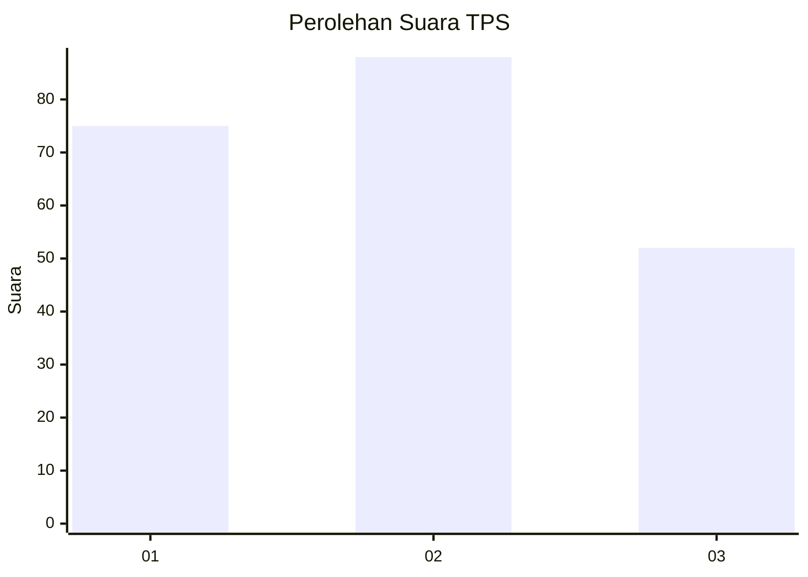
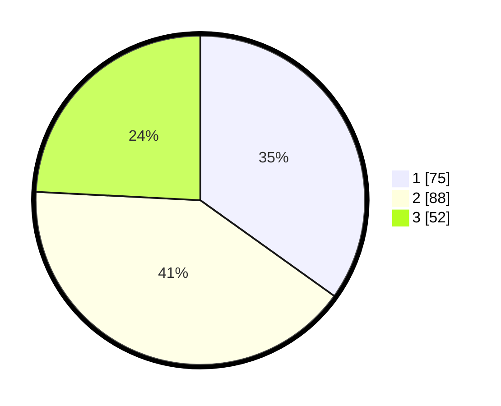

# Hasil

## Grafik

## Tabel

| No. | Nama Paslon    | Suara | Suara (raw) | Persentase |
|:--- |:-------------- | -----:| -----------:| ----------:|
| 1   | ANIES MUHAIMIN | 75    | [75][p-1]   | 34,88      |
| 2   | PRABOWO GIBRAN | 88    | [88][p-2]   | 40,93      |
| 3   | GANJAR MAHFUD  | 52    | [52][p-3]   | 24,19      |

[p-1]: https://github.com/gigit-pemilu/pemilu-2024-34-di-yogyakarta/blob/main/pilpres/hitung-suara/sub/34-di-yogyakarta/sub/71-kota-yogyakarta/sub/08-mantrijeron/sub/1003-mantrijeron/sub/007-tps/sub/paslon-1.txt
[p-2]: https://github.com/gigit-pemilu/pemilu-2024-34-di-yogyakarta/blob/main/pilpres/hitung-suara/sub/34-di-yogyakarta/sub/71-kota-yogyakarta/sub/08-mantrijeron/sub/1003-mantrijeron/sub/007-tps/sub/paslon-2.txt
[p-3]: https://github.com/gigit-pemilu/pemilu-2024-34-di-yogyakarta/blob/main/pilpres/hitung-suara/sub/34-di-yogyakarta/sub/71-kota-yogyakarta/sub/08-mantrijeron/sub/1003-mantrijeron/sub/007-tps/sub/paslon-3.txt

## Foto C Plano

https://sirekap-obj-formc.kpu.go.id/1cc0/pemilu/ppwp/34/71/08/10/03/3471081003007-20240216-082352--a2ea805a-7587-4794-833b-61f221ce3984.jpg

https://sirekap-obj-formc.kpu.go.id/1cc0/pemilu/ppwp/34/71/08/10/03/3471081003007-20240214-155554--5edba6a7-19d9-426c-9b1d-763c9ac2ab23.jpg

https://sirekap-obj-formc.kpu.go.id/1cc0/pemilu/ppwp/34/71/08/10/03/3471081003007-20240214-155629--3a8cc720-dd8f-4fa7-92dc-c08af5f8e4d3.jpg

## Metadata

| Key        | Value               |
| ---------- | ------------------- |
| Time Stamp | 2024-02-16 08:30:27 |

## DATA PEMILIH TETAP

Jumlah pemilih dalam DPT: **243**.
 * L: **111**.
 * P: **132**.

## DATA PENGGUNA HAK PILIH

Jumlah pengguna hak pilih dalam DPT: **203**.
 * L: **89**.
 * P: **114**.

Jumlah pengguna hak pilih dalam DPTb: **13**.
 * L: **1**.
 * P: **12**.

Jumlah pengguna hak pilih dalam DPK: **1**.
 * L: **1**.
 * P: **0**.

Jumlah pengguna hak pilih: **217**.
 * L: **91**.
 * P: **126**.

## JUMLAH SUARA SAH DAN TIDAK SAH

JUMLAH SELURUH SUARA SAH: **215**.

JUMLAH SUARA TIDAK SAH: **2**.

JUMLAH SELURUH SUARA SAH DAN SUARA TIDAK SAH: **217**.

