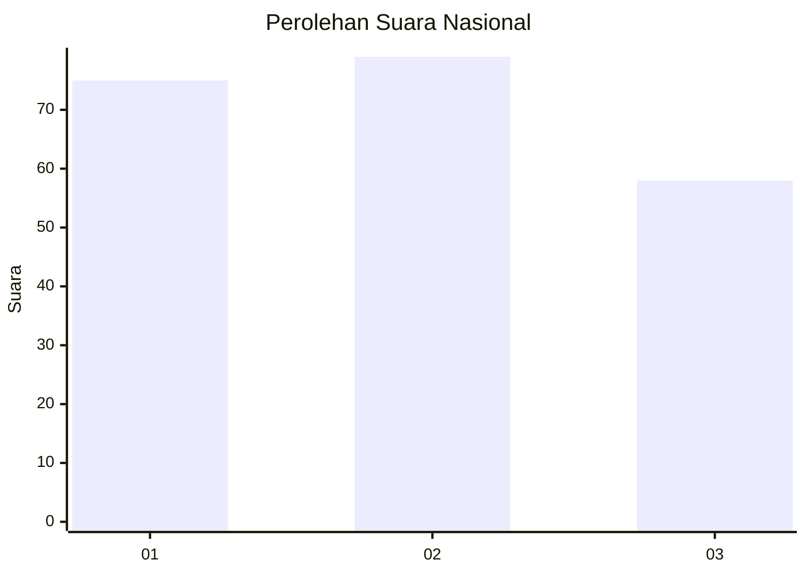
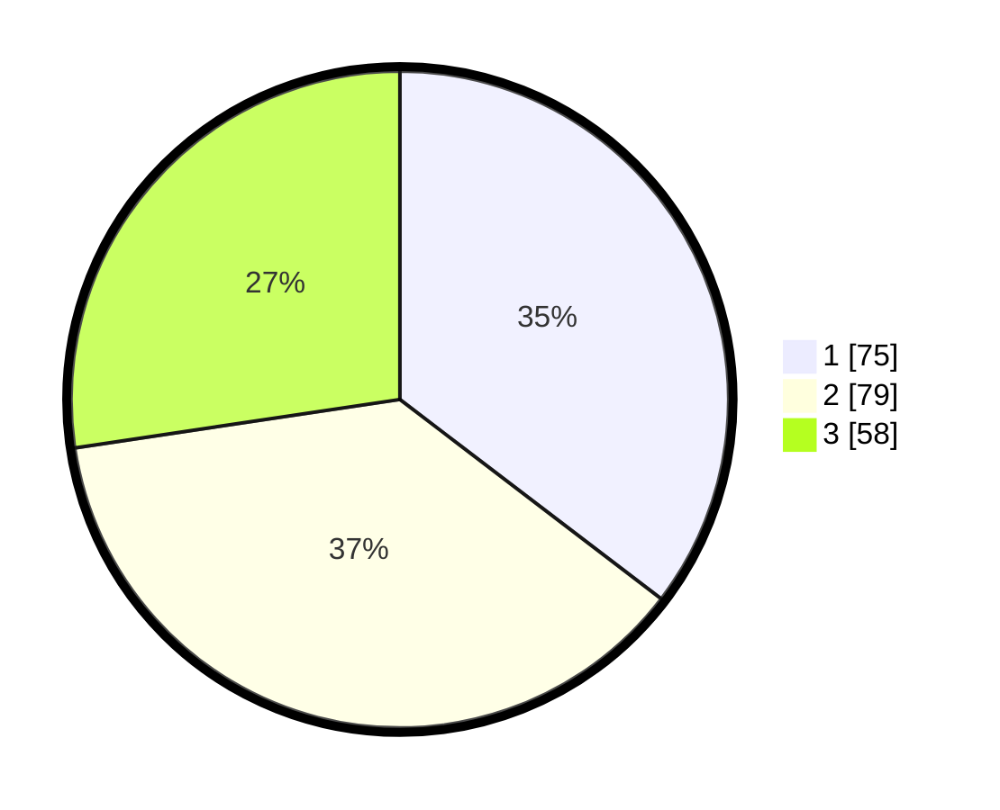

# Hasil

## Grafik

## Tabel

| No. | Nama Paslon    | Suara | Suara (raw) | Persentase |
|:--- |:-------------- | -----:| -----------:| ----------:|
| 1   | ANIES MUHAIMIN | 75    | [75][p-1]   | 35,38      |
| 2   | PRABOWO GIBRAN | 79    | [79][p-2]   | 37,26      |
| 3   | GANJAR MAHFUD  | 58    | [58][p-3]   | 27,36      |

[p-1]: https://github.com/gigit-pemilu/pemilu-2024/blob/main/pilpres/hitung-suara/sub/34-di-yogyakarta/sub/71-kota-yogyakarta/sub/08-mantrijeron/sub/1003-mantrijeron/sub/008-tps/sub/paslon-1.txt
[p-2]: https://github.com/gigit-pemilu/pemilu-2024/blob/main/pilpres/hitung-suara/sub/34-di-yogyakarta/sub/71-kota-yogyakarta/sub/08-mantrijeron/sub/1003-mantrijeron/sub/008-tps/sub/paslon-2.txt
[p-3]: https://github.com/gigit-pemilu/pemilu-2024/blob/main/pilpres/hitung-suara/sub/34-di-yogyakarta/sub/71-kota-yogyakarta/sub/08-mantrijeron/sub/1003-mantrijeron/sub/008-tps/sub/paslon-3.txt

## Foto C Plano

https://sirekap-obj-formc.kpu.go.id/fa99/pemilu/ppwp/34/71/08/10/03/3471081003008-20240214-155517--4452c979-91cc-42b2-a259-be3d1d9d7600.jpg

https://sirekap-obj-formc.kpu.go.id/fa99/pemilu/ppwp/34/71/08/10/03/3471081003008-20240214-155838--5f026915-c068-466f-b06e-ff81adea9265.jpg

https://sirekap-obj-formc.kpu.go.id/fa99/pemilu/ppwp/34/71/08/10/03/3471081003008-20240214-195646--e8d363de-1384-4d5b-8d73-1d45f5413763.jpg

## Metadata

| Key        | Value               |
| ---------- | ------------------- |
| Time Stamp | 2024-02-14 21:46:01 |

## DATA PEMILIH TETAP

Jumlah pemilih dalam DPT: **238**.
 * L: **115**.
 * P: **123**.

## DATA PENGGUNA HAK PILIH

Jumlah pengguna hak pilih dalam DPT: **198**.
 * L: **90**.
 * P: **108**.

Jumlah pengguna hak pilih dalam DPTb: **16**.
 * L: **2**.
 * P: **14**.

Jumlah pengguna hak pilih dalam DPK: **4**.
 * L: **2**.
 * P: **2**.

Jumlah pengguna hak pilih: **218**.
 * L: **94**.
 * P: **124**.

## JUMLAH SUARA SAH DAN TIDAK SAH

JUMLAH SELURUH SUARA SAH: **212**.

JUMLAH SUARA TIDAK SAH: **6**.

JUMLAH SELURUH SUARA SAH DAN SUARA TIDAK SAH: **218**.

