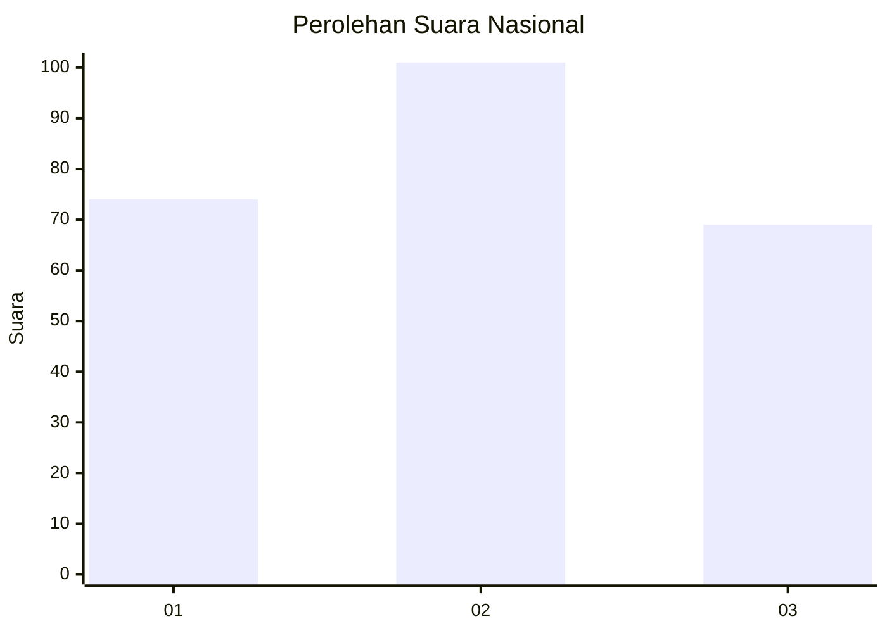
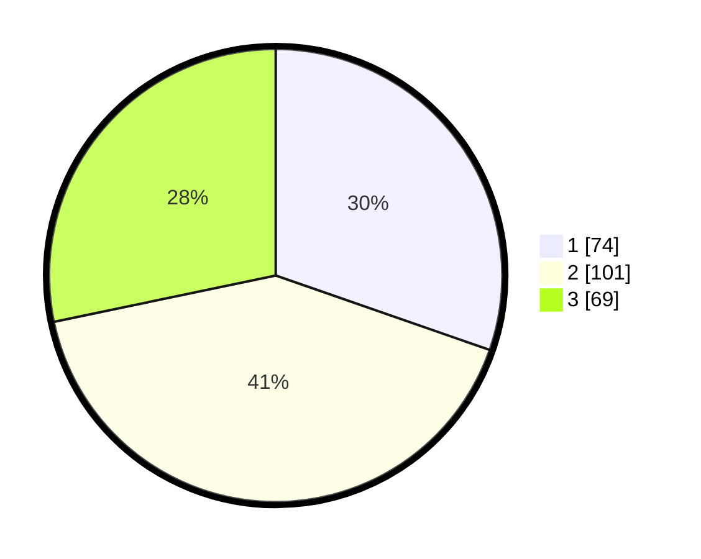

# Hasil

## Grafik

## Tabel

| No. | Nama Paslon    | Suara | Suara (raw) | Persentase |
|:--- |:-------------- | -----:| -----------:| ----------:|
| 1   | ANIES MUHAIMIN | 74    | [74][p-1]   | 30,33      |
| 2   | PRABOWO GIBRAN | 101   | [101][p-2]  | 41,39      |
| 3   | GANJAR MAHFUD  | 69    | [69][p-3]   | 28,28      |

[p-1]: https://github.com/gigit-pemilu/pemilu-2024/blob/main/pilpres/hitung-suara/sub/34-di-yogyakarta/sub/71-kota-yogyakarta/sub/08-mantrijeron/sub/1003-mantrijeron/sub/009-tps/sub/paslon-1.txt
[p-2]: https://github.com/gigit-pemilu/pemilu-2024/blob/main/pilpres/hitung-suara/sub/34-di-yogyakarta/sub/71-kota-yogyakarta/sub/08-mantrijeron/sub/1003-mantrijeron/sub/009-tps/sub/paslon-2.txt
[p-3]: https://github.com/gigit-pemilu/pemilu-2024/blob/main/pilpres/hitung-suara/sub/34-di-yogyakarta/sub/71-kota-yogyakarta/sub/08-mantrijeron/sub/1003-mantrijeron/sub/009-tps/sub/paslon-3.txt

## Foto C Plano

https://sirekap-obj-formc.kpu.go.id/ebc7/pemilu/ppwp/34/71/08/10/03/3471081003009-20240214-192109--b35014c6-9741-4508-a2fe-9c18a576fb05.jpg

https://sirekap-obj-formc.kpu.go.id/ebc7/pemilu/ppwp/34/71/08/10/03/3471081003009-20240216-211351--94784417-df9a-49e0-a6db-2e90c2b33a80.jpg

https://sirekap-obj-formc.kpu.go.id/ebc7/pemilu/ppwp/34/71/08/10/03/3471081003009-20240216-212936--68c26f2c-cb8a-4be8-ab28-a00d28f06d66.jpg

## Metadata

| Key        | Value               |
| ---------- | ------------------- |
| Time Stamp | 2024-02-17 14:56:33 |

## DATA PEMILIH TETAP

Jumlah pemilih dalam DPT: **288**.
 * L: **136**.
 * P: **152**.

## DATA PENGGUNA HAK PILIH

Jumlah pengguna hak pilih dalam DPT: **224**.
 * L: **107**.
 * P: **117**.

Jumlah pengguna hak pilih dalam DPTb: **13**.
 * L: **1**.
 * P: **12**.

Jumlah pengguna hak pilih dalam DPK: **13**.
 * L: **5**.
 * P: **8**.

Jumlah pengguna hak pilih: **250**.
 * L: **113**.
 * P: **137**.

## JUMLAH SUARA SAH DAN TIDAK SAH

JUMLAH SELURUH SUARA SAH: **244**.

JUMLAH SUARA TIDAK SAH: **6**.

JUMLAH SELURUH SUARA SAH DAN SUARA TIDAK SAH: **250**.

