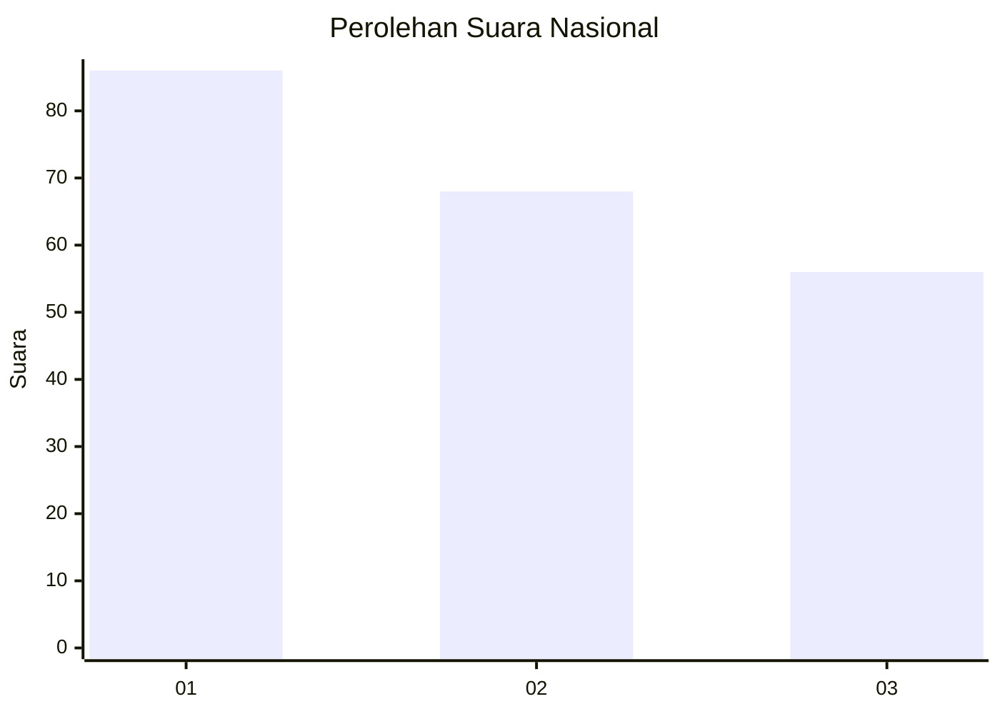
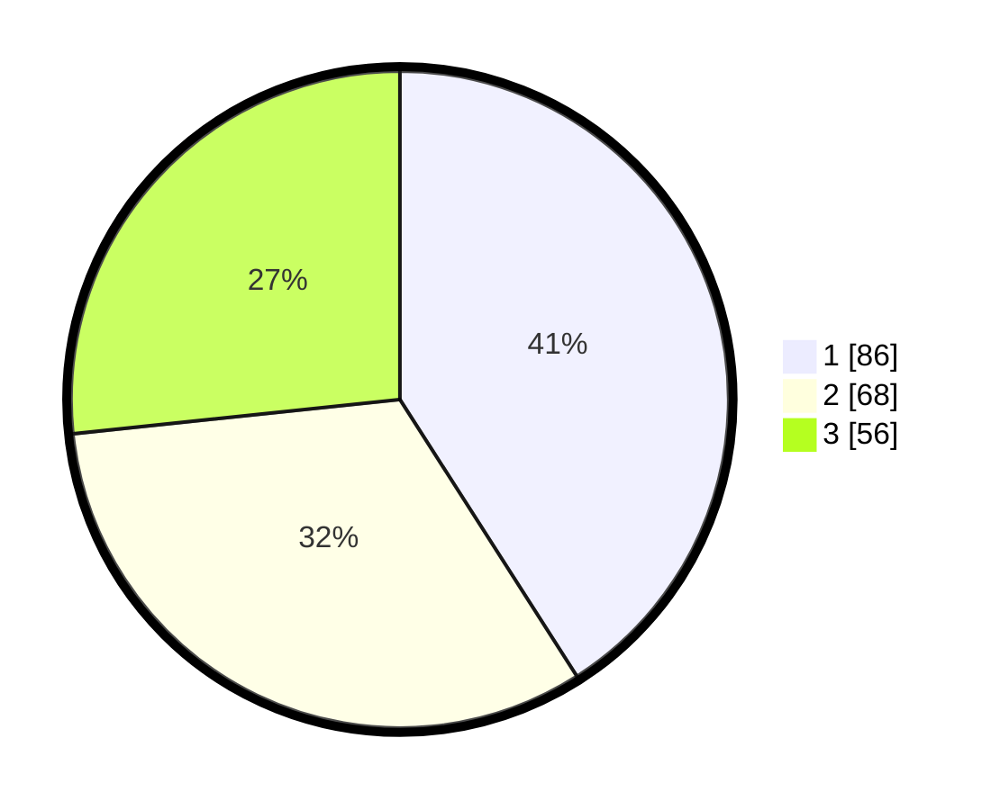

# Hasil

## Grafik

## Tabel

| No. | Nama Paslon    | Suara | Suara (raw) | Persentase |
|:--- |:-------------- | -----:| -----------:| ----------:|
| 1   | ANIES MUHAIMIN | 86    | [86][p-1]   | 40,95      |
| 2   | PRABOWO GIBRAN | 68    | [68][p-2]   | 32,38      |
| 3   | GANJAR MAHFUD  | 56    | [56][p-3]   | 26,67      |

[p-1]: https://github.com/gigit-pemilu/pemilu-2024/blob/main/pilpres/hitung-suara/sub/34-di-yogyakarta/sub/71-kota-yogyakarta/sub/08-mantrijeron/sub/1003-mantrijeron/sub/011-tps/sub/paslon-1.txt
[p-2]: https://github.com/gigit-pemilu/pemilu-2024/blob/main/pilpres/hitung-suara/sub/34-di-yogyakarta/sub/71-kota-yogyakarta/sub/08-mantrijeron/sub/1003-mantrijeron/sub/011-tps/sub/paslon-2.txt
[p-3]: https://github.com/gigit-pemilu/pemilu-2024/blob/main/pilpres/hitung-suara/sub/34-di-yogyakarta/sub/71-kota-yogyakarta/sub/08-mantrijeron/sub/1003-mantrijeron/sub/011-tps/sub/paslon-3.txt

## Foto C Plano

https://sirekap-obj-formc.kpu.go.id/68ef/pemilu/ppwp/34/71/08/10/03/3471081003011-20240214-204248--31900bb5-0150-4f2a-a378-51fb2b1b3fd0.jpg

https://sirekap-obj-formc.kpu.go.id/68ef/pemilu/ppwp/34/71/08/10/03/3471081003011-20240214-155436--9bf0fd08-950a-4474-92fb-3a2e9051e4ad.jpg

https://sirekap-obj-formc.kpu.go.id/68ef/pemilu/ppwp/34/71/08/10/03/3471081003011-20240214-204314--6dca2bf2-88c4-4eec-8233-2bee818d651a.jpg

## Metadata

| Key        | Value               |
| ---------- | ------------------- |
| Time Stamp | 2024-02-15 20:30:46 |

## DATA PEMILIH TETAP

Jumlah pemilih dalam DPT: **246**.
 * L: **120**.
 * P: **126**.

## DATA PENGGUNA HAK PILIH

Jumlah pengguna hak pilih dalam DPT: **197**.
 * L: **91**.
 * P: **106**.

Jumlah pengguna hak pilih dalam DPTb: **15**.
 * L: **4**.
 * P: **11**.

Jumlah pengguna hak pilih dalam DPK: **0**.
 * L: **0**.
 * P: **0**.

Jumlah pengguna hak pilih: **212**.
 * L: **95**.
 * P: **117**.

## JUMLAH SUARA SAH DAN TIDAK SAH

JUMLAH SELURUH SUARA SAH: **210**.

JUMLAH SUARA TIDAK SAH: **2**.

JUMLAH SELURUH SUARA SAH DAN SUARA TIDAK SAH: **212**.

