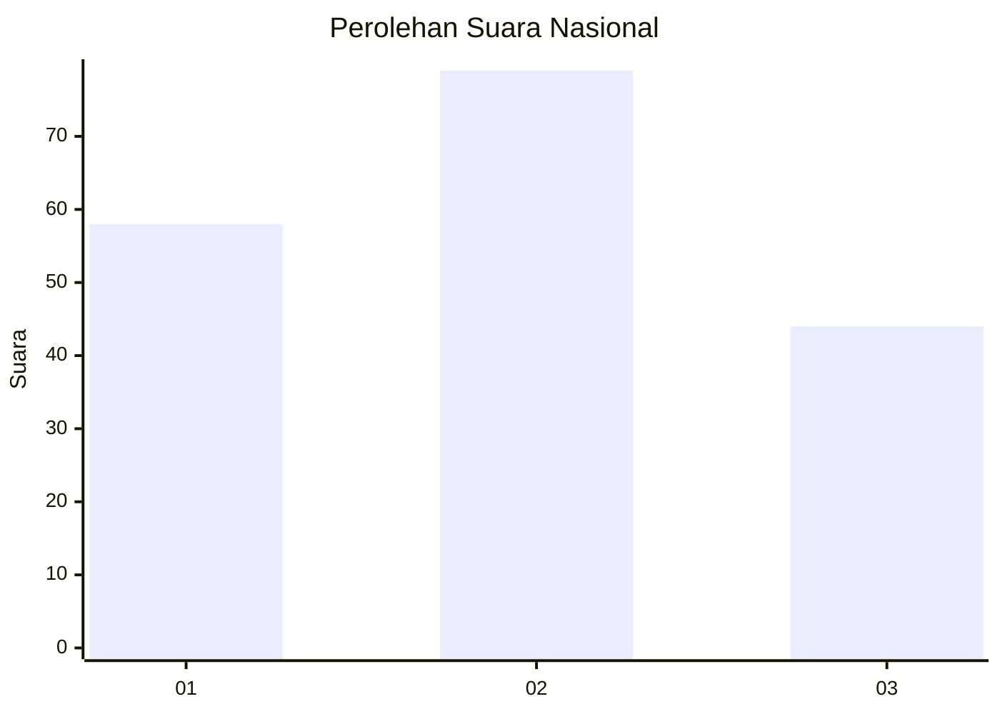
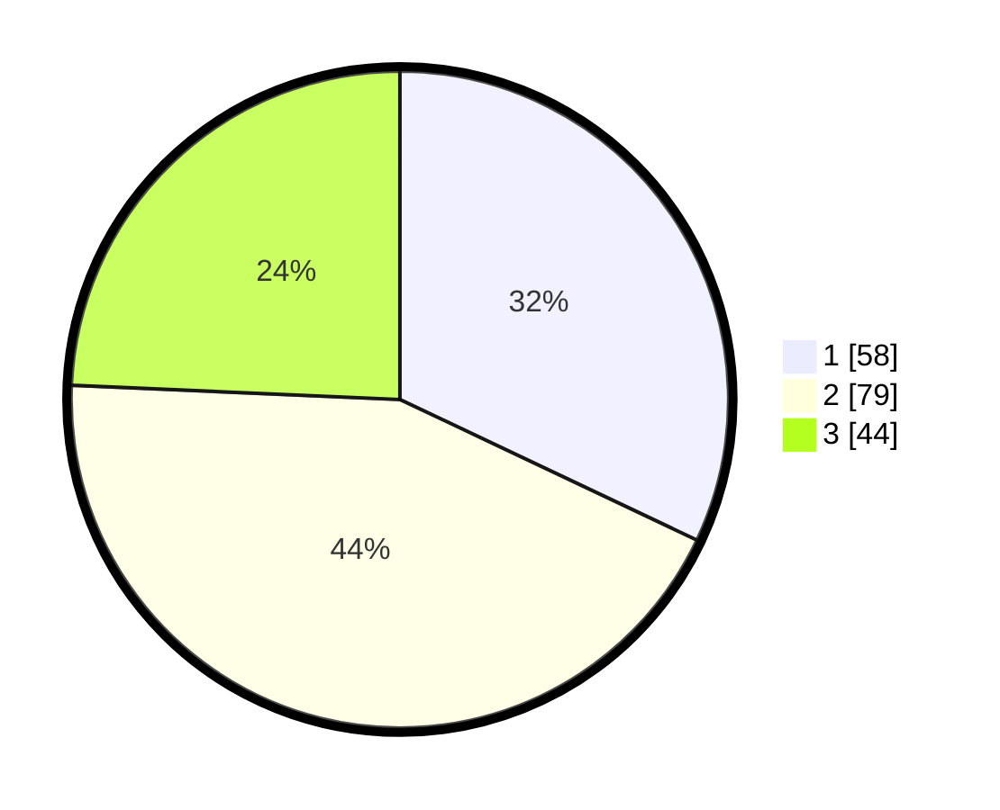

# Hasil

## Grafik

## Tabel

| No. | Nama Paslon    | Suara | Suara (raw) | Persentase |
|:--- |:-------------- | -----:| -----------:| ----------:|
| 1   | ANIES MUHAIMIN | 58    | [58][p-1]   | 32,04      |
| 2   | PRABOWO GIBRAN | 79    | [79][p-2]   | 43,65      |
| 3   | GANJAR MAHFUD  | 44    | [44][p-3]   | 24,31      |

[p-1]: https://github.com/gigit-pemilu/pemilu-2024/blob/main/pilpres/hitung-suara/sub/34-di-yogyakarta/sub/71-kota-yogyakarta/sub/08-mantrijeron/sub/1003-mantrijeron/sub/013-tps/sub/paslon-1.txt
[p-2]: https://github.com/gigit-pemilu/pemilu-2024/blob/main/pilpres/hitung-suara/sub/34-di-yogyakarta/sub/71-kota-yogyakarta/sub/08-mantrijeron/sub/1003-mantrijeron/sub/013-tps/sub/paslon-2.txt
[p-3]: https://github.com/gigit-pemilu/pemilu-2024/blob/main/pilpres/hitung-suara/sub/34-di-yogyakarta/sub/71-kota-yogyakarta/sub/08-mantrijeron/sub/1003-mantrijeron/sub/013-tps/sub/paslon-3.txt

## Foto C Plano

https://sirekap-obj-formc.kpu.go.id/2e6f/pemilu/ppwp/34/71/08/10/03/3471081003013-20240214-160134--710c578b-2886-44c2-aa7d-e3196a4302ce.jpg

https://sirekap-obj-formc.kpu.go.id/2e6f/pemilu/ppwp/34/71/08/10/03/3471081003013-20240214-160156--006e9982-2e39-4a4a-96eb-32a2a5a966cd.jpg

https://sirekap-obj-formc.kpu.go.id/2e6f/pemilu/ppwp/34/71/08/10/03/3471081003013-20240214-235753--5ad2b71f-1b9a-4e01-9e4b-8dfaabad3343.jpg

## Metadata

| Key        | Value               |
| ---------- | ------------------- |
| Time Stamp | 2024-02-15 05:00:24 |

## DATA PEMILIH TETAP

Jumlah pemilih dalam DPT: **217**.
 * L: **105**.
 * P: **112**.

## DATA PENGGUNA HAK PILIH

Jumlah pengguna hak pilih dalam DPT: **173**.
 * L: **83**.
 * P: **90**.

Jumlah pengguna hak pilih dalam DPTb: **12**.
 * L: **1**.
 * P: **11**.

Jumlah pengguna hak pilih dalam DPK: **3**.
 * L: **1**.
 * P: **2**.

Jumlah pengguna hak pilih: **188**.
 * L: **85**.
 * P: **103**.

## JUMLAH SUARA SAH DAN TIDAK SAH

JUMLAH SELURUH SUARA SAH: **181**.

JUMLAH SUARA TIDAK SAH: **7**.

JUMLAH SELURUH SUARA SAH DAN SUARA TIDAK SAH: **188**.

