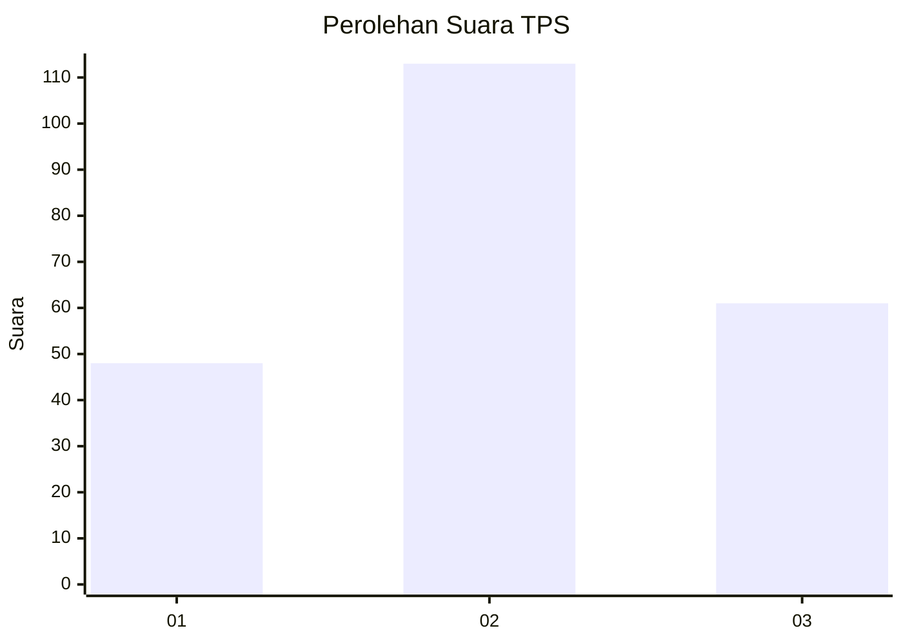
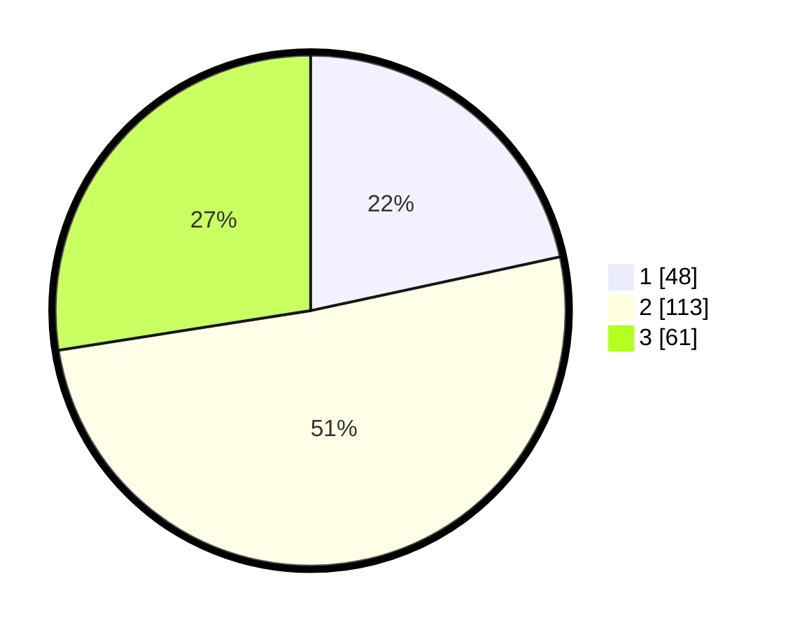

# Hasil

## Grafik

## Tabel

| No. | Nama Paslon    | Suara | Suara (raw) | Persentase |
|:--- |:-------------- | -----:| -----------:| ----------:|
| 1   | ANIES MUHAIMIN | 48    | [48][p-1]   | 21,62      |
| 2   | PRABOWO GIBRAN | 113   | [113][p-2]  | 50,90      |
| 3   | GANJAR MAHFUD  | 61    | [61][p-3]   | 27,48      |

[p-1]: https://github.com/gigit-pemilu/pemilu-2024-34-di-yogyakarta/blob/main/pilpres/hitung-suara/sub/34-di-yogyakarta/sub/71-kota-yogyakarta/sub/09-kraton/sub/1001-patehan/sub/001-tps/sub/paslon-1.txt
[p-2]: https://github.com/gigit-pemilu/pemilu-2024-34-di-yogyakarta/blob/main/pilpres/hitung-suara/sub/34-di-yogyakarta/sub/71-kota-yogyakarta/sub/09-kraton/sub/1001-patehan/sub/001-tps/sub/paslon-2.txt
[p-3]: https://github.com/gigit-pemilu/pemilu-2024-34-di-yogyakarta/blob/main/pilpres/hitung-suara/sub/34-di-yogyakarta/sub/71-kota-yogyakarta/sub/09-kraton/sub/1001-patehan/sub/001-tps/sub/paslon-3.txt

## Foto C Plano

https://sirekap-obj-formc.kpu.go.id/cb08/pemilu/ppwp/34/71/09/10/01/3471091001001-20240217-094500--6ffc0466-5a10-4fb6-b97d-3dacd32b22d1.jpg

https://sirekap-obj-formc.kpu.go.id/cb08/pemilu/ppwp/34/71/09/10/01/3471091001001-20240217-094718--5d70d281-c182-4756-b2d3-84bc8507e0e9.jpg

https://sirekap-obj-formc.kpu.go.id/cb08/pemilu/ppwp/34/71/09/10/01/3471091001001-20240217-094951--84c8bf48-2efe-4e55-ae41-97afba4affef.jpg

## Metadata

| Key        | Value               |
| ---------- | ------------------- |
| Time Stamp | 2024-02-24 23:00:00 |

