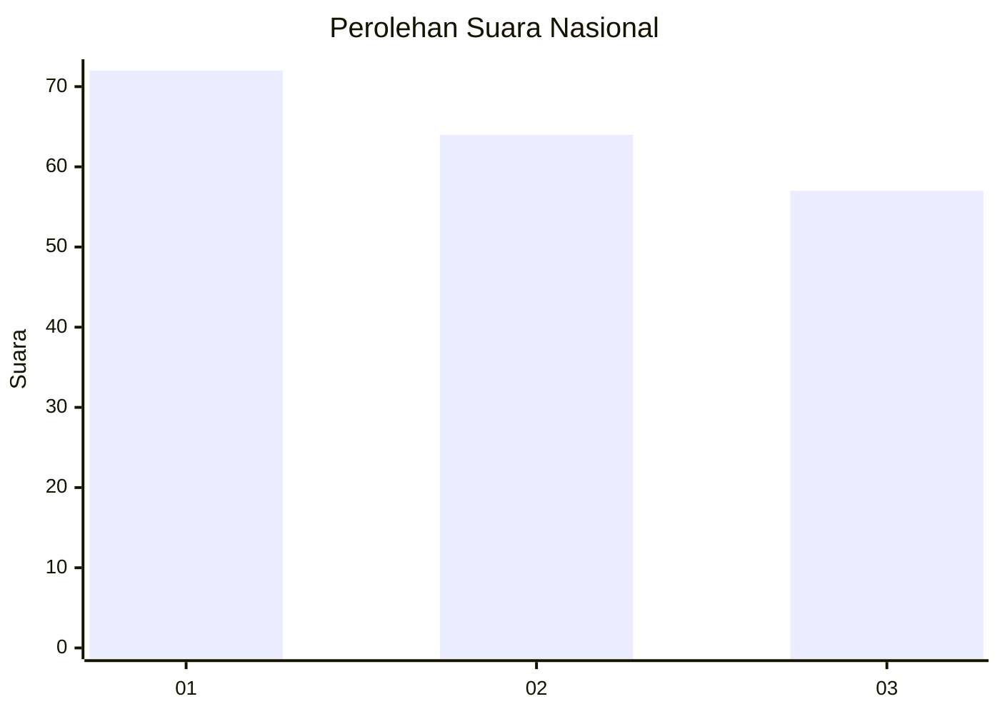
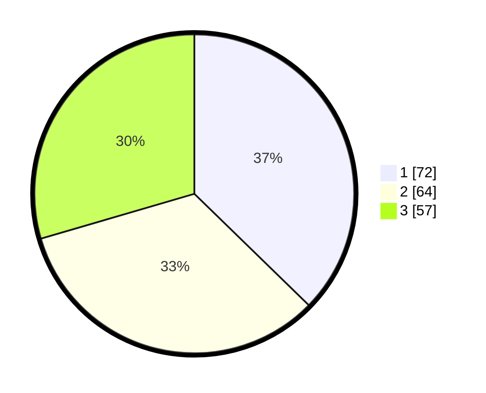

# Hasil

## Grafik

## Tabel

| No. | Nama Paslon    | Suara | Suara (raw) | Persentase |
|:--- |:-------------- | -----:| -----------:| ----------:|
| 1   | ANIES MUHAIMIN | 72    | [72][p-1]   | 37,31      |
| 2   | PRABOWO GIBRAN | 64    | [64][p-2]   | 33,16      |
| 3   | GANJAR MAHFUD  | 57    | [57][p-3]   | 29,53      |

[p-1]: https://github.com/gigit-pemilu/pemilu-2024/blob/main/pilpres/hitung-suara/sub/34-di-yogyakarta/sub/71-kota-yogyakarta/sub/09-kraton/sub/1001-patehan/sub/011-tps/sub/paslon-1.txt
[p-2]: https://github.com/gigit-pemilu/pemilu-2024/blob/main/pilpres/hitung-suara/sub/34-di-yogyakarta/sub/71-kota-yogyakarta/sub/09-kraton/sub/1001-patehan/sub/011-tps/sub/paslon-2.txt
[p-3]: https://github.com/gigit-pemilu/pemilu-2024/blob/main/pilpres/hitung-suara/sub/34-di-yogyakarta/sub/71-kota-yogyakarta/sub/09-kraton/sub/1001-patehan/sub/011-tps/sub/paslon-3.txt

## Foto C Plano

https://sirekap-obj-formc.kpu.go.id/f7b9/pemilu/ppwp/34/71/09/10/01/3471091001011-20240217-214318--70c269f8-88a1-4325-a7cd-07d19fc788b1.jpg

https://sirekap-obj-formc.kpu.go.id/f7b9/pemilu/ppwp/34/71/09/10/01/3471091001011-20240215-000834--5a28f951-61c0-4bb0-b5a7-47970041c8be.jpg

https://sirekap-obj-formc.kpu.go.id/f7b9/pemilu/ppwp/34/71/09/10/01/3471091001011-20240215-000918--4d7da18f-4b27-4a2a-92ec-8d26d29262b2.jpg

## Metadata

| Key        | Value               |
| ---------- | ------------------- |
| Time Stamp | 2024-02-24 22:31:28 |

