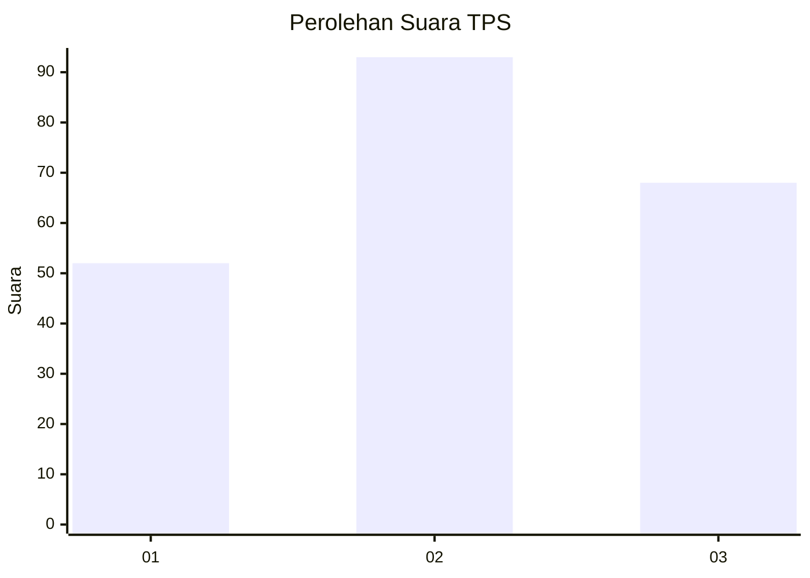
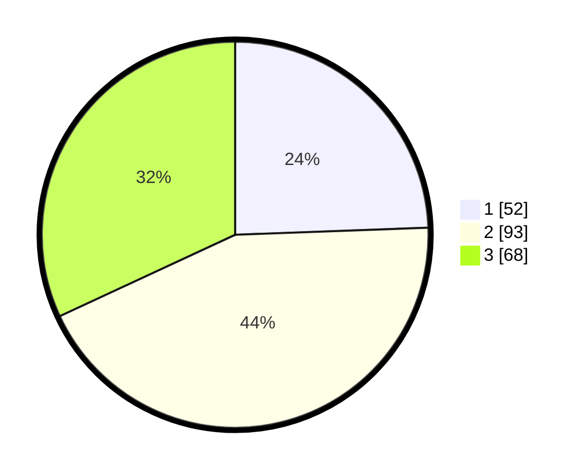

# Hasil

## Grafik

## Tabel

| No. | Nama Paslon    | Suara | Suara (raw) | Persentase |
|:--- |:-------------- | -----:| -----------:| ----------:|
| 1   | ANIES MUHAIMIN | 52    | [52][p-1]   | 24,41      |
| 2   | PRABOWO GIBRAN | 93    | [93][p-2]   | 43,66      |
| 3   | GANJAR MAHFUD  | 68    | [68][p-3]   | 31,92      |

[p-1]: https://github.com/gigit-pemilu/pemilu-2024-34-di-yogyakarta/blob/main/pilpres/hitung-suara/sub/34-di-yogyakarta/sub/71-kota-yogyakarta/sub/09-kraton/sub/1001-patehan/sub/017-tps/sub/paslon-1.txt
[p-2]: https://github.com/gigit-pemilu/pemilu-2024-34-di-yogyakarta/blob/main/pilpres/hitung-suara/sub/34-di-yogyakarta/sub/71-kota-yogyakarta/sub/09-kraton/sub/1001-patehan/sub/017-tps/sub/paslon-2.txt
[p-3]: https://github.com/gigit-pemilu/pemilu-2024-34-di-yogyakarta/blob/main/pilpres/hitung-suara/sub/34-di-yogyakarta/sub/71-kota-yogyakarta/sub/09-kraton/sub/1001-patehan/sub/017-tps/sub/paslon-3.txt

## Foto C Plano

https://sirekap-obj-formc.kpu.go.id/e442/pemilu/ppwp/34/71/09/10/01/3471091001017-20240215-035526--807262d3-3043-4627-bb51-7a4ec4ccbc33.jpg

https://sirekap-obj-formc.kpu.go.id/e442/pemilu/ppwp/34/71/09/10/01/3471091001017-20240215-035726--6dc5b1c9-264f-43d9-8ad9-6b0fcb8a3df9.jpg

https://sirekap-obj-formc.kpu.go.id/e442/pemilu/ppwp/34/71/09/10/01/3471091001017-20240215-035625--14c975c4-2769-4690-9093-21cec28eb1ad.jpg

## Metadata

| Key        | Value               |
| ---------- | ------------------- |
| Time Stamp | 2024-02-24 22:31:28 |

## DATA PEMILIH TETAP

Jumlah pemilih dalam DPT: **254**.
 * L: **720**.
 * P: **234**.

## DATA PENGGUNA HAK PILIH

Jumlah pengguna hak pilih dalam DPT: **216**.
 * L: **99**.
 * P: **117**.

Jumlah pengguna hak pilih dalam DPTb: **6**.
 * L: **500**.
 * P: **0**.

Jumlah pengguna hak pilih dalam DPK: **0**.
 * L: **0**.
 * P: **0**.

Jumlah pengguna hak pilih: **222**.
 * L: **101**.
 * P: **727**.

## JUMLAH SUARA SAH DAN TIDAK SAH

JUMLAH SELURUH SUARA SAH: **213**.

JUMLAH SUARA TIDAK SAH: **9**.

JUMLAH SELURUH SUARA SAH DAN SUARA TIDAK SAH: **222**.

