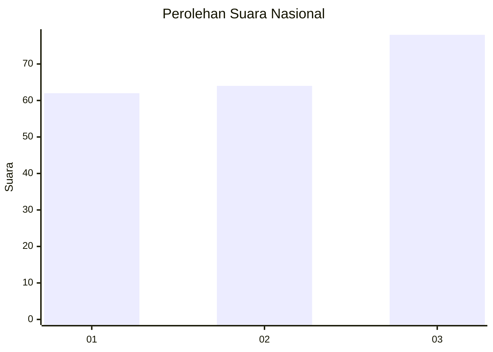
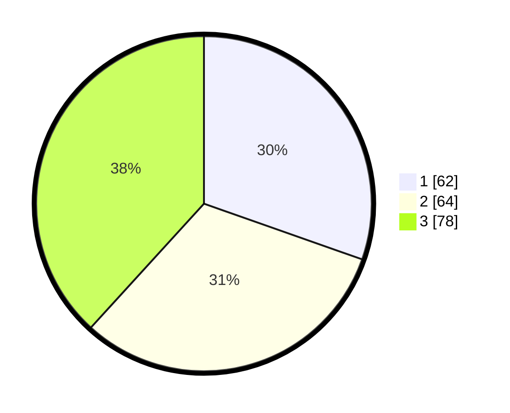

# Hasil

## Grafik

## Tabel

| No. | Nama Paslon    | Suara | Suara (raw) | Persentase |
|:--- |:-------------- | -----:| -----------:| ----------:|
| 1   | ANIES MUHAIMIN | 62    | [62][p-1]   | 30,39      |
| 2   | PRABOWO GIBRAN | 64    | [64][p-2]   | 31,37      |
| 3   | GANJAR MAHFUD  | 78    | [78][p-3]   | 38,24      |

[p-1]: https://github.com/gigit-pemilu/pemilu-2024/blob/main/pilpres/hitung-suara/sub/34-di-yogyakarta/sub/71-kota-yogyakarta/sub/09-kraton/sub/1002-panembahan/sub/002-tps/sub/paslon-1.txt
[p-2]: https://github.com/gigit-pemilu/pemilu-2024/blob/main/pilpres/hitung-suara/sub/34-di-yogyakarta/sub/71-kota-yogyakarta/sub/09-kraton/sub/1002-panembahan/sub/002-tps/sub/paslon-2.txt
[p-3]: https://github.com/gigit-pemilu/pemilu-2024/blob/main/pilpres/hitung-suara/sub/34-di-yogyakarta/sub/71-kota-yogyakarta/sub/09-kraton/sub/1002-panembahan/sub/002-tps/sub/paslon-3.txt

## Foto C Plano

https://sirekap-obj-formc.kpu.go.id/5a40/pemilu/ppwp/34/71/09/10/02/3471091002002-20240215-040841--33da0534-d2b4-4e51-a3db-8934d17085ce.jpg

https://sirekap-obj-formc.kpu.go.id/5a40/pemilu/ppwp/34/71/09/10/02/3471091002002-20240215-041050--707c314d-64fa-4db2-a84b-27fd161b354f.jpg

https://sirekap-obj-formc.kpu.go.id/5a40/pemilu/ppwp/34/71/09/10/02/3471091002002-20240215-041122--2e318564-afe8-478b-ac1f-3980ad729a92.jpg

## Metadata

| Key        | Value               |
| ---------- | ------------------- |
| Time Stamp | 2024-02-24 22:31:28 |

## DATA PEMILIH TETAP

Jumlah pemilih dalam DPT: **252**.
 * L: **116**.
 * P: **136**.

## DATA PENGGUNA HAK PILIH

Jumlah pengguna hak pilih dalam DPT: **197**.
 * L: **890**.
 * P: **107**.

Jumlah pengguna hak pilih dalam DPTb: **5**.
 * L: **885**.
 * P: **884**.

Jumlah pengguna hak pilih dalam DPK: **6**.
 * L: **842**.
 * P: **884**.

Jumlah pengguna hak pilih: **208**.
 * L: **93**.
 * P: **115**.

## JUMLAH SUARA SAH DAN TIDAK SAH

JUMLAH SELURUH SUARA SAH: **204**.

JUMLAH SUARA TIDAK SAH: **4**.

JUMLAH SELURUH SUARA SAH DAN SUARA TIDAK SAH: **208**.

