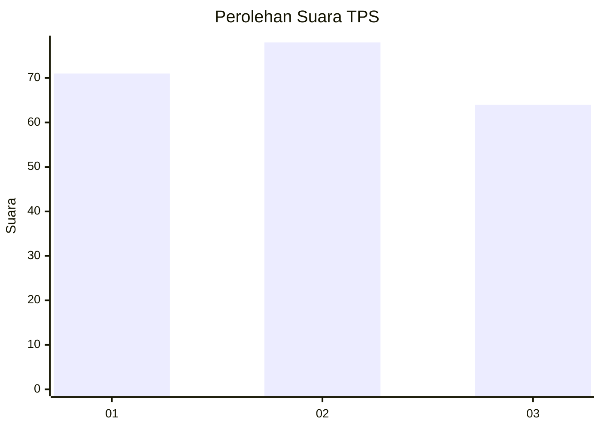
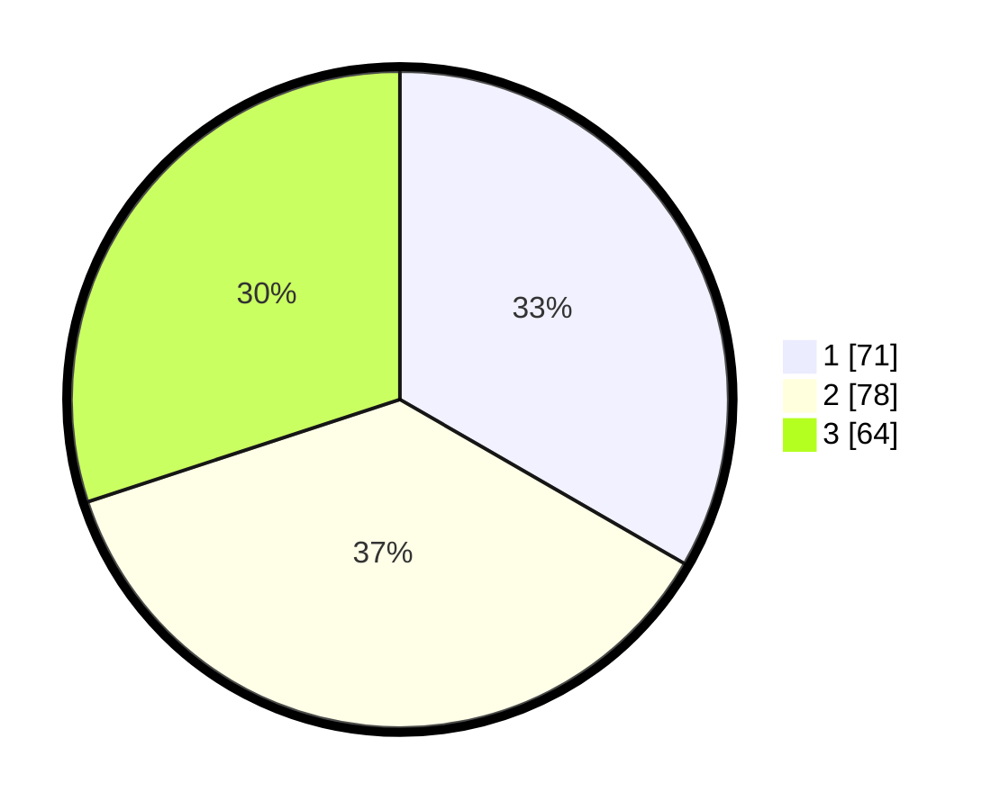

# Hasil

## Grafik

## Tabel

| No. | Nama Paslon    | Suara | Suara (raw) | Persentase |
|:--- |:-------------- | -----:| -----------:| ----------:|
| 1   | ANIES MUHAIMIN | 71    | [71][p-1]   | 33,33      |
| 2   | PRABOWO GIBRAN | 78    | [78][p-2]   | 36,62      |
| 3   | GANJAR MAHFUD  | 64    | [64][p-3]   | 30,05      |

[p-1]: https://github.com/gigit-pemilu/pemilu-2024-34-di-yogyakarta/blob/main/pilpres/hitung-suara/sub/34-di-yogyakarta/sub/71-kota-yogyakarta/sub/09-kraton/sub/1002-panembahan/sub/003-tps/sub/paslon-1.txt
[p-2]: https://github.com/gigit-pemilu/pemilu-2024-34-di-yogyakarta/blob/main/pilpres/hitung-suara/sub/34-di-yogyakarta/sub/71-kota-yogyakarta/sub/09-kraton/sub/1002-panembahan/sub/003-tps/sub/paslon-2.txt
[p-3]: https://github.com/gigit-pemilu/pemilu-2024-34-di-yogyakarta/blob/main/pilpres/hitung-suara/sub/34-di-yogyakarta/sub/71-kota-yogyakarta/sub/09-kraton/sub/1002-panembahan/sub/003-tps/sub/paslon-3.txt

## Foto C Plano

https://sirekap-obj-formc.kpu.go.id/108d/pemilu/ppwp/34/71/09/10/02/3471091002003-20240217-222248--da800e35-be64-42cb-8114-e71d45b8e3b8.jpg

https://sirekap-obj-formc.kpu.go.id/108d/pemilu/ppwp/34/71/09/10/02/3471091002003-20240214-211958--c5645dd4-08c4-4d6a-b913-a5c7435e6dc4.jpg

https://sirekap-obj-formc.kpu.go.id/108d/pemilu/ppwp/34/71/09/10/02/3471091002003-20240214-212053--b9007ee4-1e0a-45f5-a7f6-3f3479e18d1f.jpg

## Metadata

| Key        | Value               |
| ---------- | ------------------- |
| Time Stamp | 2024-02-19 06:16:00 |

