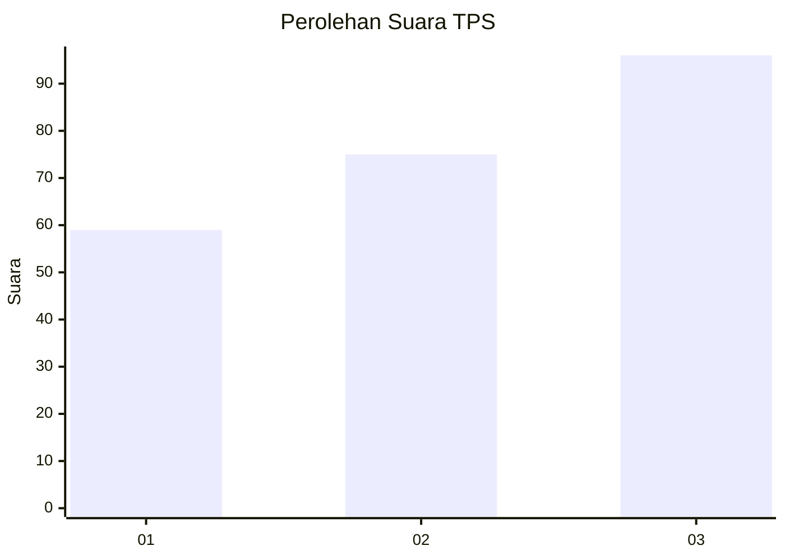
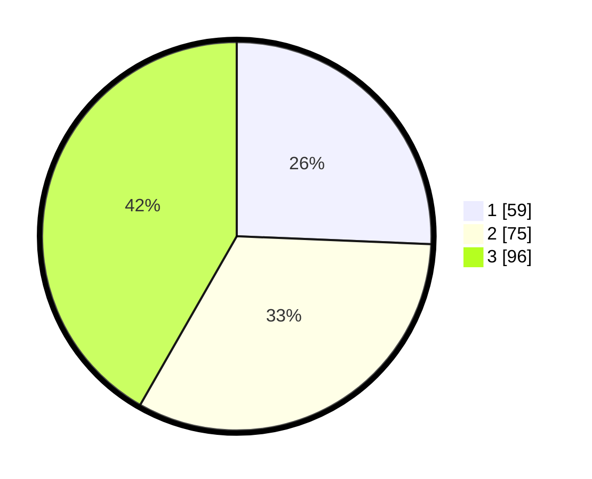

# Hasil

## Grafik

## Tabel

| No. | Nama Paslon    | Suara | Suara (raw) | Persentase |
|:--- |:-------------- | -----:| -----------:| ----------:|
| 1   | ANIES MUHAIMIN | 59    | [59][p-1]   | 25,65      |
| 2   | PRABOWO GIBRAN | 75    | [75][p-2]   | 32,61      |
| 3   | GANJAR MAHFUD  | 96    | [96][p-3]   | 41,74      |

[p-1]: https://github.com/gigit-pemilu/pemilu-2024-34-di-yogyakarta/blob/main/pilpres/hitung-suara/sub/34-di-yogyakarta/sub/71-kota-yogyakarta/sub/09-kraton/sub/1002-panembahan/sub/013-tps/sub/paslon-1.txt
[p-2]: https://github.com/gigit-pemilu/pemilu-2024-34-di-yogyakarta/blob/main/pilpres/hitung-suara/sub/34-di-yogyakarta/sub/71-kota-yogyakarta/sub/09-kraton/sub/1002-panembahan/sub/013-tps/sub/paslon-2.txt
[p-3]: https://github.com/gigit-pemilu/pemilu-2024-34-di-yogyakarta/blob/main/pilpres/hitung-suara/sub/34-di-yogyakarta/sub/71-kota-yogyakarta/sub/09-kraton/sub/1002-panembahan/sub/013-tps/sub/paslon-3.txt

## Foto C Plano

https://sirekap-obj-formc.kpu.go.id/e02e/pemilu/ppwp/34/71/09/10/02/3471091002013-20240214-233204--dd98eb32-2480-4185-a3db-ff1d5b402b6c.jpg

https://sirekap-obj-formc.kpu.go.id/e02e/pemilu/ppwp/34/71/09/10/02/3471091002013-20240214-234312--28b9d7f3-9eeb-4cf6-9e71-2b26799df41d.jpg

https://sirekap-obj-formc.kpu.go.id/e02e/pemilu/ppwp/34/71/09/10/02/3471091002013-20240214-234501--d093dcb0-32ed-457a-af17-0cbda8c67b82.jpg

## Metadata

| Key        | Value               |
| ---------- | ------------------- |
| Time Stamp | 2024-02-24 22:31:28 |

## DATA PEMILIH TETAP

Jumlah pemilih dalam DPT: **283**.
 * L: **423**.
 * P: **950**.

## DATA PENGGUNA HAK PILIH

Jumlah pengguna hak pilih dalam DPT: **226**.
 * L: **840**.
 * P: **128**.

Jumlah pengguna hak pilih dalam DPTb: **3**.
 * L: **856**.
 * P: **880**.

Jumlah pengguna hak pilih dalam DPK: **4**.
 * L: **47**.
 * P: **881**.

Jumlah pengguna hak pilih: **233**.
 * L: **602**.
 * P: **171**.

## JUMLAH SUARA SAH DAN TIDAK SAH

JUMLAH SELURUH SUARA SAH: **230**.

JUMLAH SUARA TIDAK SAH: **3**.

JUMLAH SELURUH SUARA SAH DAN SUARA TIDAK SAH: **233**.

