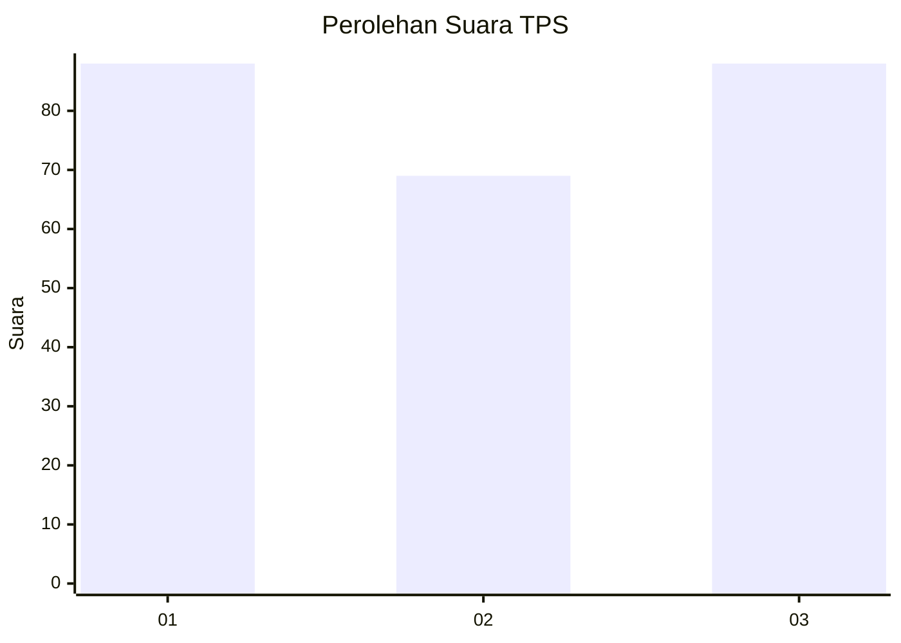
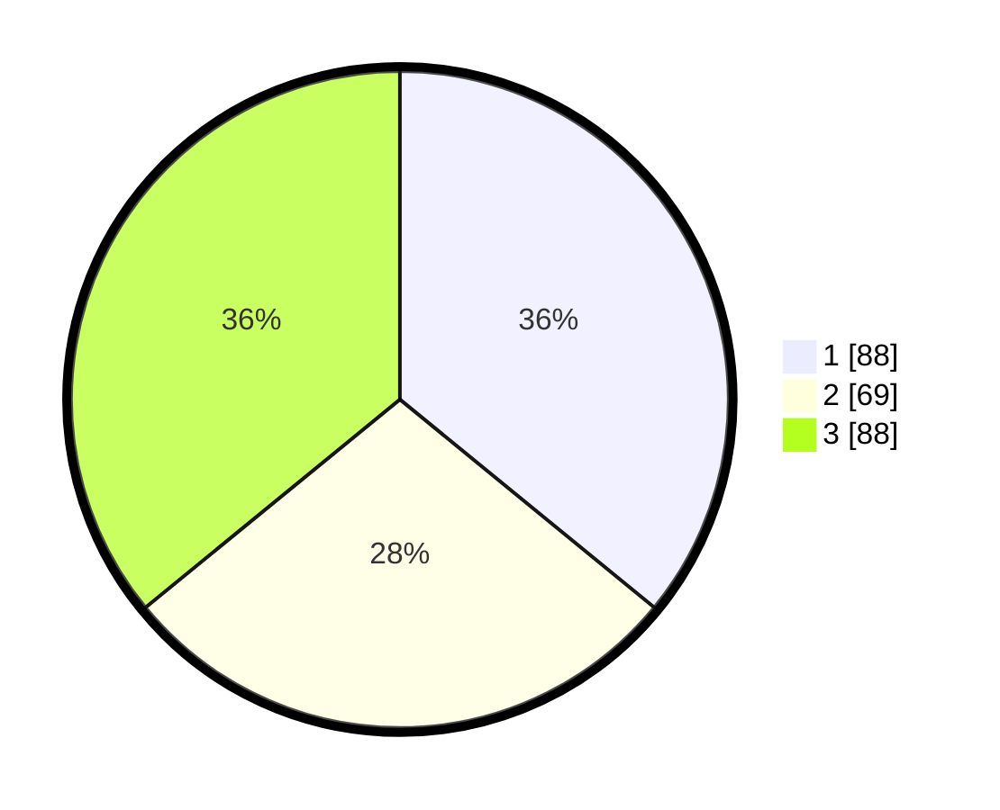

# Hasil

## Grafik

## Tabel

| No. | Nama Paslon    | Suara | Suara (raw) | Persentase |
|:--- |:-------------- | -----:| -----------:| ----------:|
| 1   | ANIES MUHAIMIN | 88    | [88][p-1]   | 35,92      |
| 2   | PRABOWO GIBRAN | 69    | [69][p-2]   | 28,16      |
| 3   | GANJAR MAHFUD  | 88    | [88][p-3]   | 35,92      |

[p-1]: https://github.com/gigit-pemilu/pemilu-2024-34-di-yogyakarta/blob/main/pilpres/hitung-suara/sub/34-di-yogyakarta/sub/71-kota-yogyakarta/sub/09-kraton/sub/1002-panembahan/sub/015-tps/sub/paslon-1.txt
[p-2]: https://github.com/gigit-pemilu/pemilu-2024-34-di-yogyakarta/blob/main/pilpres/hitung-suara/sub/34-di-yogyakarta/sub/71-kota-yogyakarta/sub/09-kraton/sub/1002-panembahan/sub/015-tps/sub/paslon-2.txt
[p-3]: https://github.com/gigit-pemilu/pemilu-2024-34-di-yogyakarta/blob/main/pilpres/hitung-suara/sub/34-di-yogyakarta/sub/71-kota-yogyakarta/sub/09-kraton/sub/1002-panembahan/sub/015-tps/sub/paslon-3.txt

## Foto C Plano

https://sirekap-obj-formc.kpu.go.id/e048/pemilu/ppwp/34/71/09/10/02/3471091002015-20240214-230013--79e6bcef-4800-4589-b028-72612b27b76b.jpg

https://sirekap-obj-formc.kpu.go.id/e048/pemilu/ppwp/34/71/09/10/02/3471091002015-20240214-230101--160db2d6-b377-4160-92d4-93410d04c1b7.jpg

https://sirekap-obj-formc.kpu.go.id/e048/pemilu/ppwp/34/71/09/10/02/3471091002015-20240214-235830--b25e6e53-65df-457d-a602-451e40b8dbb3.jpg

## Metadata

| Key        | Value               |
| ---------- | ------------------- |
| Time Stamp | 2024-02-24 22:31:28 |

