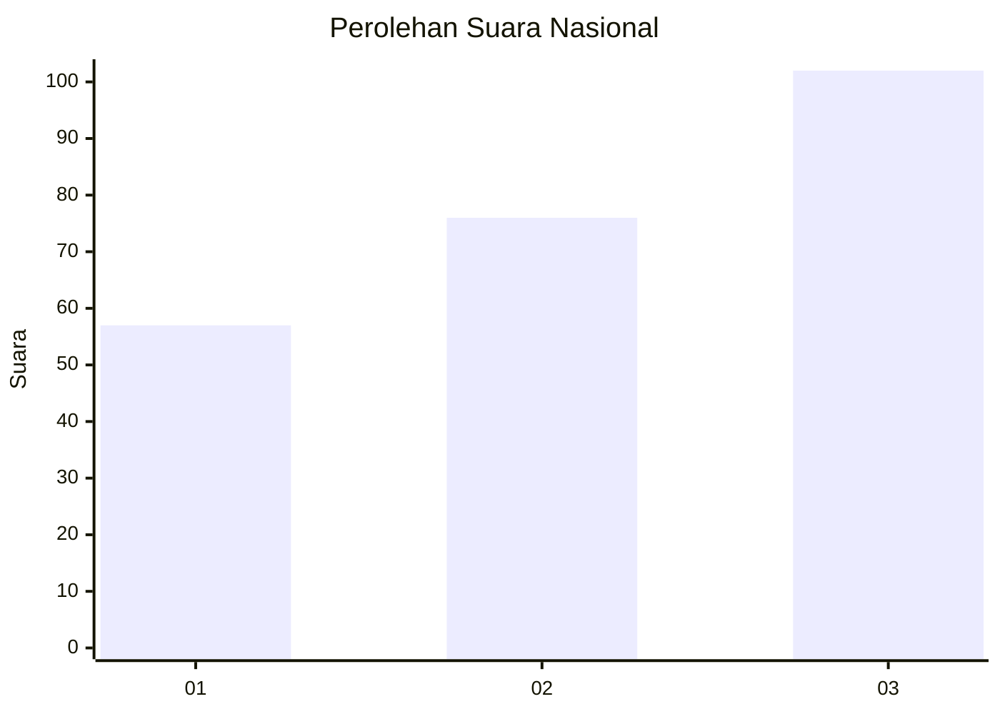
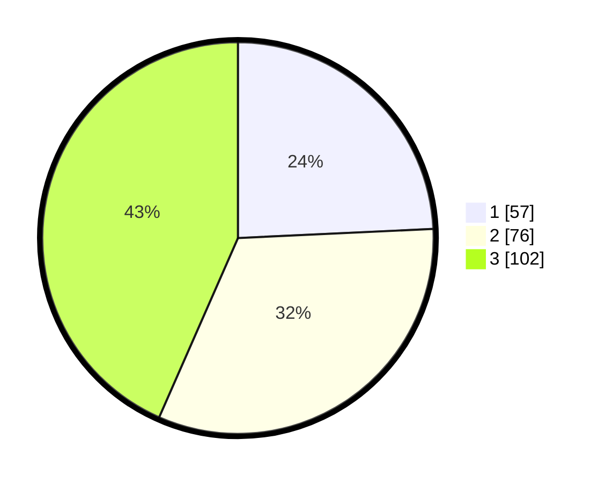

# Hasil

## Grafik

## Tabel

| No. | Nama Paslon    | Suara | Suara (raw) | Persentase |
|:--- |:-------------- | -----:| -----------:| ----------:|
| 1   | ANIES MUHAIMIN | 57    | [57][p-1]   | 24,26      |
| 2   | PRABOWO GIBRAN | 76    | [76][p-2]   | 32,34      |
| 3   | GANJAR MAHFUD  | 102   | [102][p-3]  | 43,40      |

[p-1]: https://github.com/gigit-pemilu/pemilu-2024/blob/main/pilpres/hitung-suara/sub/34-di-yogyakarta/sub/71-kota-yogyakarta/sub/09-kraton/sub/1002-panembahan/sub/026-tps/sub/paslon-1.txt
[p-2]: https://github.com/gigit-pemilu/pemilu-2024/blob/main/pilpres/hitung-suara/sub/34-di-yogyakarta/sub/71-kota-yogyakarta/sub/09-kraton/sub/1002-panembahan/sub/026-tps/sub/paslon-2.txt
[p-3]: https://github.com/gigit-pemilu/pemilu-2024/blob/main/pilpres/hitung-suara/sub/34-di-yogyakarta/sub/71-kota-yogyakarta/sub/09-kraton/sub/1002-panembahan/sub/026-tps/sub/paslon-3.txt

## Foto C Plano

https://sirekap-obj-formc.kpu.go.id/98ef/pemilu/ppwp/34/71/09/10/02/3471091002026-20240214-200411--341362b0-b29f-419d-b01f-ca5115861b38.jpg

https://sirekap-obj-formc.kpu.go.id/98ef/pemilu/ppwp/34/71/09/10/02/3471091002026-20240214-203457--7f670487-64e2-4853-b74e-0601f950879d.jpg

https://sirekap-obj-formc.kpu.go.id/98ef/pemilu/ppwp/34/71/09/10/02/3471091002026-20240214-214640--013620c3-deb2-44e1-8ff2-a9eeb462ca68.jpg

## Metadata

| Key        | Value               |
| ---------- | ------------------- |
| Time Stamp | 2024-02-15 12:00:28 |

