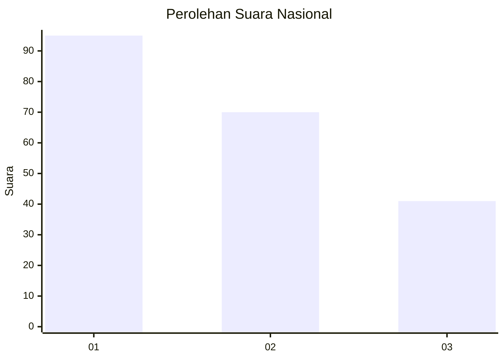
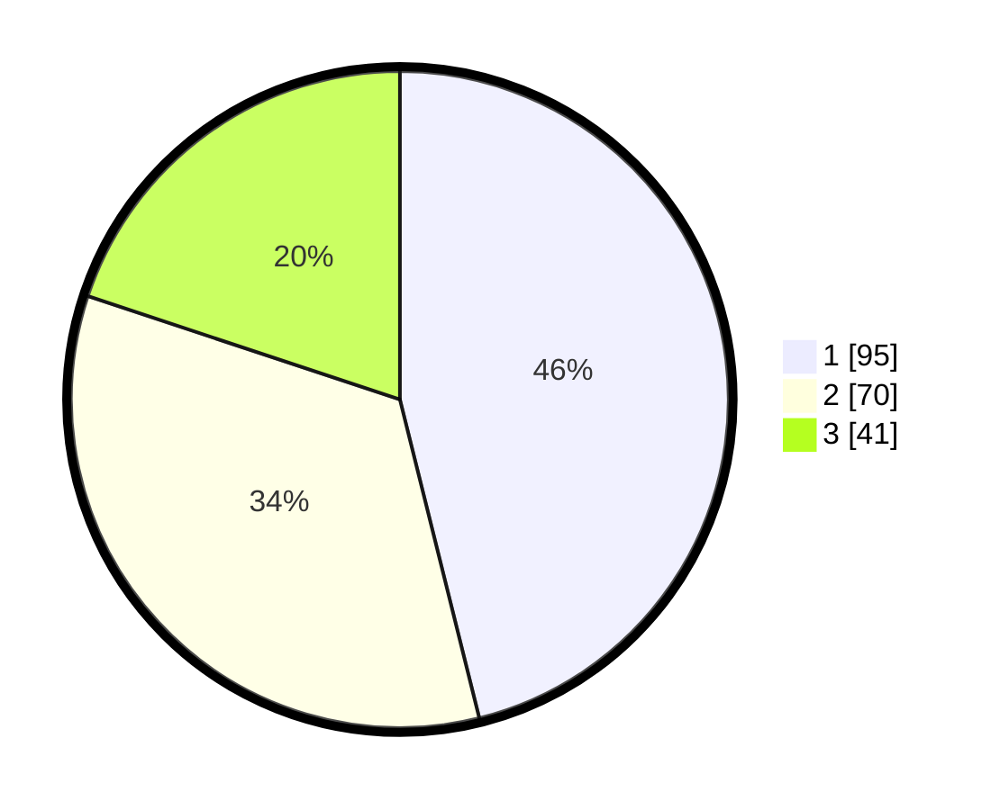

# Hasil

## Grafik

## Tabel

| No. | Nama Paslon    | Suara | Suara (raw) | Persentase |
|:--- |:-------------- | -----:| -----------:| ----------:|
| 1   | ANIES MUHAIMIN | 95    | [95][p-1]   | 46,12      |
| 2   | PRABOWO GIBRAN | 70    | [70][p-2]   | 33,98      |
| 3   | GANJAR MAHFUD  | 41    | [41][p-3]   | 19,90      |

[p-1]: https://github.com/gigit-pemilu/pemilu-2024/blob/main/pilpres/hitung-suara/sub/34-di-yogyakarta/sub/71-kota-yogyakarta/sub/09-kraton/sub/1003-kadipaten/sub/009-tps/sub/paslon-1.txt
[p-2]: https://github.com/gigit-pemilu/pemilu-2024/blob/main/pilpres/hitung-suara/sub/34-di-yogyakarta/sub/71-kota-yogyakarta/sub/09-kraton/sub/1003-kadipaten/sub/009-tps/sub/paslon-2.txt
[p-3]: https://github.com/gigit-pemilu/pemilu-2024/blob/main/pilpres/hitung-suara/sub/34-di-yogyakarta/sub/71-kota-yogyakarta/sub/09-kraton/sub/1003-kadipaten/sub/009-tps/sub/paslon-3.txt

## Foto C Plano

https://sirekap-obj-formc.kpu.go.id/6da9/pemilu/ppwp/34/71/09/10/03/3471091003009-20240214-214530--daf131c9-47b7-492e-b3c2-3ddbe35fd9fb.jpg

https://sirekap-obj-formc.kpu.go.id/6da9/pemilu/ppwp/34/71/09/10/03/3471091003009-20240214-184939--cc8cecbf-c649-417c-8633-8649c53bedf0.jpg

https://sirekap-obj-formc.kpu.go.id/6da9/pemilu/ppwp/34/71/09/10/03/3471091003009-20240214-191311--5cd5cd59-7933-42be-b028-06acd7c085d3.jpg

## Metadata

| Key        | Value               |
| ---------- | ------------------- |
| Time Stamp | 2024-02-15 12:00:28 |

