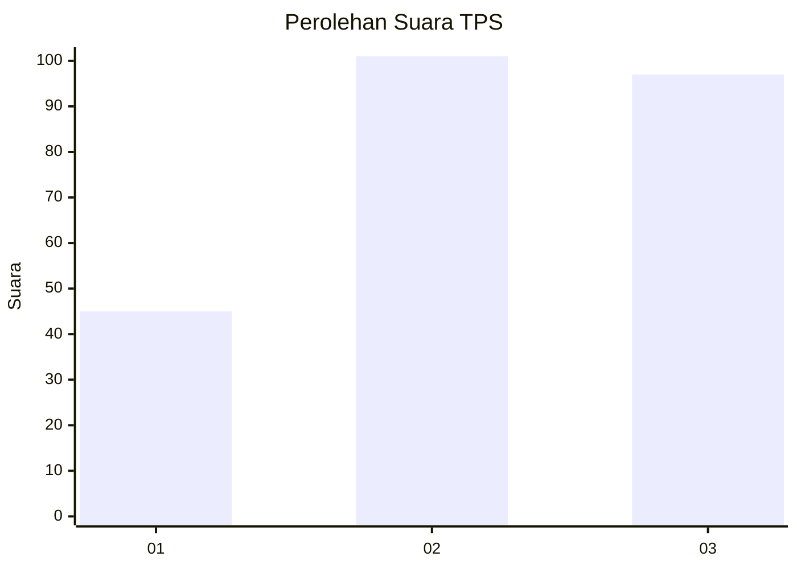
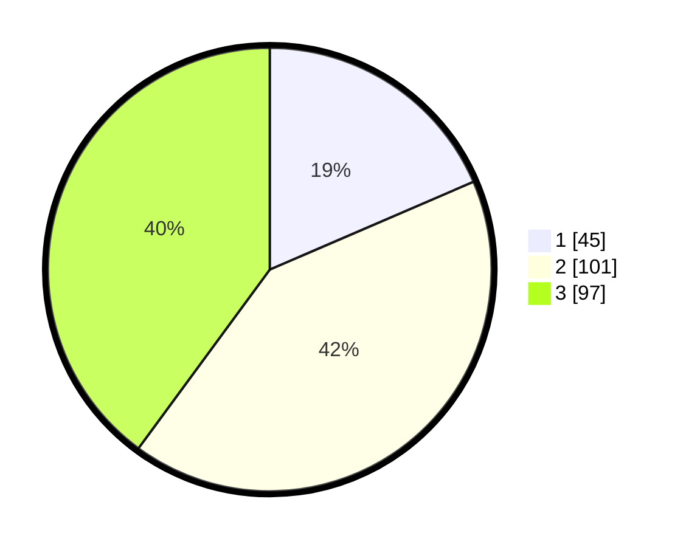

# Hasil

## Grafik

## Tabel

| No. | Nama Paslon    | Suara | Suara (raw) | Persentase |
|:--- |:-------------- | -----:| -----------:| ----------:|
| 1   | ANIES MUHAIMIN | 45    | [45][p-1]   | 18,52      |
| 2   | PRABOWO GIBRAN | 101   | [101][p-2]  | 41,56      |
| 3   | GANJAR MAHFUD  | 97    | [97][p-3]   | 39,92      |

[p-1]: https://github.com/gigit-pemilu/pemilu-2024-34-di-yogyakarta/blob/main/pilpres/hitung-suara/sub/34-di-yogyakarta/sub/71-kota-yogyakarta/sub/09-kraton/sub/1003-kadipaten/sub/010-tps/sub/paslon-1.txt
[p-2]: https://github.com/gigit-pemilu/pemilu-2024-34-di-yogyakarta/blob/main/pilpres/hitung-suara/sub/34-di-yogyakarta/sub/71-kota-yogyakarta/sub/09-kraton/sub/1003-kadipaten/sub/010-tps/sub/paslon-2.txt
[p-3]: https://github.com/gigit-pemilu/pemilu-2024-34-di-yogyakarta/blob/main/pilpres/hitung-suara/sub/34-di-yogyakarta/sub/71-kota-yogyakarta/sub/09-kraton/sub/1003-kadipaten/sub/010-tps/sub/paslon-3.txt

## Foto C Plano

https://sirekap-obj-formc.kpu.go.id/d7e0/pemilu/ppwp/34/71/09/10/03/3471091003010-20240214-210542--6baf5036-108c-4736-a7c9-66e71a3018e7.jpg

https://sirekap-obj-formc.kpu.go.id/d7e0/pemilu/ppwp/34/71/09/10/03/3471091003010-20240214-210351--657f06a1-17c1-4ca3-b3e8-f4af6e6f3acb.jpg

https://sirekap-obj-formc.kpu.go.id/d7e0/pemilu/ppwp/34/71/09/10/03/3471091003010-20240214-210510--03e0d02c-28e9-4cb8-bbf3-d0a75198adf8.jpg

## Metadata

| Key        | Value               |
| ---------- | ------------------- |
| Time Stamp | 2024-02-24 22:31:28 |

## DATA PEMILIH TETAP

Jumlah pemilih dalam DPT: **272**.
 * L: **724**.
 * P: **748**.

## DATA PENGGUNA HAK PILIH

Jumlah pengguna hak pilih dalam DPT: **233**.
 * L: **103**.
 * P: **130**.

Jumlah pengguna hak pilih dalam DPTb: **13**.
 * L: **7**.
 * P: **805**.

Jumlah pengguna hak pilih dalam DPK: **1**.
 * L: **0**.
 * P: **1**.

Jumlah pengguna hak pilih: **247**.
 * L: **10**.
 * P: **137**.

## JUMLAH SUARA SAH DAN TIDAK SAH

JUMLAH SELURUH SUARA SAH: **243**.

JUMLAH SUARA TIDAK SAH: **4**.

JUMLAH SELURUH SUARA SAH DAN SUARA TIDAK SAH: **247**.

