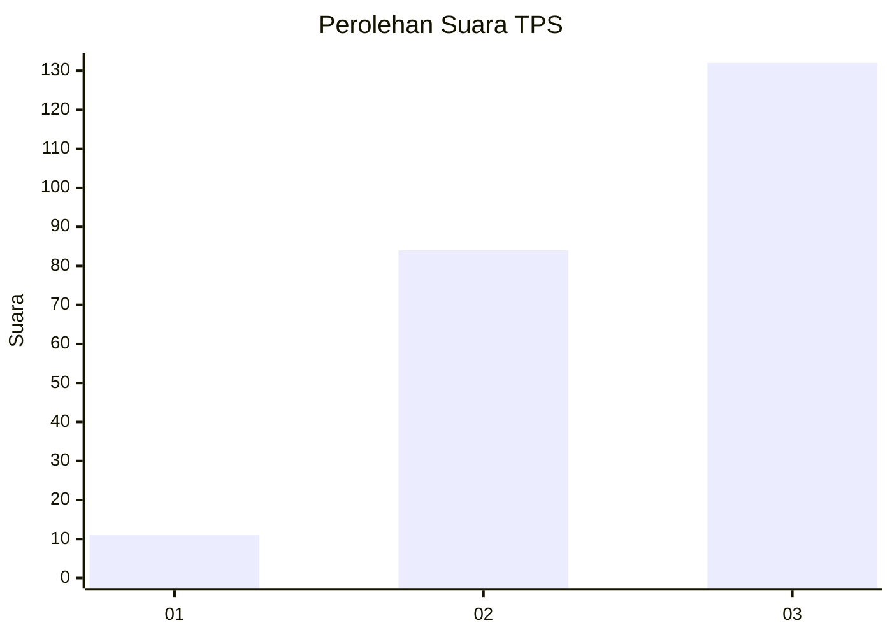
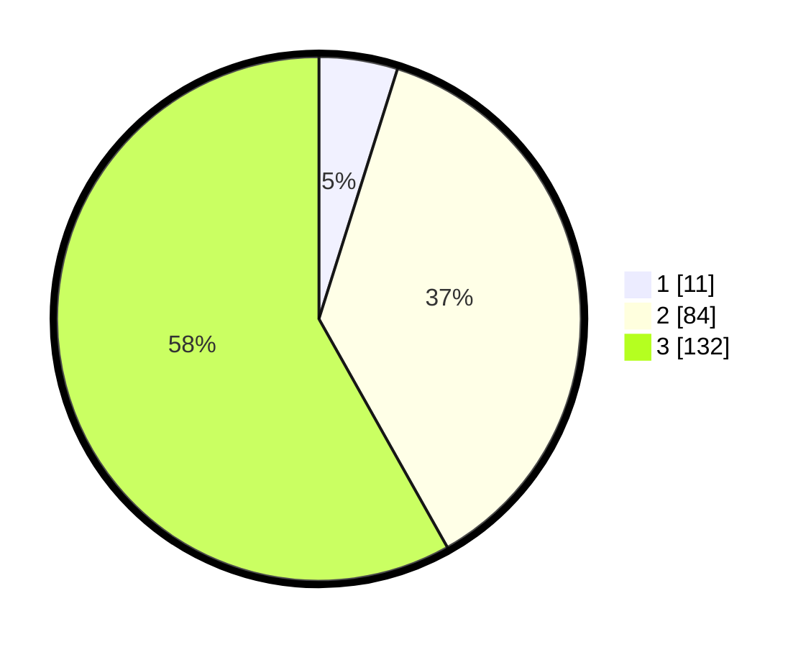

# Hasil

## Grafik

## Tabel

| No. | Nama Paslon    | Suara | Suara (raw) | Persentase |
|:--- |:-------------- | -----:| -----------:| ----------:|
| 1   | ANIES MUHAIMIN | 11    | [11][p-1]   | 4,85       |
| 2   | PRABOWO GIBRAN | 84    | [84][p-2]   | 37,00      |
| 3   | GANJAR MAHFUD  | 132   | [132][p-3]  | 58,15      |

[p-1]: https://github.com/gigit-pemilu/pemilu-2024-34-di-yogyakarta/blob/main/pilpres/hitung-suara/sub/34-di-yogyakarta/sub/71-kota-yogyakarta/sub/10-gondomanan/sub/1001-ngupasan/sub/001-tps/sub/paslon-1.txt
[p-2]: https://github.com/gigit-pemilu/pemilu-2024-34-di-yogyakarta/blob/main/pilpres/hitung-suara/sub/34-di-yogyakarta/sub/71-kota-yogyakarta/sub/10-gondomanan/sub/1001-ngupasan/sub/001-tps/sub/paslon-2.txt
[p-3]: https://github.com/gigit-pemilu/pemilu-2024-34-di-yogyakarta/blob/main/pilpres/hitung-suara/sub/34-di-yogyakarta/sub/71-kota-yogyakarta/sub/10-gondomanan/sub/1001-ngupasan/sub/001-tps/sub/paslon-3.txt

## Foto C Plano

https://sirekap-obj-formc.kpu.go.id/44fb/pemilu/ppwp/34/71/10/10/01/3471101001001-20240215-032538--d13f3c3c-d351-4cea-92fa-7fb3426ba774.jpg

https://sirekap-obj-formc.kpu.go.id/44fb/pemilu/ppwp/34/71/10/10/01/3471101001001-20240214-231703--2f13a548-897a-4905-8625-904ece2061ef.jpg

https://sirekap-obj-formc.kpu.go.id/44fb/pemilu/ppwp/34/71/10/10/01/3471101001001-20240214-231900--edddfb10-c1f4-4639-85e3-2271bdb9d8af.jpg

## Metadata

| Key        | Value               |
| ---------- | ------------------- |
| Time Stamp | 2024-02-24 22:31:28 |

## DATA PEMILIH TETAP

Jumlah pemilih dalam DPT: **251**.
 * L: **425**.
 * P: **112**.

## DATA PENGGUNA HAK PILIH

Jumlah pengguna hak pilih dalam DPT: **208**.
 * L: **208**.
 * P: **105**.

Jumlah pengguna hak pilih dalam DPTb: **23**.
 * L: **102**.
 * P: **302**.

Jumlah pengguna hak pilih dalam DPK: **5**.
 * L: **400**.
 * P: **500**.

Jumlah pengguna hak pilih: **234**.
 * L: **92**.
 * P: **341**.

## JUMLAH SUARA SAH DAN TIDAK SAH

JUMLAH SELURUH SUARA SAH: **227**.

JUMLAH SUARA TIDAK SAH: **9**.

JUMLAH SELURUH SUARA SAH DAN SUARA TIDAK SAH: **236**.

